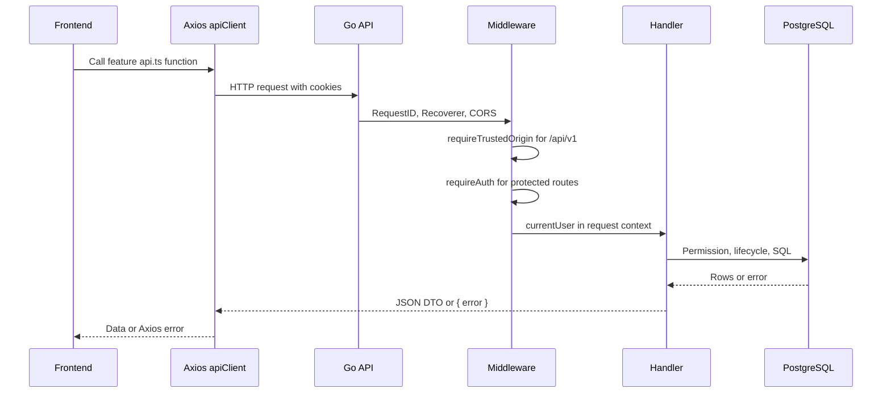
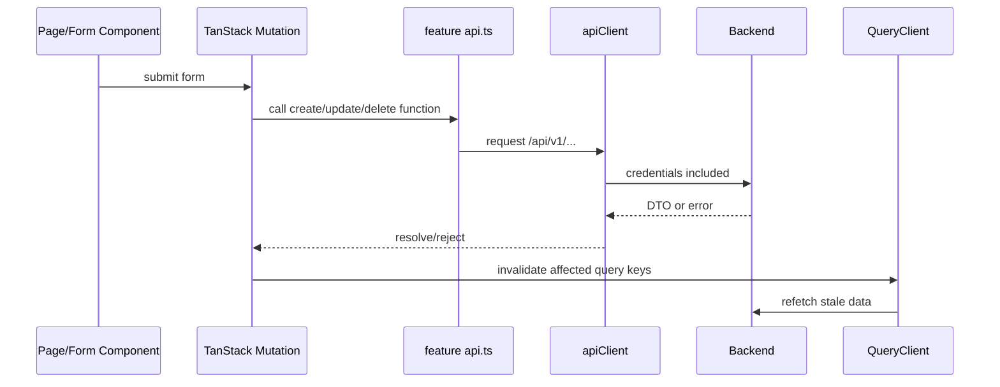
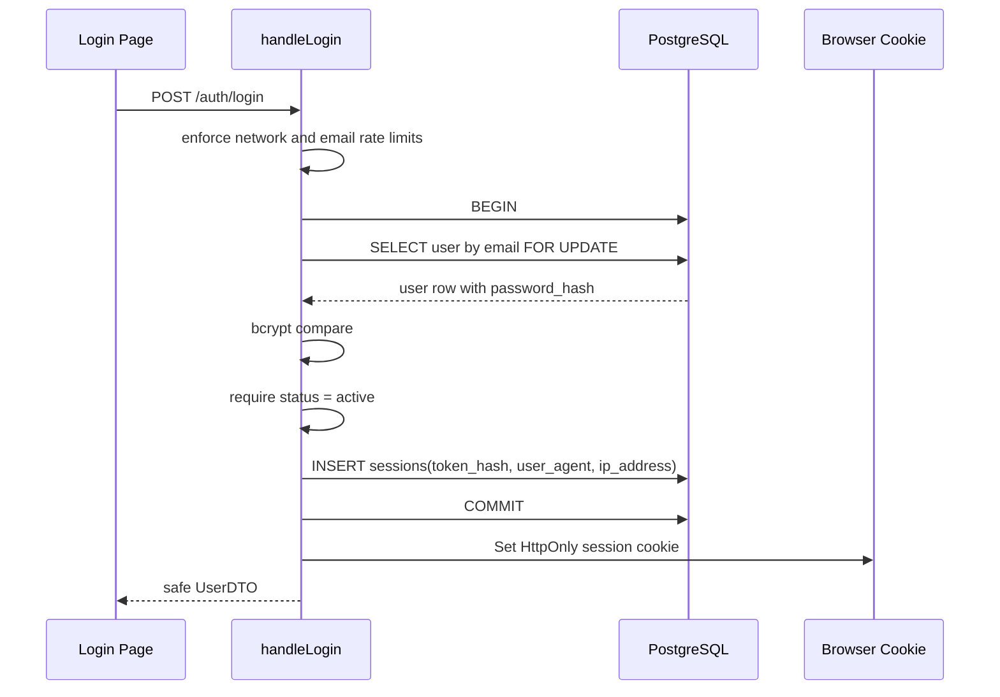
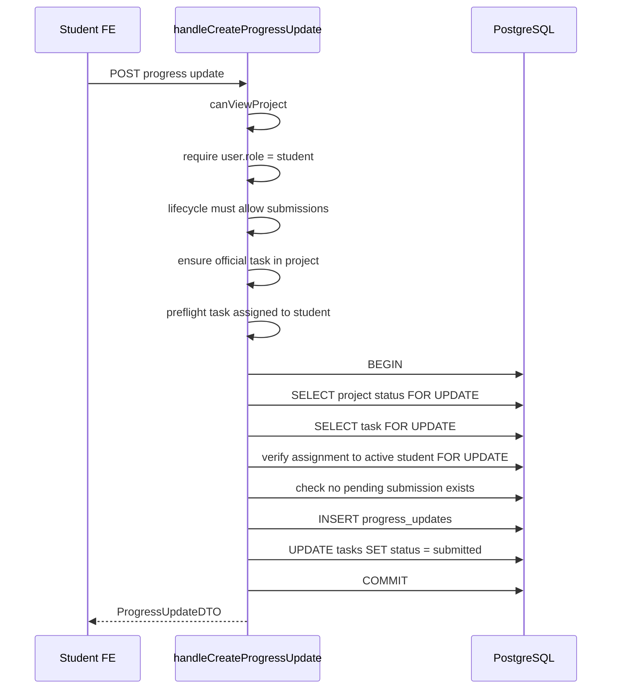
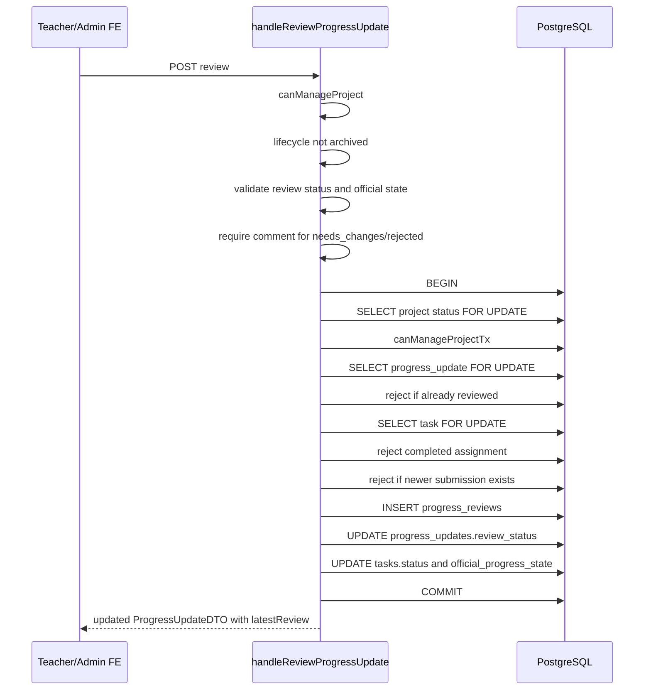

# API Flows Guide

Purpose: explain UniTrack's API routes, request sequences, frontend/backend handoff, transaction order, cache invalidation, and the flows that require the most focus.

Scope: this guide covers active REST APIs under `/api/v1`, the Go handlers in `apps/api/internal/app`, and the frontend API/query flow in `apps/web/src/features` and `apps/web/src/lib`. It explains sequence and behavior, not every UI detail.

## Fast Mental Model

UniTrack uses a REST API with cookie sessions.

```text
React frontend
  -> Axios client with credentials
  -> /api/v1 route
  -> trusted-origin middleware
  -> auth middleware for protected routes
  -> feature handler
  -> permission/lifecycle checks
  -> SQL transaction for writes
  -> PostgreSQL constraints/triggers
  -> JSON DTO back to frontend
  -> TanStack Query invalidation
```

If you only remember one rule, remember this:

```text
Frontend guards are UX. API and database rules are authority.
```

## Where The API Lives

| Concern | File |
| --- | --- |
| Route registration | `apps/api/internal/app/server.go` |
| Response and strict JSON helpers | `apps/api/internal/app/response.go` |
| Auth/session flow | `apps/api/internal/app/auth.go` |
| Trusted origin, CORS, client IP | `apps/api/internal/app/security.go` |
| Project permissions | `apps/api/internal/app/permissions.go` |
| Pagination | `apps/api/internal/app/pagination.go` |
| DTOs returned to frontend | `apps/api/internal/app/types.go` |
| Frontend API types | `apps/web/src/types/api.ts` |
| Axios setup | `apps/web/src/lib/axios.ts` |
| Query keys | `apps/web/src/lib/query-keys.ts` |
| Query invalidation | `apps/web/src/lib/query-invalidation.ts` |

## Common Request Pipeline

Every product API route lives under `/api/v1`.



Important pipeline details:

| Step | Why It Exists |
| --- | --- |
| `middleware.RequestID` | Correlates logs with requests. |
| `middleware.Recoverer` | Turns panics into `500` instead of crashing the API. |
| CORS with credentials | Allows frontend origin to send cookie-backed requests. |
| `requireTrustedOrigin` | Blocks unsafe cookie-bearing requests from untrusted origins. |
| `requireAuth` | Loads active user from cookie session for protected routes. |
| Feature handler | Performs role, relationship, lifecycle, validation, SQL, and DTO response. |

## Response Rules

Success response shape depends on the route.

```json
{
  "id": "...",
  "name": "..."
}
```

Error response shape is usually:

```json
{
  "error": "human readable message"
}
```

Some admin account transition errors include more data:

```json
{
  "error": "Choose a replacement supervisor...",
  "code": "account_transition_required",
  "impact": {
    "requiresReplacementSupervisor": true,
    "openProjectCount": 2
  }
}
```

Strict JSON rules from `response.go`:

| Rule | Meaning |
| --- | --- |
| `MaxBytesReader` at `1 MB` | Large JSON bodies are rejected. |
| `DisallowUnknownFields()` | Unknown request fields are rejected. |
| Single JSON value only | Extra trailing JSON values are rejected. |
| Route IDs validated before SQL in most handlers | Bad UUIDs produce stable `400`. |

Common HTTP statuses:

| Status | Meaning In This Project |
| --- | --- |
| `200` | Read/update/delete succeeded. |
| `201` | Create succeeded. |
| `400` | Bad input, invalid UUID, invalid enum, invalid dates. |
| `401` | Missing or invalid session. |
| `403` | Authenticated but not allowed by role/relationship. |
| `404` | Entity not found in allowed scope. |
| `409` | Valid request conflicts with lifecycle, pending review, reviewed immutability, duplicate uniqueness, or account transition requirements. |
| `500` | Unexpected server/database/storage error. |
| `503` | Database is not configured or ready. |

## Pagination Rules

Most list endpoints return paginated responses when `page` or `limit` exists.

```json
{
  "items": [],
  "page": 1,
  "limit": 50,
  "total": 123
}
```

Pagination details:

| Rule | Meaning |
| --- | --- |
| `page` defaults to `1` | Page numbers start at 1. |
| `limit` has a route-specific default and max | Example: projects default 24 and max 200. |
| Invalid/overflow page or limit returns `400` | Prevents unsafe SQL offsets. |
| Some nested lists still support legacy arrays | If no `page` or `limit`, older routes can return arrays. |

## Route Catalog

### Public And Health Routes

| Method | Route | Handler | Purpose |
| --- | --- | --- | --- |
| `GET` | `/` | inline | Service banner. |
| `GET` | `/api/v1/health` | `handleHealth` | Process liveness. |
| `GET` | `/api/v1/ready` | `handleReady` | Database readiness. |
| `POST` | `/api/v1/auth/login` | `handleLogin` | Create session cookie. |
| `POST` | `/api/v1/auth/logout` | `handleLogout` | Revoke session and clear cookie. |

### Protected Auth And Admin Routes

| Method | Route | Handler | FE API |
| --- | --- | --- | --- |
| `GET` | `/api/v1/auth/me` | `handleMe` | `features/auth/api.ts` |
| `GET` | `/api/v1/admin/users` | `handleAdminListUsers` | `features/admin/api.ts` |
| `POST` | `/api/v1/admin/users` | `handleAdminCreateUser` | `features/admin/api.ts` |
| `PATCH` | `/api/v1/admin/users/{userId}` | `handleAdminUpdateUser` | `features/admin/api.ts` |
| `POST` | `/api/v1/admin/users/{userId}/password` | `handleAdminSetUserPassword` | `features/admin/api.ts` |

### Dashboard And Workspace Routes

| Method | Route | Handler | FE API |
| --- | --- | --- | --- |
| `GET` | `/api/v1/dashboard` | `handleDashboard` | `features/dashboard/api.ts` |
| `GET` | `/api/v1/work` | `handleStudentWork` | `features/activity/api.ts` |
| `GET` | `/api/v1/search` | `handleGlobalSearch` | `features/activity/api.ts` |
| `GET` | `/api/v1/projects` | `handleListProjects` | `features/projects/api.ts` |
| `POST` | `/api/v1/projects` | `handleCreateProject` | `features/projects/api.ts` |
| `GET` | `/api/v1/projects/{projectId}` | `handleGetProject` | `features/projects/api.ts` |
| `PATCH` | `/api/v1/projects/{projectId}` | `handleUpdateProject` | `features/projects/api.ts` |
| `GET` | `/api/v1/classes` | `handleListCourseSections` | `features/classes/api.ts` |
| `POST` | `/api/v1/classes` | `handleCreateCourseSection` | `features/classes/api.ts` |
| `GET` | `/api/v1/classes/{classId}` | `handleGetCourseSection` | `features/classes/api.ts` |
| `PATCH` | `/api/v1/classes/{classId}` | `handleUpdateCourseSection` | `features/classes/api.ts` |
| `POST` | `/api/v1/classes/{classId}/projects` | `handleLinkCourseSectionProject` | `features/classes/api.ts` |

### Project Team Routes

| Method | Route | Handler | FE API |
| --- | --- | --- | --- |
| `GET` | `/api/v1/projects/{projectId}/members` | `handleListProjectMembers` | `features/projects/api.ts` |
| `POST` | `/api/v1/projects/{projectId}/members` | `handleAddProjectMember` | `features/projects/api.ts` |
| `PATCH` | `/api/v1/projects/{projectId}/members/{memberId}` | `handleUpdateProjectMember` | `features/projects/api.ts` |
| `DELETE` | `/api/v1/projects/{projectId}/members/{memberId}` | `handleRemoveProjectMember` | `features/projects/api.ts` |

### Work Plan And Assignment Routes

| Method | Route | Handler | FE API |
| --- | --- | --- | --- |
| `GET` | `/api/v1/projects/{projectId}/milestones` | `handleListMilestones` | `features/projects/api.ts` |
| `POST` | `/api/v1/projects/{projectId}/milestones` | `handleCreateMilestone` | `features/projects/api.ts` |
| `PATCH` | `/api/v1/projects/{projectId}/milestones/reorder` | `handleReorderMilestones` | `features/projects/api.ts` |
| `PATCH` | `/api/v1/projects/{projectId}/milestones/{milestoneId}` | `handleUpdateMilestone` | `features/projects/api.ts` |
| `DELETE` | `/api/v1/projects/{projectId}/milestones/{milestoneId}` | `handleDeleteMilestone` | `features/projects/api.ts` |
| `GET` | `/api/v1/projects/{projectId}/tasks` | `handleListTasks` | `features/projects/api.ts` |
| `POST` | `/api/v1/projects/{projectId}/tasks` | `handleCreateTask` | `features/tasks/api.ts` |
| `GET` | `/api/v1/projects/{projectId}/tasks/{taskId}` | `handleGetTask` | `features/tasks/api.ts` |
| `PATCH` | `/api/v1/projects/{projectId}/tasks/{taskId}` | `handleUpdateTask` | `features/tasks/api.ts` |
| `POST` | `/api/v1/projects/{projectId}/tasks/{taskId}/status-adjustments` | `handleAdjustTaskStatus` | `features/tasks/api.ts` |

### Submission, Resource, And Evidence Routes

| Method | Route | Handler | FE API |
| --- | --- | --- | --- |
| `GET` | `/api/v1/projects/{projectId}/progress-updates` | `handleListProjectProgressUpdates` | `features/projects/api.ts` |
| `POST` | `/api/v1/projects/{projectId}/tasks/{taskId}/progress-updates` | `handleCreateProgressUpdate` | `features/tasks/api.ts` |
| `POST` | `/api/v1/projects/{projectId}/progress-updates/{updateId}/reviews` | `handleReviewProgressUpdate` | `features/tasks/api.ts` |
| `GET` | `/api/v1/projects/{projectId}/resource-links` | `handleListResourceLinks` | `features/projects/api.ts` |
| `POST` | `/api/v1/projects/{projectId}/resource-links` | `handleCreateResourceLink` | `features/projects/api.ts` |
| `PATCH` | `/api/v1/projects/{projectId}/resource-links/{resourceLinkId}` | `handleUpdateResourceLink` | `features/projects/api.ts` |
| `DELETE` | `/api/v1/projects/{projectId}/resource-links/{resourceLinkId}` | `handleDeleteResourceLink` | `features/projects/api.ts` |
| `GET` | `/api/v1/projects/{projectId}/files` | `handleListUploadedFiles` | `features/files/api.ts` |
| `POST` | `/api/v1/projects/{projectId}/progress-updates/{updateId}/files` | `handleUploadProgressFile` | `features/files/api.ts` |
| `GET` | `/api/v1/projects/{projectId}/files/{fileId}/download` | `handleDownloadUploadedFile` | `features/files/api.ts` |
| `DELETE` | `/api/v1/projects/{projectId}/files/{fileId}` | `handleDeleteUploadedFile` | `features/files/api.ts` |

## Access Model

Project access is central.

| Actor | Can View Project When | Can Manage Project When |
| --- | --- | --- |
| Admin | Project exists. | Project exists. |
| Teacher | `projects.supervisor_id = user.id`. | `projects.supervisor_id = user.id`. |
| Student | `project_members` contains `(project_id, student_id)`. | Never. |

Important functions:

| Function | Purpose |
| --- | --- |
| `canViewProject` | Preflight project visibility check. |
| `canManageProject` | Preflight project manager check. |
| `canViewProjectTx` | Transaction-time visibility recheck with active user lock. |
| `canManageProjectTx` | Transaction-time manager recheck with active user lock. |
| `requireProjectManagerTx` | Converts failed manager check into a standard error. |

Focus point:

```text
Preflight checks are for clear UX errors. Transaction checks are for correctness under races.
```

## Lifecycle Model By API Action

Project status controls write behavior.

| Function | Allows Status | Used For |
| --- | --- | --- |
| `projectAcceptsMetadataChanges` | Not `archived` | Project metadata, folder movement. |
| `projectAcceptsPlanChanges` | `active`, `on_hold` | Milestones, assignment edits, manual status adjustments. |
| `projectAcceptsNewAssignments` | `active` | Creating assignments. |
| `projectAcceptsStudentSubmissions` | `active` | Student submissions and evidence uploads. |
| `projectAcceptsReviews` | Not `archived` | Reviewing pending submissions. |
| `projectAcceptsTeamChanges` | `active`, `on_hold` | Project member changes. |
| `projectAcceptsSupportChanges` | `active`, `on_hold` | Resource links and evidence deletes. |

Lifecycle checks usually happen twice on writes:

```text
1. Preflight read: clear HTTP error before transaction.
2. Transaction lock: SELECT status FROM projects WHERE id = $1 FOR UPDATE.
```

Focus point:

```text
If a write route changes project-scoped data, look for requireProjectLifecycleTx or lockProjectLifecycleTx.
```

## Frontend API And Cache Sequence

Frontend API functions are thin wrappers around Axios.



Global Axios behavior:

| Condition | Frontend Behavior |
| --- | --- |
| `401` from protected route | Clears auth store, removes queries, redirects to `/login?from=...`. |
| `401` from `/auth/login` or `/auth/me` | Does not force redirect loop. |
| Error JSON `{ error }` | `getErrorMessage()` shows message in toast/form. |
| Error JSON with `code` and `impact` | Admin account UI can show transition requirements. |

Key invalidation helpers:

| Helper | Refreshes |
| --- | --- |
| `invalidateWorkspaceData` | Current user, dashboard, projects, classes. |
| `invalidateAdminAccountImpactData` | Admin users plus workspace data. |
| `invalidateClassData` | Class list/detail/project candidates plus workspace. |
| `invalidateProjectData` | Project detail, members, milestones, tasks, progress, resources, files, workspace. |
| `invalidateAssignmentWorkflowData` | Task detail, project progress, project detail, tasks, milestones, workspace. |
| `invalidateProjectSupportData` | Resource links, project, tasks, milestones, workspace. |
| `invalidateProjectEvidenceData` | Files, project, progress, tasks, milestones, workspace. |

Stale errors:

```text
403 or 409 usually means permission/lifecycle changed after the UI loaded.
```

The frontend responds by invalidating affected queries so stale buttons and counts disappear.

## Read Path Pattern

Most reads follow this shape:

```text
1. Get current user from request context.
2. Validate route UUIDs when needed.
3. Check role/project/folder access.
4. Parse query params such as page, limit, search, status.
5. Run SQL list/detail query.
6. Map rows to DTOs.
7. Return JSON.
```

Example read:

```text
GET /api/v1/projects/{projectId}/tasks?limit=500&page=1
```

Sequence:

```text
requireAuth
  -> canViewProject
  -> parsePaginationParams
  -> listProjectTasksPage
  -> loadTaskAssigneesForTasks
  -> paginatedResponse<TaskDTO>
```

## Write Path Pattern

Most project-scoped writes follow this safer shape:

```text
1. Get current user from request context.
2. Validate route IDs and request JSON.
3. Preflight access check for user-friendly 403/404/409.
4. Begin transaction.
5. Lock project lifecycle row with SELECT ... FOR UPDATE.
6. Recheck actor permission inside transaction.
7. Lock target rows with FOR UPDATE when stale state matters.
8. Write rows.
9. Let DB constraints/triggers enforce invariants.
10. Commit.
11. Reload DTO after commit.
12. Return JSON.
```

Focus point:

```text
The DTO is usually reloaded after commit so frontend receives derived counts and latest joined names.
```

## Flow 1: Login And Session

Endpoint:

```text
POST /api/v1/auth/login
```

Request:

```json
{
  "email": "teacher@example.com",
  "password": "password123"
}
```

Backend sequence:



Important details:

| Detail | Why It Matters |
| --- | --- |
| Missing account uses dummy bcrypt check | Reduces timing clues for attackers. |
| Session stores `token_hash`, not raw token | DB leak does not expose cookie token directly. |
| `findUserByEmailTx` uses `FOR UPDATE` | Admin deactivation cannot race login. |
| Inactive users cannot log in | Account status is authoritative. |

Frontend sequence:

```text
login-page.tsx
  -> login() in features/auth/api.ts
  -> onSuccess set auth store user
  -> navigate to requested route or dashboard
```

## Flow 2: Authenticated Request

Protected endpoint example:

```text
GET /api/v1/projects
```

Backend sequence:

```text
Request cookie
  -> hash token
  -> SELECT session JOIN users
  -> require session not expired
  -> require session not revoked
  -> require user.status = active
  -> update sessions.last_seen_at
  -> put User into request context
  -> handler reads currentUser(r)
```

Focus point:

```text
Handlers trust currentUser only after requireAuth. Sensitive writes still recheck role/status inside the transaction.
```

## Flow 3: Dashboard Load

Endpoint:

```text
GET /api/v1/dashboard
```

Backend sequence:

```text
handleDashboard
  -> dashboardStats(user)
  -> dashboardProjects(user, 16)
  -> dashboardTasks(user, 8)
  -> dashboardProgressUpdates(user, 8)
  -> DashboardDTO
```

Role differences:

| Role | Dashboard Meaning |
| --- | --- |
| Admin | Global project/task/review/user counts and global attention queues. |
| Teacher | Supervised project counts and teacher review/overdue queues. |
| Student | Member project counts, assigned work, own submissions. |

Focus point:

```text
Dashboard is a read-only aggregation route. It does not mutate state but joins many tables.
```

## Flow 4: Workspace Load

Frontend route:

```text
/workspace
```

Common frontend data sequence:

```text
load current user
  -> load dashboard summary
  -> load projects page
  -> if teacher/admin, load folders/classes
```

Backend routes involved:

| Data | Endpoint |
| --- | --- |
| Projects | `GET /api/v1/projects` |
| Folders | `GET /api/v1/classes` |
| Dashboard | `GET /api/v1/dashboard` |
| Work history / people pages | `GET /api/v1/work`, `GET /api/v1/work?studentId=:id`, `GET /api/v1/work?teacherId=:id` |
| Global navigation search | `GET /api/v1/search?q=ab` |

Filtering examples:

| Query | Meaning |
| --- | --- |
| `/projects?search=abc` | Search name/topic/description/supervisor/folder/status/state. |
| `/projects?unassigned=true` | Projects not in any folder. |
| `/projects?excludeArchived=true` | Hide archived projects. |
| `/classes?status=active` | Active folders only. |
| `/search?q=ab` | Accessible global student, folder, and project navigation results. |

## Flow 5: Create Project With Optional Folder

Endpoint:

```text
POST /api/v1/projects
```

Request shape:

```json
{
  "name": "Capstone AI Tracker",
  "description": "Track team work",
  "topic": "AI",
  "classId": "optional-folder-id",
  "supervisorId": "admin-only-optional-supervisor-id",
  "startDate": "2026-07-10",
  "endDate": "2026-09-10",
  "status": "active"
}
```

Backend sequence:

```text
handleCreateProject
  -> require actor can create project: admin or teacher
  -> strict JSON decode
  -> validate name/status/dates
  -> choose supervisor: teacher self or admin-selected supervisor
  -> preflight ensure supervisor is active teacher/admin
  -> preflight folder access and folder owner match if classId exists
  -> BEGIN
  -> lock active workspace actor FOR UPDATE
  -> recheck supervisor active teacher/admin FOR UPDATE
  -> validate folder for project inside transaction
  -> INSERT projects
  -> optionally INSERT course_section_projects
  -> COMMIT
  -> reload ProjectDTO
  -> 201 ProjectDTO
```

Focus points:

| Focus | Reason |
| --- | --- |
| Teachers cannot assign another supervisor | Only admins can use `supervisorId`. |
| Folder owner must match supervisor | Prevents another teacher's folder from containing this project. |
| Project DTO is reloaded after commit | Derived counts and folder fields are returned consistently. |

Frontend cache after success:

```text
dashboard
projects
classes
class(classId) if used
classProjectCandidates(classId) if used
```

## Flow 6: Update Project Or Move Folder

Endpoint:

```text
PATCH /api/v1/projects/{projectId}
```

Backend sequence:

```text
handleUpdateProject
  -> preflight canManageProject
  -> decode patch body
  -> BEGIN
  -> SELECT project FOR UPDATE
  -> requireProjectManagerTx
  -> block non-status edits if project is archived
  -> validate next fields
  -> if classId present, validate folder access and owner match
  -> UPDATE projects
  -> if classId empty, DELETE course_section_projects link
  -> if classId provided, UPSERT course_section_projects
  -> COMMIT
  -> reload ProjectDTO
```

Focus points:

| Focus | Reason |
| --- | --- |
| Empty `classId` unlinks folder | The frontend can move a project out of folders. |
| Archive restrictions are action-specific | Archived projects are read-only except status reactivation paths. |
| Folder upsert uses unique project link | One project can be in only one folder. |

## Flow 7: Folder Creation And Project Movement

Folder endpoints:

```text
POST /api/v1/classes
PATCH /api/v1/classes/{classId}
POST /api/v1/classes/{classId}/projects
```

Create folder sequence:

```text
teacher/admin only
  -> validate title/status/color
  -> owner defaults to actor unless admin selects ownerTeacherId
  -> ensure owner is active teacher/admin
  -> BEGIN
  -> lock active workspace actor
  -> recheck owner
  -> INSERT course_sections
  -> COMMIT
  -> return CourseSectionDTO
```

Move project into folder sequence:

```text
handleLinkCourseSectionProject
  -> canManageCourseSection
  -> decode projectId
  -> canManageProject
  -> lifecycle allows metadata changes
  -> canUseCourseSectionForProject
  -> classOwnerMatchesProjectSupervisor
  -> BEGIN
  -> lock project lifecycle
  -> requireProjectManagerTx
  -> validateCourseSectionForProjectTx
  -> UPSERT course_section_projects by project_id
  -> COMMIT
  -> return folder detail
```

Focus point:

```text
The folder API path says classes, but product behavior is folder organization only.
```

## Flow 8: Admin Account Transition

Admin endpoints:

```text
POST /api/v1/admin/users
PATCH /api/v1/admin/users/{userId}
POST /api/v1/admin/users/{userId}/password
```

Why this flow is complex:

```text
Changing an account role/status can orphan projects, folders, memberships, assignments, or active sessions.
```

Create user sequence:

```text
requireAdmin
  -> validate fullName/email/password/role/status
  -> hash password
  -> BEGIN
  -> pg_advisory_xact_lock(adminAccountMutationLockKey)
  -> requireActiveAdminActorTx
  -> INSERT users
  -> INSERT activity_logs
  -> COMMIT
  -> return UserDTO
```

Update user sequence:

```text
requireAdmin
  -> validate userId and patch body
  -> BEGIN
  -> admin advisory lock
  -> requireActiveAdminActorTx
  -> SELECT target user FOR UPDATE
  -> compute next role/status/name
  -> protect actor from removing own active admin access
  -> protect last active admin
  -> accountTransitionImpactTx
  -> if replacement/cleanup needed and not confirmed, return 409 with impact
  -> validate replacement supervisor when needed
  -> UPDATE users
  -> revoke sessions if target becomes inactive
  -> reassign open teacher responsibilities if needed
  -> remove active student responsibilities if confirmed
  -> INSERT activity_logs
  -> COMMIT
  -> return UserDTO
```

Transition impact checks:

| User Change | Checks |
| --- | --- |
| Teacher/admin loses supervisor capability | Open projects and active folders. |
| Student loses student capability | Active project memberships and active assignment links. |
| Admin loses active admin capability | At least one other active admin must remain. |

Frontend behavior for transition conflict:

```text
PATCH admin user
  -> 409 account_transition_required
  -> UI shows impact counts
  -> admin chooses replacement supervisor and/or confirms cleanup
  -> PATCH again with replacementSupervisorId and confirmStudentCleanup
```

Focus points:

| Focus | Reason |
| --- | --- |
| Advisory lock | Serializes sensitive admin mutations across API instances. |
| Sessions revoked on deactivation/password reset | Prevents stale access. |
| Reassignment happens in same transaction | Avoids orphaned active work. |
| Activity logs record the transition | Auditability. |

## Flow 9: Project Detail Load

Frontend route:

```text
/workspace/projects/:projectId
```

Common data sequence:

```text
GET /projects/{projectId}
GET /projects/{projectId}/members
GET /projects/{projectId}/milestones
GET /projects/{projectId}/tasks
GET /projects/{projectId}/progress-updates
GET /projects/{projectId}/resource-links
GET /projects/{projectId}/files
```

Query keys:

| Data | Query Key |
| --- | --- |
| Project detail | `queryKeys.project(projectId)` |
| Members | `queryKeys.projectMembers(projectId)` |
| Milestones | `queryKeys.projectMilestones(projectId)` |
| Assignments | `queryKeys.projectTasks(projectId)` |
| Submissions | `queryKeys.projectProgress(projectId)` |
| Resources | `queryKeys.projectResourceLinks(projectId)` |
| Files | `queryKeys.projectFiles(projectId)` |

Focus point:

```text
Project detail is a composition of several independent API calls. A mutation must invalidate all affected slices.
```

## Flow 10: Create Milestone And Reorder Work Plan

Create endpoint:

```text
POST /api/v1/projects/{projectId}/milestones
```

Create sequence:

```text
handleCreateMilestone
  -> preflight canManageProject
  -> lifecycle allows plan changes
  -> decode title/description/targetDate/sortOrder
  -> createMilestone helper
  -> BEGIN
  -> lock project lifecycle
  -> requireProjectManagerTx
  -> compute next sortOrder if not supplied
  -> INSERT project_milestones
  -> COMMIT
  -> reload MilestoneDTO
```

Reorder endpoint:

```text
PATCH /api/v1/projects/{projectId}/milestones/reorder
```

Reorder sequence:

```text
validate milestoneIds non-empty
  -> reject duplicates and blank IDs
  -> BEGIN
  -> lock project lifecycle
  -> requireProjectManagerTx
  -> SELECT all project milestones FOR UPDATE
  -> require submitted list includes every project milestone exactly once
  -> update sort_order by list order
  -> COMMIT
  -> return full milestone list
```

Focus point:

```text
Reorder is all-or-nothing. The submitted array must contain every checkpoint in the project.
```

## Flow 11: Create Assignment

Endpoint:

```text
POST /api/v1/projects/{projectId}/tasks
```

Request shape:

```json
{
  "title": "Build prototype",
  "description": "Create a working demo",
  "status": "todo",
  "priority": "high",
  "deadline": "2026-08-01",
  "milestoneId": "milestone-id",
  "assigneeIds": ["student-id"]
}
```

Backend sequence:

```text
handleCreateTask
  -> preflight canManageProject
  -> lifecycle must be active for new assignments
  -> decode strict JSON
  -> validate title/status/priority/deadline/milestone
  -> BEGIN
  -> lock project lifecycle for creating assignments
  -> requireProjectManagerTx
  -> ensure milestone belongs to project
  -> INSERT tasks with parent_task_id NULL
  -> for each assignee: validate active project member student, then INSERT task_assignees
  -> COMMIT
  -> reload TaskDetailDTO
```

Focus points:

| Focus | Reason |
| --- | --- |
| New assignments require `active` project | On-hold projects can edit plan but cannot create new assignments. |
| Milestone is required | Official assignment must belong to a checkpoint. |
| Assignees must be active project members | Prevents assigning outsiders/inactive students. |
| New assignment cannot start completed | Completion must be review/manual status flow. |

Frontend invalidation:

```text
projectTasks(projectId)
project(projectId)
projectMilestones(projectId)
projects
classes
dashboard
```

## Flow 12: Update Assignment

Endpoint:

```text
PATCH /api/v1/projects/{projectId}/tasks/{taskId}
```

Backend sequence:

```text
handleUpdateTask
  -> validate taskId
  -> preflight canManageProject
  -> lifecycle allows plan changes
  -> decode patch body
  -> BEGIN
  -> lock project lifecycle
  -> requireProjectManagerTx
  -> SELECT task FOR UPDATE where parent_task_id IS NULL
  -> compute next fields
  -> validate milestone in project
  -> validate task status and official progress state
  -> reject contradictory status/state
  -> reject reopening completed assignment
  -> if marking complete, require no pending submissions
  -> UPDATE tasks
  -> if assigneeIds present, replace task_assignees
  -> COMMIT
  -> reload TaskDetailDTO
```

Focus point:

```text
Assignment state has two fields: tasks.status and tasks.official_progress_state. They must not contradict each other.
```

Contradiction examples:

| Bad Combination | Why |
| --- | --- |
| `status = done`, `official_progress_state != completed` | Done must mean officially completed. |
| `status != done`, `official_progress_state = completed` | Completed official state must use done status. |

## Flow 13: Student Submission

Endpoint:

```text
POST /api/v1/projects/{projectId}/tasks/{taskId}/progress-updates
```

Request shape:

```json
{
  "title": "Week 2 update",
  "description": "Implemented authentication and project page.",
  "blockers": "Need review on data model."
}
```

Backend sequence:



Database backstops:

| Rule | Enforced By |
| --- | --- |
| Submitter is active assigned student | `ensure_progress_update_submitter_assigned()` trigger. |
| Submission targets official assignment | Same trigger requires `tasks.parent_task_id IS NULL`. |
| One pending submission per assignment | `progress_updates_one_pending_per_task_unique`. |
| Submission task belongs to project | Composite FK `(project_id, task_id)`. |

Focus points:

| Focus | Reason |
| --- | --- |
| Only students submit | Teachers/admins review, they do not submit as students. |
| Project must be active | On-hold/completed/archived projects reject new submissions. |
| Completed assignment rejects submissions | Finished work cannot receive new progress. |
| Existing pending submission blocks new one | Teacher must review first. |

## Flow 14: Evidence Upload

Endpoint:

```text
POST /api/v1/projects/{projectId}/progress-updates/{updateId}/files
```

Request type:

```text
multipart/form-data with field file
```

Backend sequence:

```text
handleUploadProgressFile
  -> validate updateId
  -> canViewProject
  -> lifecycle must allow student submissions
  -> preflight progress update exists and get submitter
  -> allow manager or submitter only
  -> ParseMultipartForm up to 10 MB
  -> sanitize original filename
  -> detect content type
  -> read bytes with max limit
  -> prepare generated stored filename and storage key
  -> validation transaction before storage write
  -> INSERT uploaded_file_object_cleanup_jobs(reason = upload_metadata_rollback)
  -> fileStore.Put bytes to local/R2 storage
  -> BEGIN metadata transaction
  -> lock project lifecycle
  -> recheck view permission, submitter/manager permission, pending review
  -> INSERT uploaded_files metadata
  -> mark cleanup job completed
  -> COMMIT
  -> reload UploadedFileDTO
```

Why this flow is extra complex:

```text
It crosses two systems: PostgreSQL metadata and object storage bytes.
```

Failure handling:

| Failure Point | Cleanup Behavior |
| --- | --- |
| Validation before object write fails | No object written. |
| Object write fails | Cleanup job is attempted and error returned. |
| Metadata insert fails after object write | Cleanup job remains pending/attempted for object deletion. |
| Delete metadata succeeds | New cleanup job with reason `metadata_deleted` removes object. |

Focus points:

| Focus | Reason |
| --- | --- |
| Upload target must be pending submission | Reviewed submissions cannot change evidence. |
| Manager or submitter can upload | Other project members cannot upload to someone else's submission. |
| File metadata hides `storage_path` | Frontend never receives object key. |
| 10 MB limit | Enforced before storage write. |

## Flow 15: Review Submission

Endpoint:

```text
POST /api/v1/projects/{projectId}/progress-updates/{updateId}/reviews
```

Request shape:

```json
{
  "reviewStatus": "needs_changes",
  "reviewComment": "Please include evidence for testing.",
  "officialProgressState": "needs_changes"
}
```

Backend sequence:



Review status rules:

| `reviewStatus` | Default `officialProgressState` | Comment Required |
| --- | --- | --- |
| `approved` | `in_progress` | No |
| `needs_changes` | `needs_changes` | Yes |
| `rejected` | `needs_changes` | Yes |

Manual official state can override defaults only if not contradictory:

| Review Decision | Allowed Official State |
| --- | --- |
| `approved` | `in_progress` or `completed` |
| `needs_changes` | `needs_changes` only |
| `rejected` | `needs_changes` only |

Focus points:

| Focus | Reason |
| --- | --- |
| Reviews allowed for completed projects but not archived projects | Pending review closure can continue after completion. |
| Submission must still be pending | Reviewed submission is final. |
| One review per submission | DB unique index backs this up. |
| Task state changes with review | Project and milestone rollups change after review. |
| Reviewed support freezes | Resource/evidence changes fail after review. |

## Flow 16: Resource Link Changes

Endpoints:

```text
POST /api/v1/projects/{projectId}/resource-links
PATCH /api/v1/projects/{projectId}/resource-links/{resourceLinkId}
DELETE /api/v1/projects/{projectId}/resource-links/{resourceLinkId}
```

Target types:

```text
project
milestone
task
progress_update
```

Create sequence:

```text
handleCreateResourceLink
  -> canViewProject
  -> lifecycle allows support changes
  -> decode strict JSON
  -> normalize URL and target
  -> BEGIN
  -> requireProjectSupportWriteTx
  -> canViewProjectTx
  -> ensure target belongs to project
  -> if progress_update target, require pending and manager/submitter
  -> INSERT resource_links
  -> COMMIT
  -> reload ResourceLinkDTO
```

Update/delete sequence adds:

```text
SELECT resource link FOR UPDATE
  -> if not project manager, require current.AddedBy == user.ID
  -> verify old target writable
  -> verify new target writable for updates
```

Focus points:

| Focus | Reason |
| --- | --- |
| Project-level link normalizes target to project/projectId | Avoids ambiguous target in API DTO. |
| Progress submission resources are special | Only submitter or manager can change them. |
| Reviewed submission resources are immutable | API and DB both enforce. |
| Duplicate URL per same target returns conflict | Unique target URL index backs this up. |

## Flow 17: Evidence Delete And Download

Download endpoint:

```text
GET /api/v1/projects/{projectId}/files/{fileId}/download
```

Download sequence:

```text
canViewProject
  -> get uploaded_files metadata in project
  -> open object from fileStore using storage_path
  -> stream bytes with Content-Disposition attachment
```

Delete endpoint:

```text
DELETE /api/v1/projects/{projectId}/files/{fileId}
```

Delete sequence:

```text
canViewProject
  -> lifecycle allows support changes
  -> BEGIN
  -> requireProjectSupportWriteTx
  -> canViewProjectTx
  -> SELECT uploaded_files FOR UPDATE
  -> if target is progress_update, require pending review
  -> if target is resource_link to progress_update, require pending review
  -> if not manager, require uploaded_by == user.id
  -> DELETE uploaded_files metadata
  -> INSERT uploaded_file_object_cleanup_jobs(reason = metadata_deleted)
  -> COMMIT
  -> process cleanup job soon
```

Focus point:

```text
Download checks view access only. Delete requires support-write rules and owner/manager checks.
```

## Flow 18: Manual Assignment Status Adjustment

Endpoint:

```text
POST /api/v1/projects/{projectId}/tasks/{taskId}/status-adjustments
```

Request shape:

```json
{
  "officialProgressState": "needs_changes",
  "reason": "Reopening after review discussion."
}
```

Backend sequence:

```text
handleAdjustTaskStatus
  -> canManageProject
  -> lifecycle allows plan changes
  -> validate target official state: in_progress, needs_changes, completed
  -> map official state to task status
  -> BEGIN
  -> lock project lifecycle
  -> requireProjectManagerTx
  -> SELECT task FOR UPDATE
  -> reject no-op
  -> require reason when completing, marking needs changes, or reopening completed
  -> reject if any pending submission exists
  -> UPDATE tasks status/state
  -> INSERT activity_logs(action = assignment.status_adjusted)
  -> COMMIT
  -> reload TaskDetailDTO
```

Focus point:

```text
Manual status adjustment cannot bypass pending reviews. Pending submissions must be reviewed first.
```

## Flow 19: Remove Project Member

Endpoint:

```text
DELETE /api/v1/projects/{projectId}/members/{memberId}
```

Backend sequence:

```text
canManageProject
  -> lifecycle allows team changes
  -> preflight block removing project supervisor
  -> BEGIN
  -> lock project lifecycle
  -> requireProjectManagerTx
  -> recheck supervisor is not being removed
  -> DELETE task_assignees for this student/project
  -> DELETE project_members row
  -> INSERT activity_logs with taskAssigneeLinksRemoved count
  -> COMMIT
```

Focus point:

```text
Removing a project member also removes active assignment links, but historical submissions remain readable.
```

## Source Map By Flow

| Flow | Backend Source | Frontend Source |
| --- | --- | --- |
| Login/current user | `auth.go` | `features/auth/*`, `lib/axios.ts`, `stores/auth-store.ts` |
| Admin accounts | `admin_users.go` | `features/admin/*` |
| Dashboard | `dashboard.go` | `features/dashboard/*` |
| Projects/team | `projects.go` | `features/projects/*` |
| Folders/classes | `classes.go` | `features/classes/*`, `features/workspace/*` |
| Milestones | `milestones.go` | `features/projects/*` |
| Assignments/submissions/reviews | `tasks.go` | `features/tasks/*` |
| Resources | `resources.go` | `features/resources/*`, `features/projects/api.ts` |
| Evidence files | `files.go`, `storage.go` | `features/files/*` |
| Permissions | `permissions.go` | UI affordances in feature pages/components |
| Response/pagination | `response.go`, `pagination.go` | `lib/pagination.ts`, `lib/axios.ts` |
| Cache invalidation | N/A | `lib/query-keys.ts`, `lib/query-invalidation.ts` |

## Request Body Cheat Sheet

| Endpoint | Key Body Fields |
| --- | --- |
| `POST /auth/login` | `email`, `password` |
| `POST /admin/users` | `fullName`, `email`, `password`, `role`, `status` |
| `PATCH /admin/users/{userId}` | `fullName`, `role`, `status`, `replacementSupervisorId`, `confirmStudentCleanup` |
| `POST /admin/users/{userId}/password` | `password` |
| `POST /projects` | `name`, `description`, `topic`, `classId`, `supervisorId`, `startDate`, `endDate`, `status` |
| `PATCH /projects/{projectId}` | Same as project create, plus `progressSummary`; all patch fields optional. |
| `POST /projects/{projectId}/members` | `email` |
| `PATCH /projects/{projectId}/members/{memberId}` | `memberRole` |
| `POST /classes` | `title`, `color`, `description`, `ownerTeacherId`, `status` |
| `PATCH /classes/{classId}` | `title`, `color`, `description`, `status` |
| `POST /classes/{classId}/projects` | `projectId` |
| `POST /projects/{projectId}/milestones` | `title`, `description`, `targetDate`, `sortOrder` |
| `PATCH /projects/{projectId}/milestones/{milestoneId}` | `title`, `description`, `targetDate`, `sortOrder` |
| `PATCH /projects/{projectId}/milestones/reorder` | `milestoneIds` |
| `POST /projects/{projectId}/tasks` | `title`, `description`, `status`, `priority`, `deadline`, `milestoneId`, `assigneeIds` |
| `PATCH /projects/{projectId}/tasks/{taskId}` | Same as task create, plus `officialProgressState`; all patch fields optional. |
| `POST /projects/{projectId}/tasks/{taskId}/status-adjustments` | `officialProgressState`, `reason` |
| `POST /projects/{projectId}/tasks/{taskId}/progress-updates` | `title`, `description`, `blockers` |
| `POST /projects/{projectId}/progress-updates/{updateId}/reviews` | `reviewStatus`, `reviewComment`, `officialProgressState` |
| `POST /projects/{projectId}/resource-links` | `relatedType`, `relatedId`, `title`, `url`, `type`, `description` |
| `PATCH /projects/{projectId}/resource-links/{resourceLinkId}` | Same as create; all patch fields optional. |
| `POST /projects/{projectId}/progress-updates/{updateId}/files` | Multipart field `file` |

## Error And Conflict Focus Points

| Error | Usually Means | What To Inspect |
| --- | --- | --- |
| `400 invalid ... id` | Route param is not UUID-shaped. | Frontend route params or API caller. |
| `400 unknown request field` | Body has a field not in request struct. | Feature `api.ts` input and Go request type. |
| `403 you do not have access` | Relationship or role check failed. | `permissions.go`, project membership/supervisor, folder owner. |
| `409 archived projects are read-only...` | Lifecycle changed or route not allowed for status. | Project status and lifecycle accept function. |
| `409 reviewed submissions cannot change...` | Submission is no longer pending. | `progress_updates.review_status`, resources/files UI state. |
| `409 this assignment already has a submission waiting for review` | Pending submission exists. | `progress_updates_one_pending_per_task_unique`. |
| `409 account_transition_required` | Admin account change needs replacement/cleanup. | `accountTransitionImpactTx`, frontend admin modal/state. |
| `500 could not save/load...` | Unexpected DB/storage path. | Handler SQL, migrations, storage config, logs. |

## Debugging Checklist

When an API flow is confusing, inspect in this order:

1. Route in `server.go`.
2. Request type struct at top of handler file.
3. Frontend API function in `features/*/api.ts`.
4. DTO type in `apps/web/src/types/api.ts` and `apps/api/internal/app/types.go`.
5. Preflight permission check in handler.
6. Lifecycle check function in `projects.go`.
7. Transaction block and `FOR UPDATE` locks.
8. SQL writes and reload query.
9. Database migration constraints/triggers for the touched tables.
10. Frontend invalidation helper after mutation success/error.

## Adding Or Changing An API Route

Use this checklist before changing routes.

| Step | Reason |
| --- | --- |
| Add route in `server.go` under `/api/v1`. | Keeps route surface explicit. |
| Put handler in owning feature file. | Keeps code slice-based. |
| Define strict request struct. | `decodeJSON` rejects unknown fields. |
| Validate route IDs before SQL. | Stable `400` for malformed IDs. |
| Preflight permission/lifecycle. | Clear UX errors. |
| Use transaction for writes. | Atomic state changes. |
| Lock project lifecycle row for project-scoped writes. | Prevent stale status races. |
| Recheck actor permission in transaction. | Prevent stale role/session races. |
| Lock target rows when current state matters. | Prevent double review, stale assignment state, stale support target. |
| Let DB constraints/triggers backstop invariants. | API checks are not enough. |
| Reload DTO after commit. | Return derived fields consistently. |
| Update `apps/web/src/types/api.ts`. | FE contracts are manual. |
| Add/update feature `api.ts` wrapper. | Frontend should not build URLs ad hoc. |
| Update query keys/invalidation if mutation affects visible data. | Avoid stale UI. |
| Update owning feature docs. | Durable behavior must be documented. |

## One-Sentence Summary

UniTrack APIs are thin REST routes with strict JSON, cookie auth, project-scoped permissions, lifecycle-aware transaction locks, database-backed integrity, and frontend query invalidation that refreshes every affected workspace slice after mutations.
