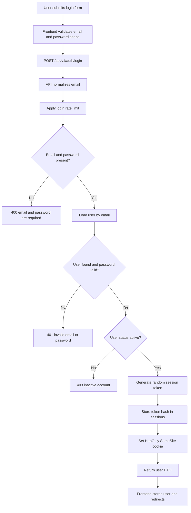
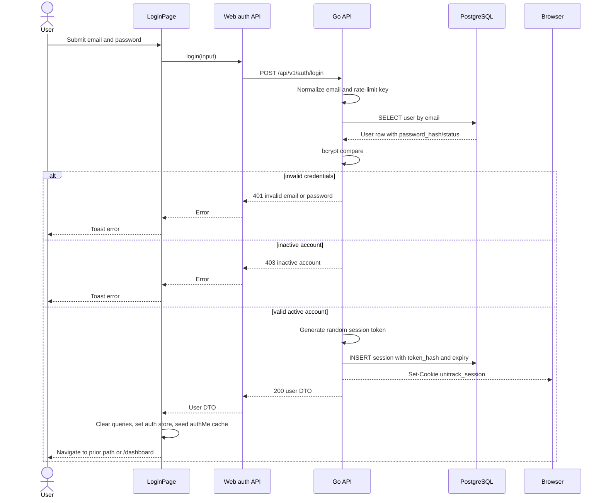
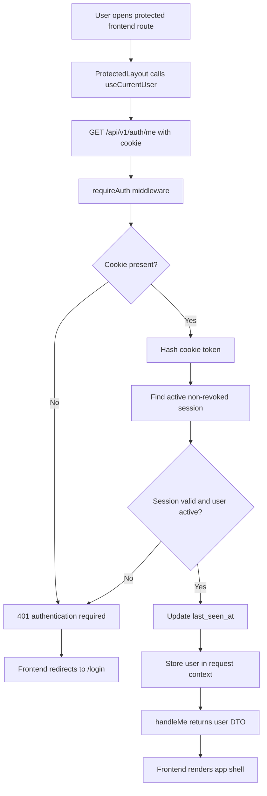
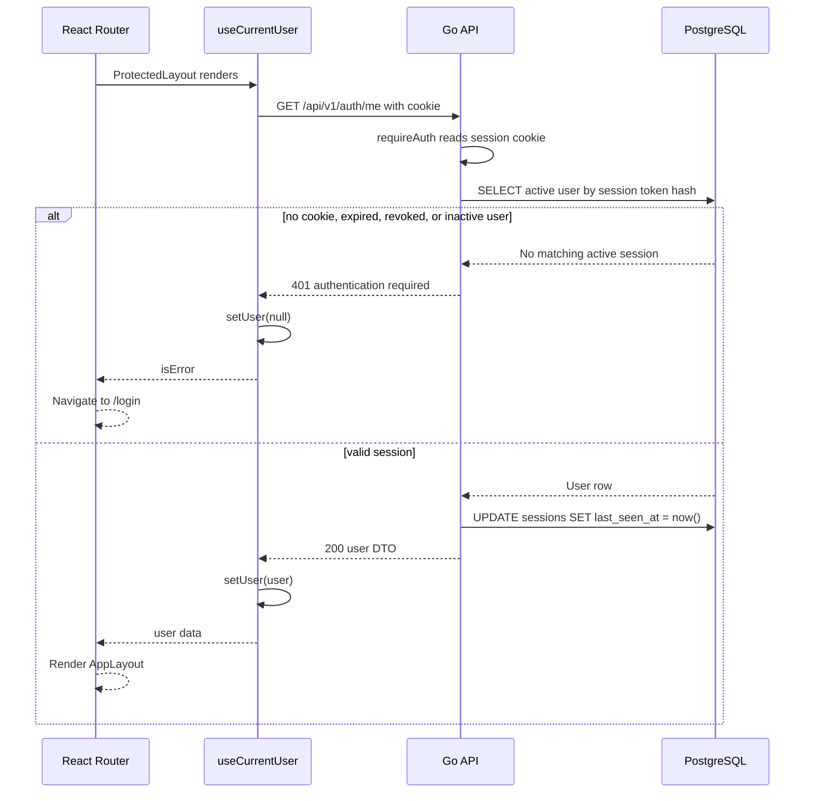
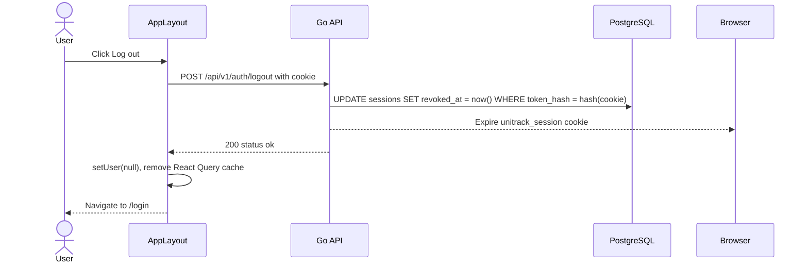
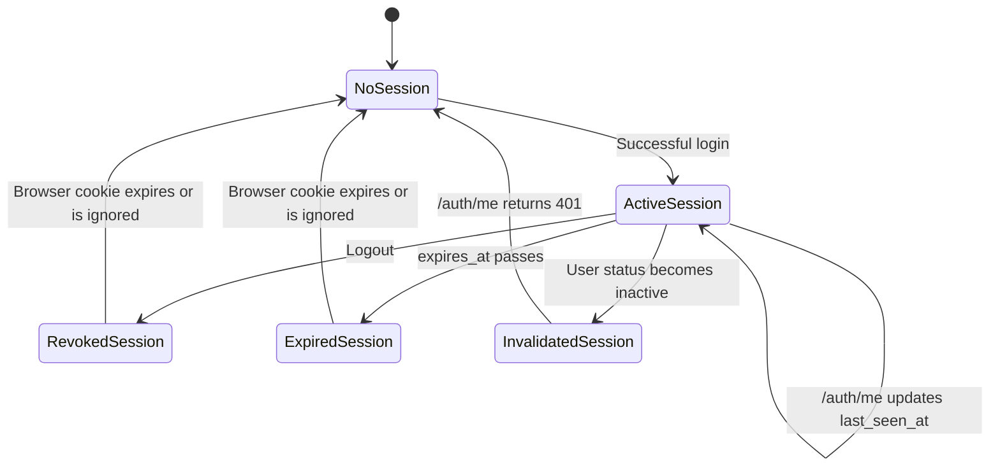
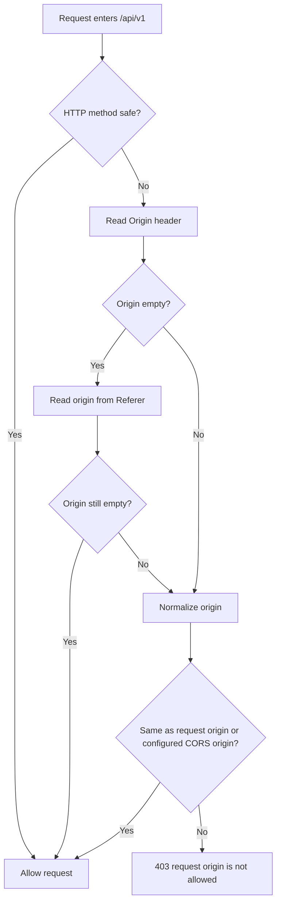

# Auth And Session Onboarding

This document explains the current UniTrack authentication and session implementation for engineers who need to maintain or extend it.

## Purpose

Auth/session provides the foundation for all protected UniTrack surfaces:

- Existing users sign in with email and password.
- The API creates a cookie-backed server session.
- The frontend checks `/auth/me` before rendering protected routes.
- Logout revokes the current session and clears the browser cookie.
- Inactive accounts cannot log in or use an existing session.
- Unsafe API requests pass through an origin guard.
- Login attempts are protected by an in-memory rate limit.

Account creation is not part of the login/session feature. Admin account management creates accounts, then auth/session handles sign-in and active-session enforcement.

## Current Status

| Capability                 | Status                 | Notes                                                                                  |
| -------------------------- | ---------------------- | -------------------------------------------------------------------------------------- |
| Email/password login       | Implemented            | Uses bcrypt password verification.                                                     |
| Server sessions            | Implemented            | Session cookie stores a raw random token; database stores only the SHA-256 token hash. |
| Current user lookup        | Implemented            | `GET /api/v1/auth/me` returns the authenticated active user.                           |
| Logout revocation          | Implemented            | `POST /api/v1/auth/logout` sets `sessions.revoked_at` and expires the cookie.          |
| Active-account gate        | Implemented            | Inactive users cannot log in; inactive users also fail session lookup.                 |
| Protected route middleware | Implemented            | `requireAuth` loads the session user and stores it on request context.                 |
| Frontend route protection  | Implemented            | Protected React routes call `useCurrentUser()` and redirect unauthenticated users.     |
| Origin guard               | Implemented foundation | Unsafe API methods reject untrusted `Origin` or `Referer` values.                      |
| Login rate limit           | Implemented foundation | 10 attempts per IP/email per 10 minutes in process memory.                             |
| Full CSRF token            | Not implemented        | Origin guard is present, but no synchronizer token or double-submit token exists.      |
| Password reset             | Not implemented        | Out of current scope.                                                                  |
| Frontend auth tests        | Missing/partial        | Backend lifecycle coverage exists; frontend route/component tests are still needed.    |

## User-Facing Behavior

| User action                                  | Expected result                                                                                              |
| -------------------------------------------- | ------------------------------------------------------------------------------------------------------------ |
| Open `/` with no valid session               | Redirect to `/login`.                                                                                        |
| Open `/` with a valid active session         | Redirect to `/dashboard`.                                                                                    |
| Open a protected route with no valid session | Redirect to `/login` with the attempted path in router state.                                                |
| Sign in with valid active account            | Session cookie is set, auth cache is updated, user is routed to the previous protected path or `/dashboard`. |
| Sign in with wrong credentials               | API returns `401`; frontend shows an error toast.                                                            |
| Sign in with inactive account                | API returns forbidden-style inactive-account error; no session row is created.                               |
| Click logout                                 | API revokes session, frontend clears auth/query state, user returns to `/login`.                             |
| Open auth-related public pages               | Login uses the subtle blue/ocean `AuthFrame` background.                                                     |

## API Contract

Base path: `/api/v1`

| Method | Endpoint       | Access        | Request                                   | Success                                       | Common Errors              |
| ------ | -------------- | ------------- | ----------------------------------------- | --------------------------------------------- | -------------------------- |
| `POST` | `/auth/login`  | Public        | `{ "email": string, "password": string }` | `200` user DTO and session cookie             | `400`, `401`, `403`, `429` |
| `GET`  | `/auth/me`     | Authenticated | Cookie only                               | `200` user DTO                                | `401`                      |
| `POST` | `/auth/logout` | Authenticated | Cookie only                               | `200` `{ "status": "ok" }` and expired cookie | `401`                      |

User DTO shape is defined in `apps/api/internal/app/response.go` and mirrored by `apps/web/src/types/api.ts`.

## Data Model

| Table      | Important Fields                                                                                                    | Purpose                                                                               |
| ---------- | ------------------------------------------------------------------------------------------------------------------- | ------------------------------------------------------------------------------------- |
| `users`    | `id`, `full_name`, `email`, `password_hash`, `role`, `status`, `avatar_url`, timestamps                             | Stores login identity, bcrypt password hash, role, and active/inactive account state. |
| `sessions` | `id`, `user_id`, `token_hash`, `expires_at`, `revoked_at`, `last_seen_at`, `user_agent`, `ip_address`, `created_at` | Stores server-side session records keyed by token hash.                               |

Relevant migrations:

| Migration                                         | Role                                                                         |
| ------------------------------------------------- | ---------------------------------------------------------------------------- |
| `20260601000100_init_mvp.sql`                     | Creates `users` and `sessions`.                                              |
| `20260604000100_session_revocation.sql`           | Adds `revoked_at`, `last_seen_at`, user agent, IP, and active-session index. |
| `20260607000200_case_insensitive_user_emails.sql` | Lowercases existing users and adds `users_email_lower_unique`.               |

## Backend Implementation Map

| File                                      | Responsibility                                                                                                          |
| ----------------------------------------- | ----------------------------------------------------------------------------------------------------------------------- |
| `apps/api/internal/app/server.go`         | Registers `/auth/login`, protected `/auth/me`, protected `/auth/logout`, CORS, origin guard, and protected route group. |
| `apps/api/internal/app/auth.go`           | Password hashing, login, current user, logout, session creation, session lookup, auth middleware.                       |
| `apps/api/internal/app/security.go`       | In-memory rate limiter and trusted-origin guard.                                                                        |
| `apps/api/internal/config/config.go`      | Session/CORS/auth-related environment variables.                                                                        |
| `apps/api/internal/app/bootstrap.go`      | Optional bootstrap admin creation from environment variables.                                                           |
| `apps/api/internal/app/lifecycle_test.go` | Backend regression coverage for auth/session basics.                                                                    |

Important functions:

| Function                 | What It Does                                                                                      |
| ------------------------ | ------------------------------------------------------------------------------------------------- |
| `handleLogin`            | Normalizes email, rate-limits login, verifies password, blocks inactive account, creates session. |
| `createSession`          | Generates random token, stores SHA-256 hash, sets HttpOnly SameSite cookie.                       |
| `findUserBySessionToken` | Looks up non-expired, non-revoked session for an active user.                                     |
| `requireAuth`            | Requires session cookie, loads user, updates `last_seen_at`, places user in request context.      |
| `handleMe`               | Returns current context user.                                                                     |
| `handleLogout`           | Revokes current session hash and expires browser cookie.                                          |
| `requireTrustedOrigin`   | Rejects unsafe requests from untrusted origins.                                                   |
| `enforceRateLimit`       | Applies per-key in-memory request windows.                                                        |

## Frontend Implementation Map

| File                                              | Responsibility                                                        |
| ------------------------------------------------- | --------------------------------------------------------------------- |
| `apps/web/src/features/auth/api.ts`               | Auth API calls for login, logout, and current user.                  |
| `apps/web/src/features/auth/hooks.ts`             | `useCurrentUser()` query and auth-store synchronization.              |
| `apps/web/src/features/auth/components/auth-frame.tsx` | Shared auth page frame with subtle blue/ocean background accents. |
| `apps/web/src/features/auth/pages/login-page.tsx` | Login form, safe redirect handling, cache/store update after login.   |
| `apps/web/src/app/router.tsx`                     | Root redirect, protected layout, teacher/admin guard.                 |
| `apps/web/src/stores/auth-store.ts`               | Minimal Zustand auth user store.                                      |
| `apps/web/src/components/layout/app-layout.tsx`   | Logout action, query clearing, app shell.                             |

## Login Flow

## Login Sequence

## Protected Route Flow

## Current User Sequence

## Logout Sequence

## Session State Diagram

## Origin Guard Flow

Implementation note: unsafe requests with no `Origin` and no parseable `Referer` are currently allowed so non-browser clients and tests can still work.

## Security Controls

| Control                  | Current Implementation                            | Notes                                                               |
| ------------------------ | ------------------------------------------------- | ------------------------------------------------------------------- |
| Password hashing         | bcrypt                                            | `hashPassword` enforces at least 8 characters when creating hashes. |
| Session token generation | 32 random bytes, base64url encoded                | `generateToken` uses `crypto/rand`.                                 |
| Token storage            | SHA-256 hash only                                 | Raw token is stored only in the browser cookie.                     |
| Cookie flags             | `HttpOnly`, configurable `SameSite`, configurable `Secure` | `SESSION_SECURE=true` should be used behind HTTPS; use `SESSION_SAME_SITE=none` only with `SESSION_SECURE=true` for cross-site HTTPS frontend/API hosts. |
| Session expiry           | Configurable TTL                                  | Default is 7 days.                                                  |
| Session revocation       | `sessions.revoked_at`                             | Logout revokes only the presented session token.                    |
| Active user gate         | Query requires `u.status = 'active'`              | Inactive accounts fail both login and session lookup.               |
| Trusted origin guard     | `Origin` or `Referer` check on unsafe methods     | Not a full CSRF-token mechanism.                                    |
| Login rate limit         | In-memory key `login:{ip}:{email}`                | Not distributed across API instances.                               |

## Environment Variables

| Variable                          | Default                 | Purpose                                             |
| --------------------------------- | ----------------------- | --------------------------------------------------- |
| `SESSION_COOKIE_NAME`             | `unitrack_session`      | Name of the auth cookie.                            |
| `SESSION_TTL`                     | `168h`                  | Session lifetime.                                   |
| `SESSION_SECURE`                  | `false`                 | Whether the auth cookie requires HTTPS.             |
| `SESSION_SAME_SITE`               | `lax`                   | Cookie SameSite mode: `lax`, `strict`, or `none`. Use `none` for separate HTTPS Render default frontend/API domains. |
| `CORS_ALLOWED_ORIGINS`            | `http://localhost:5173` | Trusted frontend origins for CORS and origin guard. |
| `AUTH_BOOTSTRAP_ADMIN_EMAIL`      | empty                   | Optional bootstrap admin email.                     |
| `AUTH_BOOTSTRAP_ADMIN_PASSWORD`   | empty                   | Optional bootstrap admin password.                  |

## Error Matrix

| Scenario                  | Endpoint                   | Status | Message                                                      |
| ------------------------- | -------------------------- | ------ | ------------------------------------------------------------ |
| Missing email or password | `POST /auth/login`         | `400`  | `email and password are required`                            |
| Invalid credentials       | `POST /auth/login`         | `401`  | `invalid email or password`                                  |
| Inactive account          | `POST /auth/login`         | `403`  | `account is inactive; contact your teacher or administrator` |
| Too many login attempts   | `POST /auth/login`         | `429`  | `too many login attempts; try again later`                   |
| Missing/invalid session   | `GET /auth/me`             | `401`  | `authentication required`                                    |
| Missing/invalid session   | `POST /auth/logout`        | `401`  | `authentication required`                                    |
| Untrusted unsafe origin   | Any unsafe `/api/v1` route | `403`  | `request origin is not allowed`                              |

## Test Coverage

Backend lifecycle tests currently cover:

| Test                                       | Coverage                                                                                  |
| ------------------------------------------ | ----------------------------------------------------------------------------------------- |
| `TestAuthSessionLifecycle`                 | Login, `/auth/me`, logout, revoked session, `/auth/me` after logout returns unauthorized. |
| `TestInactiveUserCannotLogin`              | Inactive user login fails and no session is created.                                      |
| `TestProtectedRoutesRequireAuthentication` | Protected API route rejects unauthenticated requests.                                     |

Important test gaps:

| Gap                            | Why It Matters                                                       |
| ------------------------------ | -------------------------------------------------------------------- |
| Login rate-limit test          | Ensures brute-force guard does not regress.                          |
| Origin guard test              | Ensures unsafe cross-origin requests remain blocked.                 |
| Frontend protected-route tests | Ensures `/dashboard` and app shell redirect behavior remains stable. |
| Login safe-redirect test       | Ensures login cannot redirect to external or protocol-relative URLs. |

## Known Gaps And Non-Goals

| Gap                       | Current Direction                                                                                         |
| ------------------------- | --------------------------------------------------------------------------------------------------------- |
| Full CSRF token           | Add synchronizer-token or double-submit flow before production hardening if cookie-auth risk requires it. |
| Distributed rate limiting | Move to Redis, database-backed counters, or gateway-level controls for multi-instance deployments.        |
| Password reset            | Add after admin/account lifecycle is stable.                                                              |
| Public registration       | Removed from active routes; accounts are admin-created.                                                     |
| Multi-factor auth         | Out of current scope.                                                                                     |
| Session management UI     | No UI for listing/revoking other sessions yet.                                                            |

## Change Checklist

Before changing Auth/session behavior:

| Check               | Action                                                                                                               |
| ------------------- | -------------------------------------------------------------------------------------------------------------------- |
| Route behavior      | Confirm `/login`, `/auth/me`, `/auth/logout`, protected route redirects, and root redirect still behave as expected. |
| Cookie behavior     | Confirm cookie name, expiry, `HttpOnly`, `SameSite`, and `Secure` behavior match environment.                        |
| Session database    | Confirm session rows are created, `last_seen_at` updates, and logout sets `revoked_at`.                              |
| Active account gate | Confirm inactive users cannot log in and active sessions stop working if user becomes inactive.                      |
| Security controls   | Confirm rate limit and origin guard still apply to unsafe `/api/v1` requests.                                        |
| Frontend cache      | Confirm login/logout clear stale query state and update `authMe` cache correctly.                                    |
| Tests               | Run `make api-test`; add focused tests if changing rate limits, origin guard, cookies, or route guards.              |

## Related Features

| Feature                 | Relationship                                                             |
| ----------------------- | ------------------------------------------------------------------------ |
| Team/members            | Adds existing active student accounts to projects after authentication/account creation. |
| Protected access        | Builds on `requireAuth` and project permission helpers.                  |
| Dashboard and workspace | Depend on `useCurrentUser()` and protected route guards.                 |
| Admin accounts          | Creates and updates accounts while reusing active-account and session-revocation rules. |
