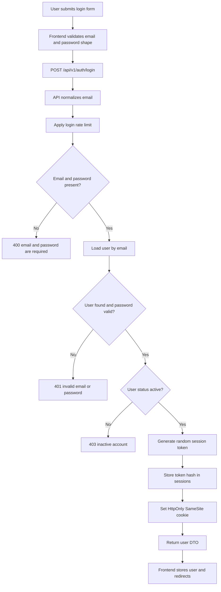
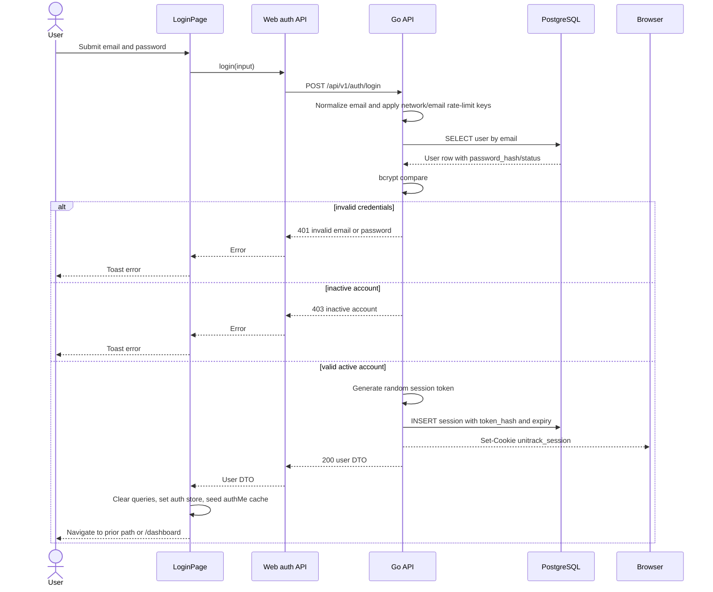
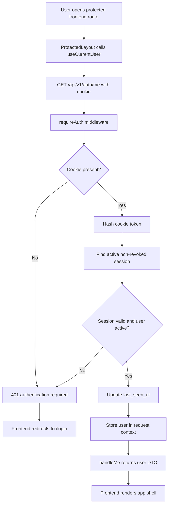
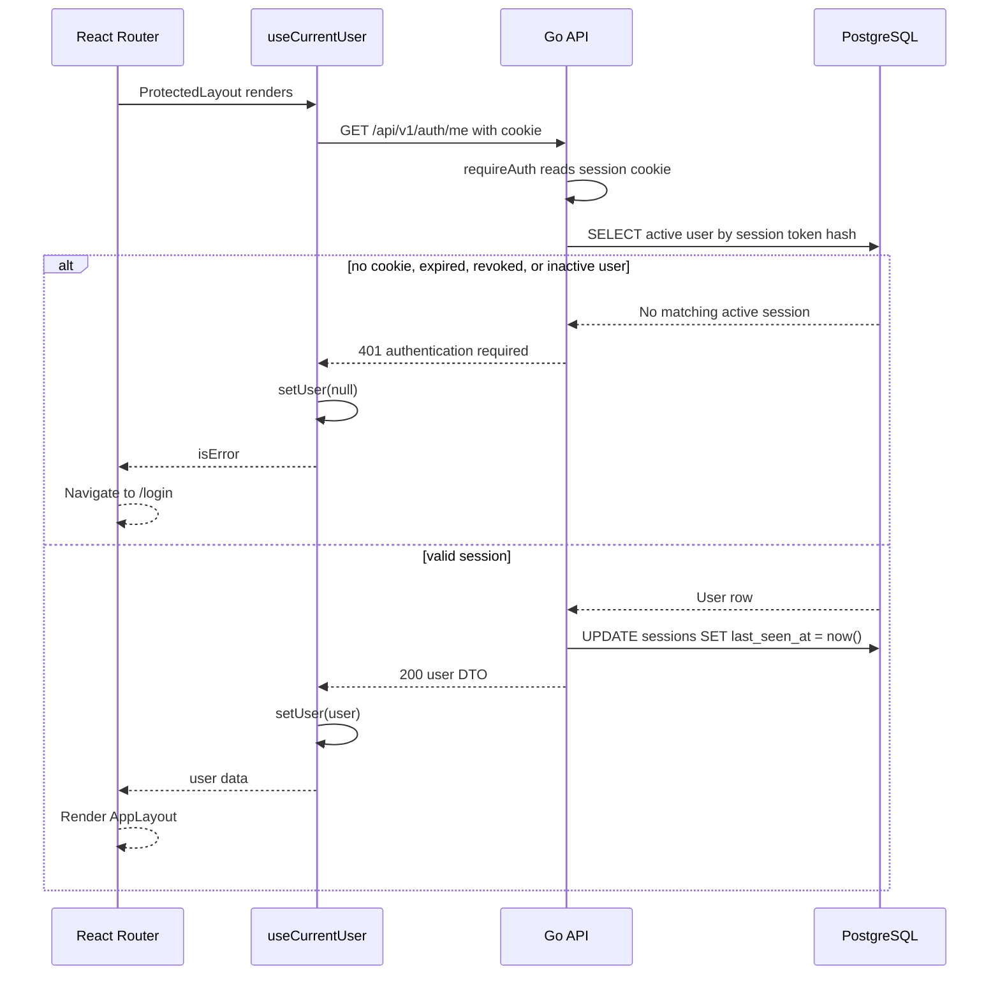
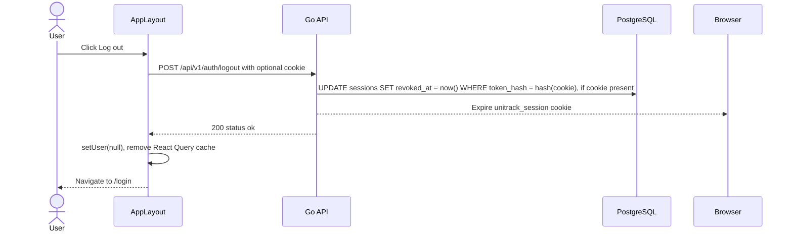
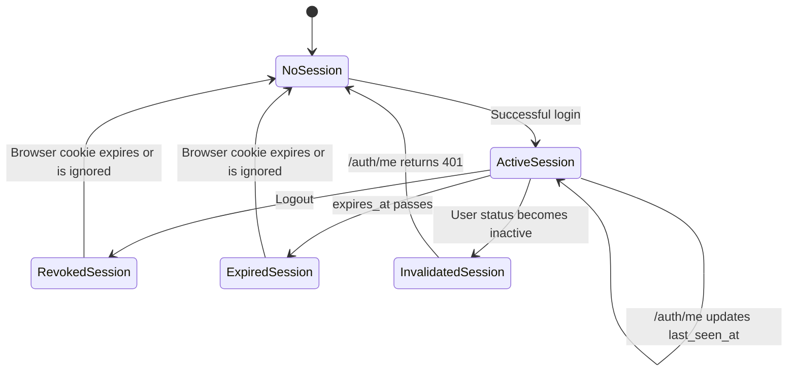
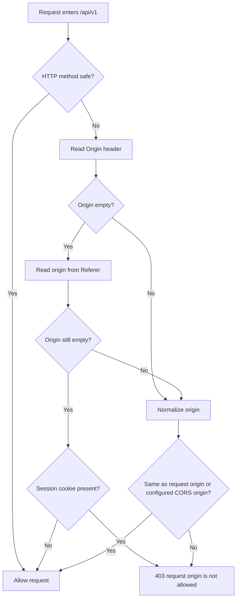

# Auth And Session Onboarding

This document explains the current UniTrack authentication and session implementation for engineers who need to maintain or extend it.

## Purpose

Auth/session provides the foundation for all protected UniTrack surfaces:

- Existing users sign in with email and password.
- The API creates a cookie-backed server session and serializes login/session creation with account-control mutations.
- The frontend checks `/auth/me` before rendering protected routes.
- Logout revokes the current session when one is present and always clears the browser cookie.
- Inactive accounts cannot log in or use an existing session.
- Unsafe API requests reject untrusted origins, wildcard CORS origins are not trusted for cookie-authenticated writes, and cookie-authenticated unsafe requests require an `Origin` or parseable `Referer` signal.
- Login attempts are protected by bounded in-memory network and email rate limits.

Account creation is not part of the login/session feature. Admin account management creates accounts, then auth/session handles sign-in and active-session enforcement.

## Current Status

| Capability                 | Status                 | Notes                                                                                  |
| -------------------------- | ---------------------- | -------------------------------------------------------------------------------------- |
| Email/password login       | Implemented            | Uses bcrypt password verification under a user-row lock; missing-account attempts run a dummy bcrypt check before returning the generic invalid-credentials error. |
| Server sessions            | Implemented            | Session cookie stores a raw random token; database stores only the SHA-256 token hash; login inserts the session in the same transaction as credential verification. |
| Current user lookup        | Implemented            | `GET /api/v1/auth/me` returns the authenticated active user.                           |
| Logout revocation          | Implemented            | `POST /api/v1/auth/logout` is idempotent: it revokes the presented session when valid or stale and expires the cookie even if the session is already invalid. |
| Active-account gate        | Implemented            | Inactive users cannot log in; inactive users also fail session lookup.                 |
| Protected route middleware | Implemented            | `requireAuth` loads the session user and stores it on request context.                 |
| Frontend route protection  | Implemented            | Protected React routes call `useCurrentUser()` and redirect unauthenticated users; transient non-401 current-user refetch failures do not clear the last known auth-store user. |
| Origin guard               | Implemented foundation | Unsafe API methods reject untrusted `Origin` or `Referer` values; session-cookie unsafe requests with no origin signal are rejected, and `*` is not trusted as a credentialed write origin. |
| Cookie/CORS config validation | Implemented         | Startup rejects `SESSION_SAME_SITE=none` without `SESSION_SECURE=true`, wildcard or malformed CORS origins, production HTTP CORS origins, production insecure cookies, and missing production `DATABASE_URL`. |
| Login rate limit           | Implemented foundation | 60 attempts per observed network address plus 25 attempts per email per 10 minutes in process memory; the limiter caps stored keys and hashes oversized keys. |
| Full CSRF token            | Not implemented        | Origin guard protects the current cookie flow, but no synchronizer token or double-submit token exists. |
| Password reset             | Not implemented        | Out of current scope.                                                                  |
| Frontend auth tests        | Partial                | Playwright covers local admin login to dashboard; broader redirect/cache tests are still needed. |

## User-Facing Behavior

| User action                                  | Expected result                                                                                              |
| -------------------------------------------- | ------------------------------------------------------------------------------------------------------------ |
| Open `/` with no valid session               | Redirect to `/login`.                                                                                        |
| Open `/` with a valid active session         | Redirect to `/dashboard`.                                                                                    |
| Open a protected route with no valid session | Redirect to `/login` with the attempted path in router state.                                                |
| Sign in with valid active account            | Session cookie is set, auth cache is updated, user is routed to the previous protected path or `/dashboard`. |
| Sign in with wrong credentials               | API returns `401`; frontend shows an error toast.                                                            |
| Sign in with inactive account                | API returns forbidden-style inactive-account error; no session row is created.                               |
| Click logout                                 | API revokes the presented session when present, clears the cookie even for stale sessions, frontend clears auth/query state, and user returns to `/login`. |
| `/auth/me` refetch temporarily fails without `401` | The query can surface its error state, but the frontend keeps the last known auth-store user until the API confirms unauthorized access. |
| Open auth-related public pages               | Login uses a compact centered `AuthFrame` card over the subtle blue/ocean background, with concise single-line header copy and no extra access-instruction footer copy. |

## API Contract

Base path: `/api/v1`

| Method | Endpoint       | Access        | Request                                   | Success                                       | Common Errors              |
| ------ | -------------- | ------------- | ----------------------------------------- | --------------------------------------------- | -------------------------- |
| `POST` | `/auth/login`  | Public        | `{ "email": string, "password": string }` | `200` user DTO and session cookie             | `400`, `401`, `403`, `429` |
| `GET`  | `/auth/me`     | Authenticated | Cookie only                               | `200` user DTO                                | `401`                      |
| `POST` | `/auth/logout` | Public plus origin guard | Optional cookie                  | `200` `{ "status": "ok" }` and expired cookie | `403`, `503`               |

Login uses the shared backend JSON decoder documented in `docs/features/backend-api.md`; request bodies must contain one JSON value only, and trailing JSON is rejected with `400` before session creation.

User DTO shape is defined in `apps/api/internal/app/response.go` and mirrored by `apps/web/src/types/api.ts`.

## Data Model

| Table      | Important Fields                                                                                                    | Purpose                                                                               |
| ---------- | ------------------------------------------------------------------------------------------------------------------- | ------------------------------------------------------------------------------------- |
| `users`    | `id`, `full_name`, `email`, `password_hash`, `role`, `status`, `avatar_url`, timestamps                             | Stores login identity, bcrypt password hash, role, and active/inactive account state. |
| `sessions` | `id`, `user_id`, `token_hash`, `expires_at`, `revoked_at`, `last_seen_at`, `user_agent`, `ip_address`, `created_at` | Stores server-side session records keyed by token hash.                               |

Relevant migrations:

| Migration                                         | Role                                                                         |
| ------------------------------------------------- | ---------------------------------------------------------------------------- |
| `20260601000100_init_mvp.sql`                     | Creates `users` and `sessions`.                                              |
| `20260604000100_session_revocation.sql`           | Adds `revoked_at`, `last_seen_at`, user agent, IP, and active-session index. |
| `20260607000200_case_insensitive_user_emails.sql` | Lowercases existing users and adds `users_email_lower_unique`.               |

## Backend Implementation Map

| File                                      | Responsibility                                                                                                          |
| ----------------------------------------- | ----------------------------------------------------------------------------------------------------------------------- |
| `apps/api/internal/app/server.go`         | Registers `/auth/login`, idempotent `/auth/logout`, protected `/auth/me`, CORS, origin guard, and protected route group. |
| `apps/api/internal/app/auth.go`           | Password hashing, transaction-locked login/session creation, current user, logout, session lookup, auth middleware.      |
| `apps/api/internal/app/response.go`       | Shared strict JSON decoding and error responses used by login.                                                           |
| `apps/api/internal/app/security.go`       | Bounded in-memory rate limiter and trusted-origin guard.                                                                 |
| `apps/api/internal/config/config.go`      | Session/CORS/auth-related environment variables and startup validation for unsafe cookie/CORS combinations.              |
| `apps/api/internal/app/bootstrap.go`      | Optional bootstrap admin creation from environment variables.                                                           |
| `apps/api/internal/app/lifecycle_test.go` | Backend regression coverage for auth/session basics.                                                                    |
| `apps/api/internal/app/security_test.go`  | Unit coverage for rate-limit key cap and oversized-key normalization.                                                   |

Important functions:

| Function                 | What It Does                                                                                      |
| ------------------------ | ------------------------------------------------------------------------------------------------- |
| `handleLogin`            | Normalizes email, applies network and email login rate limits, locks the user row, verifies password, runs dummy bcrypt for missing accounts, blocks inactive account, creates and commits the session. |
| `createSessionTx`        | Generates random token and stores its SHA-256 hash inside the login transaction.                  |
| `findUserBySessionToken` | Looks up non-expired, non-revoked session for an active user.                                     |
| `requireAuth`            | Requires session cookie, loads user, updates `last_seen_at`, places user in request context.      |
| `handleMe`               | Returns current context user.                                                                     |
| `handleLogout`           | Revokes the presented session hash when present and always expires the browser cookie.             |
| `requireTrustedOrigin`   | Rejects unsafe requests from untrusted origins; wildcard CORS entries are not trusted for unsafe requests. |
| `enforceRateLimit`       | Applies bounded per-key in-memory request windows.                                                |

## Frontend Implementation Map

| File                                              | Responsibility                                                        |
| ------------------------------------------------- | --------------------------------------------------------------------- |
| `apps/web/src/features/auth/api.ts`               | Auth API calls for login, logout, and current user.                  |
| `apps/web/src/features/auth/hooks.ts`             | `useCurrentUser()` query and auth-store synchronization that clears the store only on confirmed `401`. |
| `apps/web/src/lib/axios.ts`                       | API client, global unauthorized redirect handling, and status helpers used by auth/cache flows. |
| `apps/web/src/features/auth/components/auth-frame.tsx` | Shared auth page frame with subtle blue/ocean background accents, compact centered card chrome, and optional single-line header rendering. |
| `apps/web/src/features/auth/pages/login-page.tsx` | Login form, concise workspace sign-in copy, safe redirect handling, cache/store update after login.   |
| `apps/web/src/app/router.tsx`                     | Root redirect, protected layout, teacher/admin guard.                 |
| `apps/web/src/stores/auth-store.ts`               | Minimal Zustand auth user store.                                      |
| `apps/web/src/components/layout/app-layout.tsx`   | Logout action, query clearing, app shell.                             |
| `apps/web/e2e/auth-flow.spec.ts`                  | Playwright smoke test for local admin login, dashboard render, user identity, and primary navigation. |

## Login Flow

```mermaid
flowchart TD
  A[User submits login form] --> B[Frontend validates email and password shape]
  B --> C[POST /api/v1/auth/login]
  C --> D[API normalizes email]
  D --> E[Apply login rate limit]
  E --> F{Email and password present?}
  F -- No --> G[400 email and password are required]
  F -- Yes --> H[Load user by email]
  H --> I{User found and password valid?}
  I -- No --> J[401 invalid email or password]
  I -- Yes --> K{User status active?}
  K -- No --> L[403 inactive account]
  K -- Yes --> M[Generate random session token]
  M --> N[Store token hash in sessions]
  N --> O[Set HttpOnly SameSite cookie]
  O --> P[Return user DTO]
  P --> Q[Frontend stores user and redirects]
```

## Login Sequence

```mermaid
sequenceDiagram
  actor User
  participant LoginPage
  participant AuthAPI as Web auth API
  participant Server as Go API
  participant DB as PostgreSQL
  participant Browser

  User->>LoginPage: Submit email and password
  LoginPage->>AuthAPI: login(input)
  AuthAPI->>Server: POST /api/v1/auth/login
  Server->>Server: Normalize email and apply network/email rate-limit keys
  Server->>DB: SELECT user by email
  DB-->>Server: User row with password_hash/status
  Server->>Server: bcrypt compare
  alt invalid credentials
    Server-->>AuthAPI: 401 invalid email or password
    AuthAPI-->>LoginPage: Error
    LoginPage-->>User: Toast error
  else inactive account
    Server-->>AuthAPI: 403 inactive account
    AuthAPI-->>LoginPage: Error
    LoginPage-->>User: Toast error
  else valid active account
    Server->>Server: Generate random session token
    Server->>DB: INSERT session with token_hash and expiry
    Server-->>Browser: Set-Cookie unitrack_session
    Server-->>AuthAPI: 200 user DTO
    AuthAPI-->>LoginPage: User DTO
    LoginPage->>LoginPage: Clear queries, set auth store, seed authMe cache
    LoginPage-->>User: Navigate to prior path or /dashboard
  end
```

## Protected Route Flow

```mermaid
flowchart TD
  A[User opens protected frontend route] --> B[ProtectedLayout calls useCurrentUser]
  B --> C[GET /api/v1/auth/me with cookie]
  C --> D[requireAuth middleware]
  D --> E{Cookie present?}
  E -- No --> F[401 authentication required]
  E -- Yes --> G[Hash cookie token]
  G --> H[Find active non-revoked session]
  H --> I{Session valid and user active?}
  I -- No --> F
  I -- Yes --> J[Update last_seen_at]
  J --> K[Store user in request context]
  K --> L[handleMe returns user DTO]
  L --> M[Frontend renders app shell]
  F --> N[Frontend redirects to /login]
```

## Current User Sequence

```mermaid
sequenceDiagram
  participant Router as React Router
  participant Hook as useCurrentUser
  participant Server as Go API
  participant DB as PostgreSQL

  Router->>Hook: ProtectedLayout renders
  Hook->>Server: GET /api/v1/auth/me with cookie
  Server->>Server: requireAuth reads session cookie
  Server->>DB: SELECT active user by session token hash
  alt no cookie, expired, revoked, or inactive user
    DB-->>Server: No matching active session
    Server-->>Hook: 401 authentication required
    Hook->>Hook: setUser(null)
    Hook-->>Router: isError
    Router-->>Router: Navigate to /login
  else valid session
    DB-->>Server: User row
    Server->>DB: UPDATE sessions SET last_seen_at = now()
    Server-->>Hook: 200 user DTO
    Hook->>Hook: setUser(user)
    Hook-->>Router: user data
    Router-->>Router: Render AppLayout
  end
```

## Logout Sequence

```mermaid
sequenceDiagram
  actor User
  participant AppLayout
  participant Server as Go API
  participant DB as PostgreSQL
  participant Browser

  User->>AppLayout: Click Log out
  AppLayout->>Server: POST /api/v1/auth/logout with optional cookie
  Server->>DB: UPDATE sessions SET revoked_at = now() WHERE token_hash = hash(cookie), if cookie present
  Server-->>Browser: Expire unitrack_session cookie
  Server-->>AppLayout: 200 status ok
  AppLayout->>AppLayout: setUser(null), remove React Query cache
  AppLayout-->>User: Navigate to /login
```

## Session State Diagram

```mermaid
stateDiagram-v2
  [*] --> NoSession
  NoSession --> ActiveSession: Successful login
  ActiveSession --> ActiveSession: /auth/me updates last_seen_at
  ActiveSession --> RevokedSession: Logout
  ActiveSession --> ExpiredSession: expires_at passes
  ActiveSession --> InvalidatedSession: User status becomes inactive
  RevokedSession --> NoSession: Browser cookie expires or is ignored
  ExpiredSession --> NoSession: Browser cookie expires or is ignored
  InvalidatedSession --> NoSession: /auth/me returns 401
```

## Origin Guard Flow

```mermaid
flowchart TD
  A[Request enters /api/v1] --> B{HTTP method safe?}
  B -- Yes --> C[Allow request]
  B -- No --> D[Read Origin header]
  D --> E{Origin empty?}
  E -- Yes --> F[Read origin from Referer]
  E -- No --> G[Normalize origin]
  F --> H{Origin still empty?}
  H -- Yes --> K{Session cookie present?}
  K -- Yes --> J
  K -- No --> C
  H -- No --> G
  G --> I{Same as request origin or configured CORS origin?}
  I -- Yes --> C
  I -- No --> J[403 request origin is not allowed]
```

Implementation note: unsafe requests with no `Origin` and no parseable `Referer` are allowed only when no session cookie is present, so public login and non-browser clients can still work while browser session state changes require an origin signal.

## Security Controls

| Control                  | Current Implementation                            | Notes                                                               |
| ------------------------ | ------------------------------------------------- | ------------------------------------------------------------------- |
| Password hashing         | bcrypt                                            | `hashPassword` enforces at least 8 characters and rejects leading/trailing spaces when creating hashes. |
| Session token generation | 32 random bytes, base64url encoded                | `generateToken` uses `crypto/rand`.                                 |
| Token storage            | SHA-256 hash only                                 | Raw token is stored only in the browser cookie.                     |
| Cookie flags             | `HttpOnly`, configurable `SameSite`, configurable `Secure` | Startup rejects `SESSION_SAME_SITE=none` unless `SESSION_SECURE=true`; production also requires `SESSION_SECURE=true`. |
| Session expiry           | Configurable TTL                                  | Default is 7 days.                                                  |
| Session revocation       | `sessions.revoked_at`                             | Logout revokes only the presented session token.                    |
| Active user gate         | Query requires `u.status = 'active'`              | Inactive accounts fail both login and session lookup.               |
| Login/account-control serialization | User-row lock plus same-transaction session insert | Password resets and deactivations cannot leave a new session created from stale account state. |
| Trusted origin guard     | `Origin` or `Referer` check on unsafe methods     | Rejects untrusted origins, does not trust wildcard CORS origins for unsafe requests, rejects malformed or wildcard configured CORS origins at startup, and rejects missing-origin unsafe requests when the session cookie is present; not a full CSRF-token mechanism. |
| Login rate limit         | In-memory key `login:{ip}:{email}`                | Not distributed across API instances.                               |
| Missing-account timing   | Dummy bcrypt verification before generic `401`    | Reduces account enumeration signal between missing email and wrong password attempts. |

## Environment Variables

| Variable                          | Default                 | Purpose                                             |
| --------------------------------- | ----------------------- | --------------------------------------------------- |
| `APP_ENV`                         | `development`           | Runtime environment; `production` enables stricter startup validation for database, secure cookies, and HTTPS CORS origins. |
| `DATABASE_URL`                    | empty                   | PostgreSQL connection string; required when `APP_ENV=production`. |
| `SESSION_COOKIE_NAME`             | `unitrack_session`      | Name of the auth cookie.                            |
| `SESSION_TTL`                     | `168h`                  | Session lifetime.                                   |
| `SESSION_SECURE`                  | `false`                 | Whether the auth cookie requires HTTPS; must be `true` when `SESSION_SAME_SITE=none` and when `APP_ENV=production`. |
| `SESSION_SAME_SITE`               | `lax`                   | Cookie SameSite mode: `lax`, `strict`, or `none`. Use `none` only with `SESSION_SECURE=true` for separate HTTPS Render default frontend/API domains. |
| `CORS_ALLOWED_ORIGINS`            | `http://localhost:5173` | Exact trusted frontend origins for CORS and origin guard; wildcard `*`, malformed origins, paths, queries, and fragments are rejected. Production requires HTTPS origins. |
| `AUTH_BOOTSTRAP_ADMIN_EMAIL`      | empty                   | Optional bootstrap admin email.                     |
| `AUTH_BOOTSTRAP_ADMIN_PASSWORD`   | empty                   | Optional bootstrap admin password.                  |

## Error Matrix

| Scenario                  | Endpoint                   | Status | Message                                                      |
| ------------------------- | -------------------------- | ------ | ------------------------------------------------------------ |
| Missing email or password | `POST /auth/login`         | `400`  | `email and password are required`                            |
| Invalid credentials       | `POST /auth/login`         | `401`  | `invalid email or password`                                  |
| Inactive account          | `POST /auth/login`         | `403`  | `account is inactive; contact your teacher or administrator` |
| Too many login attempts   | `POST /auth/login`         | `429`  | `too many login attempts; try again later`                   |
| Missing/invalid session   | `GET /auth/me`             | `401`  | `authentication required`                                    |
| Missing/invalid session   | `POST /auth/logout`        | `200`  | Logout is idempotent and still expires the cookie             |
| Untrusted unsafe origin   | Any unsafe `/api/v1` route | `403`  | `request origin is not allowed`                              |

## Test Coverage

Backend lifecycle tests currently cover:

| Test                                       | Coverage                                                                                  |
| ------------------------------------------ | ----------------------------------------------------------------------------------------- |
| `TestAuthSessionLifecycle`                 | Login, `/auth/me`, logout, revoked session, `/auth/me` after logout returns unauthorized. |
| `TestLoginWaitsForAccountControlLock`      | Login waits for account-control row locks and rejects old credentials after a concurrent password change commits. |
| `TestLogoutClearsCookieForAlreadyRevokedSession` | Logout remains `200` and expires the cookie after the server-side session was already revoked. |
| `TestSessionCookieFlagsFollowConfig`       | Login and logout cookies keep configured `Secure` and `SameSite=None` attributes.         |
| `TestInactiveUserCannotLogin`              | Inactive user login fails and no session is created.                                      |
| `TestInvalidLoginResponsesDoNotRevealAccountExistence` | Missing account and wrong-password attempts both return the same unauthorized status. |
| `TestOriginGuardRejectsUnsafeUntrustedOrigin` | Unsafe requests from an untrusted origin are rejected before login processing. |
| `TestOriginGuardRejectsMissingOriginOnSessionUnsafeRequest` | Unsafe requests with a session cookie but no `Origin`/`Referer` are rejected before protected write handling. |
| `TestOriginGuardDoesNotTrustWildcardOrigins` | `CORS_ALLOWED_ORIGINS=*` does not become a trusted unsafe request origin. |
| `TestProtectedRoutesRequireAuthentication` | Protected API route rejects unauthenticated requests.                                     |
| `apps/api/internal/config` validation tests | Reject unsafe SameSite/Secure, wildcard/malformed CORS, and unsafe production configurations. |

Frontend browser tests currently cover:

| Test | Coverage |
| --- | --- |
| `apps/web/e2e/auth-flow.spec.ts` | Uses the configured API URL, signs in as the default local admin or `E2E_ADMIN_EMAIL`/`E2E_ADMIN_PASSWORD`, and asserts the dashboard/app shell renders. |
| `apps/web/e2e/login-page.visual.spec.ts` | Renders `/login` and attaches a full-page screenshot to the Playwright HTML report for visual inspection. |

Important test gaps:

| Gap                            | Why It Matters                                                       |
| ------------------------------ | -------------------------------------------------------------------- |
| Login rate-limit test          | Ensures brute-force guard does not regress.                          |
| Full frontend protected-route tests | Ensures redirects for `/dashboard`, `/workspace`, and role-restricted routes remain stable across roles. |
| Login safe-redirect test       | Ensures login cannot redirect to external or protocol-relative URLs. |

## Known Gaps And Non-Goals

| Gap                       | Current Direction                                                                                         |
| ------------------------- | --------------------------------------------------------------------------------------------------------- |
| Full CSRF token           | Add synchronizer-token or double-submit flow before production hardening if cookie-auth risk requires stronger defense than strict origin checks. |
| Distributed rate limiting | Move to Redis, database-backed counters, or gateway-level controls for multi-instance deployments.        |
| Password reset            | Add after admin/account lifecycle is stable.                                                              |
| Public registration       | Removed from active routes; accounts are admin-created.                                                     |
| Multi-factor auth         | Out of current scope.                                                                                     |
| Session management UI     | No UI for listing/revoking other sessions yet.                                                            |

## Change Checklist

Before changing Auth/session behavior:

| Check               | Action                                                                                                               |
| ------------------- | -------------------------------------------------------------------------------------------------------------------- |
| Route behavior      | Confirm `/login`, `/auth/me`, `/auth/logout`, protected route redirects, and root redirect still behave as expected. |
| Cookie behavior     | Confirm cookie name, expiry, `HttpOnly`, `SameSite`, and `Secure` behavior match environment.                        |
| Session database    | Confirm session rows are created, `last_seen_at` updates, and logout sets `revoked_at`.                              |
| Active account gate | Confirm inactive users cannot log in and active sessions stop working if user becomes inactive.                      |
| Security controls   | Confirm rate limit and origin guard still apply to unsafe `/api/v1` requests.                                        |
| Frontend cache      | Confirm login/logout clear stale query state and update `authMe` cache correctly.                                    |
| Tests               | Run `make api-test` and `pnpm --filter @unitrack/web test:e2e`; add focused tests if changing rate limits, origin guard, cookies, or route guards. |

## Related Features

| Feature                 | Relationship                                                             |
| ----------------------- | ------------------------------------------------------------------------ |
| Team/members            | Adds existing active student accounts to projects after authentication/account creation. |
| Protected access        | Builds on `requireAuth` and project permission helpers.                  |
| Dashboard and workspace | Depend on `useCurrentUser()` and protected route guards.                 |
| Admin accounts          | Creates and updates accounts while reusing active-account and session-revocation rules. |
