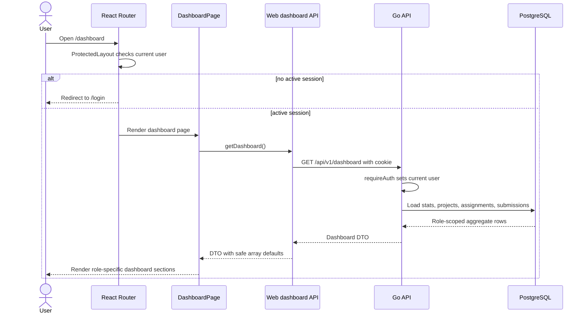
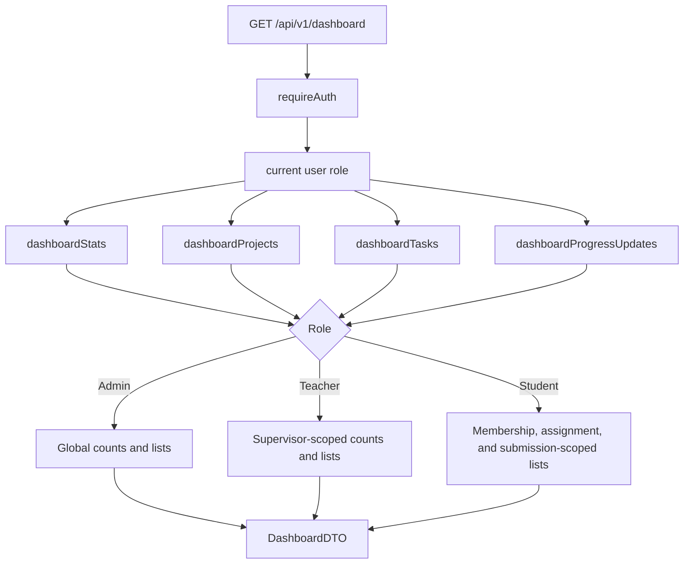
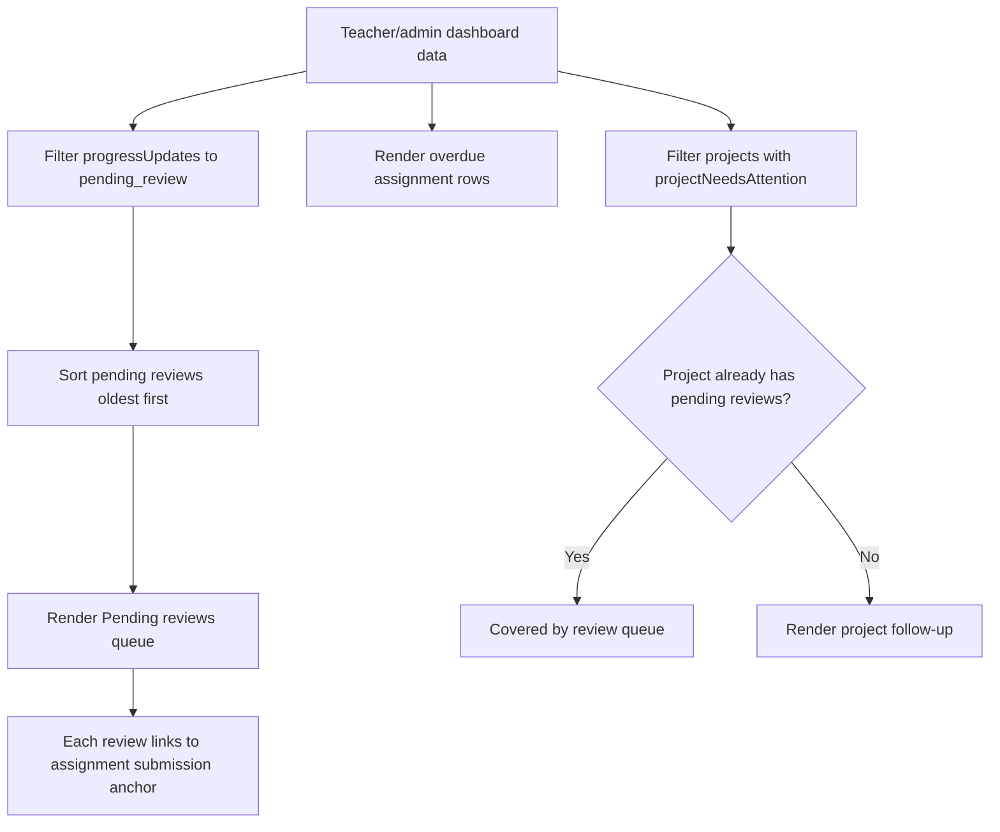
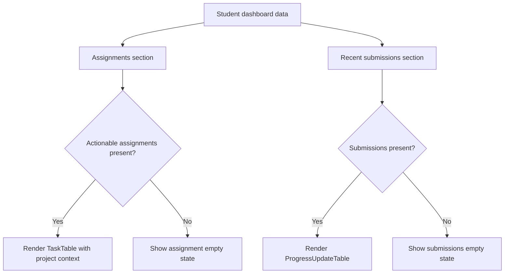

# Dashboard Onboarding

This document explains the current UniTrack dashboard implementation for engineers who need to maintain or extend the role-aware work summary.

## Purpose

The dashboard is the first protected surface after login. It helps users decide what to do next without becoming a separate product module:

- Teachers and admins start with pending student submissions, then overdue assignment follow-ups and project follow-ups.
- Students start with actionable assignments, then recent submissions that are waiting for or have received review.
- The API still returns counts for future summaries, but the frontend now prioritizes the actual review/work queues instead of generic KPI cards.
- Data is scoped by role and relationship in the backend.
- The frontend renders the same aggregate API response into role-specific sections.

Protected route/session behavior is documented separately in `docs/features/protected-access.md` and `docs/features/auth-session.md`.

## Current Status

| Capability                         | Status          | Notes                                                                                        |
| ---------------------------------- | --------------- | -------------------------------------------------------------------------------------------- |
| Protected dashboard route          | Implemented     | `/dashboard` is inside `ProtectedLayout`; `/api/v1/dashboard` is inside `requireAuth`.       |
| Role-aware stats                   | Implemented in API | Admin, teacher, and student stats are scoped differently in SQL; the frontend does not render a KPI card strip. |
| Teacher review queue               | Implemented     | Pending reviews are returned oldest-first and rendered as the first queue.                    |
| Teacher overdue assignments        | Implemented     | Teacher/admin assignment queue shows active-project overdue assignments with project context. |
| Project follow-ups                 | Implemented     | Teacher/admin project follow-ups show stale or missing progress after pending-review-only projects are excluded from the secondary section. |
| Student assignments                | Implemented     | Student dashboard shows active-project assigned work that still needs student action, excluding completed assignments and assignments already waiting for review. |
| Student recent submissions         | Implemented     | Student dashboard shows the student's recent submissions, newest first.                      |
| Client fallback defaults           | Implemented     | `getDashboard` normalizes missing arrays/stats to safe empty values.                         |
| Cache invalidation after mutations | Implemented     | Project/assignment/milestone/team/submission mutations invalidate the dashboard query in key flows. |
| Admin-specific dashboard UI        | Missing/partial | Admin receives global backend data but shares the teacher-oriented frontend branch and copy. |
| Frontend dashboard tests           | Missing/partial | Backend lifecycle coverage exists; route/rendering tests are still needed.                   |

## User-Facing Behavior

| User action                                   | Expected result                                                                                 |
| --------------------------------------------- | ----------------------------------------------------------------------------------------------- |
| Open `/dashboard` without a valid session     | Redirect to `/login` through protected routing.                                                 |
| Teacher opens `/dashboard`                    | Sees pending reviews oldest-first, overdue assignments, and non-duplicate project follow-ups.   |
| Student opens `/dashboard`                    | Sees actionable assignments first and recent submissions below.                                  |
| Admin opens `/dashboard`                      | Sees global backend stats and global review/attention data in the teacher-oriented layout.      |
| Teacher has no pending reviews                | Review queue shows a positive empty state.                                                      |
| Student has no assignments or submissions     | Student sections show empty states.                                                             |
| Dashboard request fails                       | Frontend shows `ErrorState` with a retry action.                                                |
| Teacher clicks a review item                  | Navigates to `/workspace/projects/:projectId/tasks/:taskId#progress-:updateId`.                 |
| User creates or updates relevant project data | Related mutations invalidate `queryKeys.dashboard` so the next render refetches dashboard data. |

## API Contract

Base path: `/api/v1`

| Method | Endpoint     | Access        | Request     | Success             | Common Errors |
| ------ | ------------ | ------------- | ----------- | ------------------- | ------------- |
| `GET`  | `/dashboard` | Authenticated | Cookie only | `200` dashboard DTO | `401`, `500`  |

Dashboard DTO fields:

| Field             | Type                          | Meaning                                                                         |
| ----------------- | ----------------------------- | ------------------------------------------------------------------------------- |
| `role`            | `admin`, `teacher`, `student` | Role of the authenticated user used to render the frontend branch.              |
| `stats`           | `DashboardStats`              | Count summary scoped to the role.                                               |
| `projects`        | `Project[]`                   | Up to 16 projects, scoped and ordered for dashboard follow-up use.              |
| `tasks`           | `Task[]`                      | Up to 8 assignment DTOs: overdue assignments for teacher/admin, actionable assignments for students. |
| `progressUpdates` | `ProgressUpdate[]`            | Up to 8 pending reviews for teachers/admins or recent submissions for students. |

Dashboard stats fields:

| Field              | Meaning                                                                                                      |
| ------------------ | ------------------------------------------------------------------------------------------------------------ |
| `projectCount`     | Admin: all projects. Teacher: supervised projects. Student: joined projects.                                 |
| `taskCount`        | Admin: all assignments. Teacher: assignments in supervised projects. Student: the student's assignments.      |
| `overdueTaskCount` | Active-project assignments with `deadline < current_date`, not `done`, and not officially completed.         |
| `pendingReviews`   | Admin/teacher: pending project progress reviews excluding archived projects. Student: student's submissions still pending review. |
| `studentCount`     | Admin: all student users. Teacher: distinct students across supervised projects. Omitted when zero.          |
| `teacherCount`     | Admin: all teacher users. Omitted for teachers/students and when zero.                                       |

The frontend currently does not render dashboard stats as KPI cards; counts remain in the DTO for future contextual summaries or admin reporting.

## Role-Scoped Data Matrix

| Role    | Stats Scope             | Projects Payload                                  | Tasks Payload                              | Progress Payload                                 |
| ------- | ----------------------- | ------------------------------------------------- | ------------------------------------------ | ------------------------------------------------ |
| Admin   | Global                  | Up to 16 global attention-ordered projects        | Up to 8 global overdue active-project assignments | Up to 8 non-archived global pending reviews, oldest first |
| Teacher | Supervised projects     | Up to 16 supervised attention-ordered projects    | Up to 8 supervised overdue active-project assignments | Up to 8 non-archived supervised pending reviews, oldest first |
| Student | Memberships/assignments | Up to 16 joined projects ordered by project update | Up to 8 assigned active-project assignments that are not completed and not waiting for review | Up to 8 own submissions, newest first            |

## Data Model

| Table              | Fields Used By Dashboard                                                                            | Purpose                                                          |
| ------------------ | --------------------------------------------------------------------------------------------------- | ---------------------------------------------------------------- |
| `users`            | `id`, `role`, `full_name`                                                                           | Role scoping, student/teacher counts, display names.             |
| `projects`         | `id`, `name`, `supervisor_id`, `status`, `updated_at`                                               | Project counts, teacher/admin project lists, attention ordering. |
| `project_members`  | `project_id`, `student_id`                                                                          | Student project membership and teacher distinct-student counts.  |
| `tasks`            | `id`, `project_id`, `parent_task_id`, `deadline`, `status`, `official_progress_state`, `updated_at` | Assignment counts, overdue counts, assignment list ordering.     |
| `task_assignees`   | `task_id`, `student_id`                                                                             | Student assignment counts and assignment list.                   |
| `progress_updates` | `id`, `project_id`, `task_id`, `submitted_by`, `review_status`, `created_at`                        | Review queue and recent submission list.                         |
| `progress_reviews` | `progress_update_id`, `review_status`, `reviewed_at`                                                | Latest review details and stale/missing progress ordering.       |

## Backend Implementation Map

| File                                      | Responsibility                                                                                  |
| ----------------------------------------- | ----------------------------------------------------------------------------------------------- |
| `apps/api/internal/app/server.go`         | Registers `GET /dashboard` inside the protected route group.                                    |
| `apps/api/internal/app/auth.go`           | `requireAuth` loads the current user before `handleDashboard` runs.                             |
| `apps/api/internal/app/dashboard.go`      | Dashboard handler, role-scoped stats, project list, assignment list, and submission list.       |
| `apps/api/internal/app/projects.go`       | `projectSelectSQL`, `scanProject`, and student project listing used by dashboard projects.      |
| `apps/api/internal/app/tasks.go`          | `taskSelectSQL`, `scanTask`, and task assignee loading used by dashboard tasks.                 |
| `apps/api/internal/app/types.go`          | `DashboardDTO` and `DashboardStats`.                                                            |
| `apps/api/internal/app/lifecycle_test.go` | Backend regression coverage for protected access, pending review ordering, and attention order. |

Important functions:

| Function                   | What It Does                                                                                     |
| -------------------------- | ------------------------------------------------------------------------------------------------ |
| `handleDashboard`          | Loads stats, projects, assignments, submissions, normalizes nil slices, and writes DTO.          |
| `dashboardStats`           | Runs role-specific aggregate count queries.                                                      |
| `dashboardProjects`        | Returns student joined projects or teacher/admin attention-ordered projects.                     |
| `dashboardTasks`           | Returns teacher/admin overdue assignment follow-ups or student actionable assignments.           |
| `dashboardProgressUpdates` | Returns pending reviews oldest-first for admin/teacher, or student submissions newest-first.     |
| `projectNeedsAttention`    | Frontend helper that filters dashboard projects to attention items for teacher/admin display.    |

## Frontend Implementation Map

| File                                                           | Responsibility                                                                                       |
| -------------------------------------------------------------- | ---------------------------------------------------------------------------------------------------- |
| `apps/web/src/app/router.tsx`                                  | Registers `/dashboard` as a protected route and root redirect target.                                |
| `apps/web/src/features/dashboard/api.ts`                       | Fetches `/dashboard` and applies safe defaults for missing arrays/stats.                             |
| `apps/web/src/features/dashboard/pages/dashboard-page.tsx`     | Renders loading/error states, compact summary chips, student actionable queue, teacher review queue, overdue assignment follow-ups, and project follow-ups without a generic KPI card strip. |
| `apps/web/src/lib/query-keys.ts`                               | Defines `queryKeys.dashboard`.                                                                       |
| `apps/web/src/features/projects/attention.ts`                  | Computes project attention state and reasons used by project tables.                                 |
| `apps/web/src/features/tasks/components/task-table.tsx`        | Displays assigned or scoped assignment rows with derived assignment state.                            |
| `apps/web/src/features/projects/components/progress-table.tsx` | Displays student submission rows.                                                                    |
| `apps/web/src/features/projects/components/project-table.tsx`  | Displays project follow-ups and attention reasons.                                                    |

## Dashboard Load Sequence

## Backend Role Scoping Flow

## Teacher/Admin Dashboard Flow

## Student Dashboard Flow

## Attention Ordering

Teacher/admin dashboard projects are ordered in the backend before the frontend filters them for display:

1. More pending progress reviews first, excluding archived projects.
2. More overdue assignments first, counting active projects only.
3. Active projects with missing or stale approved progress first.
4. Oldest or missing approved review date first.
5. Most recently updated project first as a final tie-breaker.

The frontend `projectNeedsAttention` check marks active projects as attention-worthy when they have pending reviews, overdue assignments, no approved update, or approved progress older than seven days. On-hold and completed projects surface only pending reviews; archived projects are excluded from attention. The dashboard project follow-up section then removes pending-review projects so it does not repeat work already shown in the review queue.

Dashboard assignment queues are intentionally action-scoped:

| Role | Assignment Queue Rule |
| --- | --- |
| Admin/teacher | Active-project assignments that are overdue, not `done`, and not officially completed. |
| Student | Assigned active-project assignments that are not `done`, not officially completed, and do not already have a pending review submission. Needs-revision assignments are ordered first, then overdue assignments, then nearest deadlines. |

## Cache And Refresh Behavior

| Trigger Area            | Dashboard Impact                                                                    |
| ----------------------- | ----------------------------------------------------------------------------------- |
| Project create/edit     | Project count, project list, attention state, and create-project navigation.        |
| Class/folder movement   | Project summaries can change and dashboard query is invalidated in workspace flows. |
| Assignment create/edit/delete | Assignment count, overdue count, assignment list, and attention projects can change. |
| Milestone/assignment plan     | Project summary and attention table can change when assignment state changes.        |
| Submission                   | Pending review/submission counts and submission lists can change.                    |
| Review                       | Pending review counts, latest review, and stale/missing progress state can change.   |

The frontend uses TanStack Query with `queryKeys.dashboard`. Feature mutations invalidate that query in the relevant project/workspace/assignment flows instead of manually patching the aggregate response.

## Error Behavior

| Status | Meaning In Dashboard Context                                                                |
| ------ | ------------------------------------------------------------------------------------------- |
| `401`  | No valid active session reached the protected dashboard endpoint.                           |
| `500`  | One of the aggregate queries failed; handler returns a feature-specific load error message. |

Frontend states:

| State            | UI Behavior                                                                    |
| ---------------- | ------------------------------------------------------------------------------ |
| Loading          | `LoadingState` with `Loading dashboard`.                                       |
| Query error      | `ErrorState` with retry.                                                       |
| Empty query data | `ErrorState` saying the dashboard returned no data.                            |
| Empty sections   | Section-specific empty states for no reviews, assignments, or submissions.      |

## Test Coverage

Backend lifecycle tests in `apps/api/internal/app/lifecycle_test.go` cover the current dashboard behavior:

| Test                                                                | Coverage                                                                         |
| ------------------------------------------------------------------- | -------------------------------------------------------------------------------- |
| `TestProtectedRoutesRequireAuthentication`                          | `/api/v1/dashboard` returns `401` without a valid session.                       |
| `TestTeacherDashboardListsOldestPendingReviewsFirst`                | Teacher pending review queue returns oldest pending updates first.               |
| `TestTeacherDashboardIncludesAttentionProjectsBeforeRecentProjects` | Attention ordering includes an urgent old project before recent stable projects. |
| Project lifecycle gate tests                                        | Confirm non-active status blocks or suppresses work so dashboard attention remains lifecycle-aware. |
| Broader project/assignment/submission lifecycle tests               | Protect the data relationships that dashboard aggregates depend on.              |

Frontend route/rendering tests for dashboard loading, role branches, empty states, and review links are still missing or minimal.

## Known Gaps And Risks

| Gap or Risk                                                                | Impact                                                                                                            |
| -------------------------------------------------------------------------- | ----------------------------------------------------------------------------------------------------------------- |
| Admin UI is not admin-specific                                             | Admins receive global data but see teacher-oriented copy until admin basics are implemented.                      |
| Dashboard aggregates are hand-written SQL                                  | New lifecycle states must update counts, overdue logic, and ordering together.                                    |
| Project attention is split between backend ordering and frontend filtering | Keep `dashboardProjects` ordering and `projectNeedsAttention` semantics aligned.                                  |
| Student project payload is not rendered as a standalone section            | Assignment and submission rows now carry project context; the standalone student project list remains hidden to keep the dashboard action-first. |
| Frontend tests are sparse                                                  | Loading, error, empty, and role-specific dashboard regressions can slip through.                                  |
| Counts do not expose all admin details in UI                               | `studentCount` and `teacherCount` can be returned but are not currently rendered.                                 |

## Maintenance Checklist

When adding or changing dashboard behavior:

- Keep `/api/v1/dashboard` inside the protected route group.
- Keep stats, list queries, and frontend labels aligned for each role.
- Count only active assignments with `parent_task_id IS NULL`; `parent_task_id` is retained only as historical schema.
- Preserve overdue semantics: active project, deadline before current date, not `done`, and official progress not `completed`.
- Preserve teacher scope through `projects.supervisor_id = user.id`.
- Preserve student scope through `project_members`, `task_assignees`, and `submitted_by`.
- Update `projectNeedsAttention` when backend attention ordering changes, and vice versa.
- Invalidate `queryKeys.dashboard` from mutations that change project summaries, assignments, or submissions/reviews.
- Add backend lifecycle tests for new role/relationship aggregates and negative cases.
- Add frontend tests for role branches, empty states, error retry, and review/assignment links when frontend testing is expanded.
