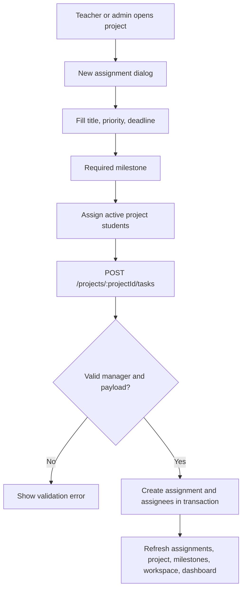
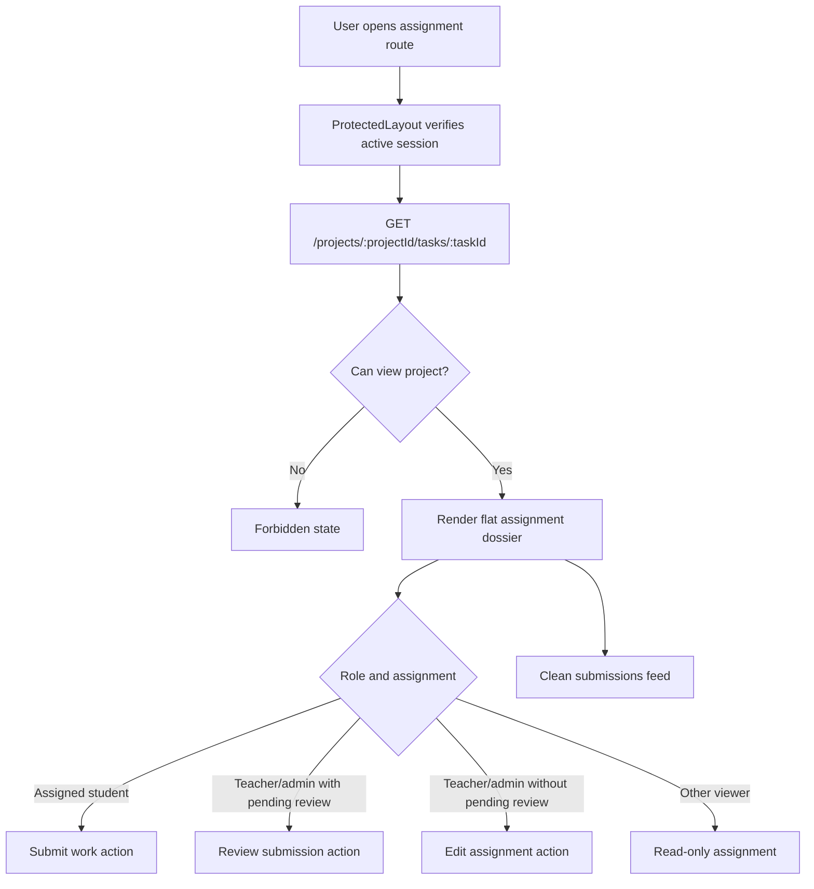

# Official Tasks / Assignments Onboarding

This document explains the current UniTrack assignment implementation for engineers who need to maintain teacher-created project work, assignment state, submissions, and review workflows. The backend/API object is still named task for compatibility.

## Purpose

Official tasks are the backend/API object. The user-facing product name is `Assignment`: teacher-owned work inside a project. Students submit work against their assigned work, teachers review those submissions, and project/milestone rollups summarize reviewed assignment progress.

The feature provides:

- Teacher/admin creation and editing of assignments.
- Required milestone assignment for planning checkpoints; active assignments cannot be standalone.
- Date-only deadlines for overdue rollups.
- Priority, due dates, and assignment ownership without exposing duplicate workflow status in the normal UI.
- Assignment to active student project members with a searchable, capped assignee checklist.
- An assignment detail page with a flat dossier layout, inline state/priority/submission summary, instructions, divider-based details/resources, one primary action, and a clean submissions feed.
- Centered assignment resource management instead of a page-edge drawer; submission resources remain inline in the feed.
- A derived assignment state so users see one lifecycle truth: `Not started`, `Waiting for review`, `Needs revision`, `In progress`, `Complete`, or `Overdue`.
- Review decisions that update both submission status and internal task progress state, including an explicit `Approve and complete` choice that marks the assignment done.

Project rollups are documented in `docs/features/projects.md`. Team membership and assignment eligibility are documented in `docs/features/team-members.md`. Access rules are documented in `docs/features/protected-access.md`.

## Current Status

| Capability | Status | Notes |
| --- | --- | --- |
| Assignment list | Implemented | Project viewers can list assignments; historical child-task rows are excluded from the project assignment list and assignees are loaded in one batched query. |
| Assignment detail | Implemented | Project viewers can open an assignment page with a flat dossier header, inline state summary, instructions, divider details/resources, one primary action, and submissions feed. |
| Assignment create | Implemented | Teacher/admin only; launched from a milestone, validates title, priority, deadline, required milestone, and assignees. Manual workflow status is hidden from normal UI. |
| Assignment edit | Implemented | Teacher/admin only; supports changing deadline, required milestone, and assignments. Manual workflow status is hidden from normal UI. |
| Project status gates | Implemented | Active projects allow assignment creation and submissions; on-hold projects allow manager assignment edits but block new assignments/submissions; completed projects allow pending reviews only; archived projects are read-only. |
| Assignment validation | Implemented | Assignees must be active student members of the project; the form initially shows 80 matching assignee options and asks users to search when more match. |
| Date-only deadlines | Implemented | Deadlines accept `YYYY-MM-DD` and are stored as `DATE`. |
| Milestone assignment | Implemented | Assignments must be linked to milestones in the same project; standalone assignments are migrated into a generated milestone. |
| Review-driven state sync | Implemented | Student submission sets internal workflow status to `submitted`; teacher review syncs internal status and official progress state, and `Approve and complete` sets the assignment to `done`/`completed`. |
| Nested child work items | Removed | No UI, API client functions, or protected API routes are exposed for child work items. |
| Assignment deletion | Not implemented | Out of current scope; no delete route or UI exists for assignments. |
| Direct lifecycle tests | Implemented | Assignment create/update permission, validation, submission state sync, and review state sync coverage exists in lifecycle tests. |
| Frontend automated tests | Missing/partial | Backend coverage is strong; route/component interaction tests are still needed. |

## User-Facing Behavior

| User action | Expected result |
| --- | --- |
| Teacher/admin creates an assignment | Assignment is created from a milestone and appears in the project plan, dashboard assignment lists, milestone rollups, and project rollups. |
| Teacher/admin changes an assignment milestone | Assignment moves under the selected milestone and contributes to that milestone's progress. |
| Teacher/admin assigns students | Only active student project members can be assigned; large member lists are searchable and capped visually. |
| Teacher/admin edits an assignment | Assignment metadata, plan rows, rollups, dashboard data, and folder summaries refresh. |
| Teacher/admin clears deadline | Empty deadline removes the due date; the milestone cannot be cleared. |
| Teacher/admin opens an assignment with pending reviews | Header actions show one `Review submission` link to the submissions feed. |
| Project viewer opens a project plan assignment row | Assignment title links to the assignment page; no separate `Open` button is shown. |
| Assigned student opens an assignment | Header actions show `Submit work` as the primary action. |
| Unassigned project member opens an assignment | Assignment is readable, but submission is hidden and backend-blocked. |
| Non-member opens an assignment | Backend returns `403`; frontend shows a restricted state. |
| User reads assignment state | UI shows one derived assignment state inline under the title instead of separate task workflow/review badges or a redundant state card. |
| Student submits work | Backend creates a pending submission and marks the internal task workflow as `submitted`. |
| Teacher reviews work | Backend locks the pending submission row, records one final review, and updates submission status, reviewed progress state, and internal task workflow together; choosing `Approve and complete` completes the assignment. |
| Teacher deletes a milestone with assignments | App confirmation appears first; backend rejects the delete until assignments are moved elsewhere. |
| Student submits while project is on hold, completed, or archived | Backend returns `409`; frontend hides submission and evidence-upload affordances. |
| Teacher reviews while project is archived | Backend returns `409`; completed and on-hold projects can still clear pending reviews. |

## API Contract

Base path: `/api/v1`

| Method | Endpoint | Access | Request | Success | Common Errors |
| --- | --- | --- | --- | --- | --- |
| `GET` | `/projects/{projectId}/tasks` | Project viewer | Cookie only | `200` assignment DTO list | `400`, `401`, `403`, `500` |
| `POST` | `/projects/{projectId}/tasks` | Project manager | Create task DTO | `201` task detail DTO | `400`, `401`, `403`, `409`, `500` |
| `GET` | `/projects/{projectId}/tasks/{taskId}` | Project viewer | Cookie only | `200` task detail DTO | `400`, `401`, `403`, `404`, `500` |
| `PATCH` | `/projects/{projectId}/tasks/{taskId}` | Project manager | Partial update task DTO | `200` task detail DTO | `400`, `401`, `403`, `404`, `409`, `500` |
| `POST` | `/projects/{projectId}/tasks/{taskId}/progress-updates` | Assigned student plus active project | Progress submission DTO | `201` progress update DTO | `400`, `401`, `403`, `404`, `409`, `500` |
| `POST` | `/projects/{projectId}/progress-updates/{updateId}/reviews` | Project manager plus non-archived project | Review DTO | `200` progress update DTO | `400`, `401`, `403`, `404`, `409`, `500` |

Create task DTO fields:

| Field | Required | Meaning |
| --- | --- | --- |
| `title` | Yes | Assignment title. Blank titles are rejected. |
| `description` | No | Expected work, evidence, and review notes. |
| `status` | API only optional | Internal workflow status: `todo`, `in_progress`, `submitted`, `needs_changes`, or `done`. Normal UI no longer exposes this field. Defaults to `todo`. |
| `priority` | No | `low`, `medium`, or `high`. Defaults to `medium`. |
| `deadline` | No | Date-only `YYYY-MM-DD`; empty means no deadline. |
| `milestoneId` | Yes | Same-project milestone ID. Empty values are rejected. |
| `assigneeIds` | No | Active student project member IDs. Invalid or non-member students are rejected. |

Update task DTO fields:

| Field | Meaning |
| --- | --- |
| `title` | New assignment title; cannot become blank. |
| `description` | New description; empty string clears it. |
| `status` | API-only internal workflow status. Normal UI does not send this field. |
| `priority` | New priority. |
| `deadline` | New date-only deadline; empty string clears it; omitted leaves as-is. |
| `milestoneId` | New same-project milestone ID; empty string is rejected; omitted leaves as-is. |
| `officialProgressState` | API-only reviewed progress state. Normal UI changes this through review decisions. |
| `assigneeIds` | Replaces current task assignees when present; empty array clears assignments; omitted leaves as-is. |

Task DTO fields, rendered as assignments in the UI:

| Field | Meaning |
| --- | --- |
| `id`, `projectId`, `projectName` | Task identity and owning project context used by dashboard rows and assignment links. |
| `milestoneId`, `milestoneTitle` | Required planning checkpoint context for active assignments. |
| `title`, `description` | User-facing assignment brief. |
| `status` | Internal workflow status used for compatibility and overdue checks. |
| `priority` | Scan/sorting priority. |
| `deadline` | Optional date-only deadline. |
| `officialProgressState` | Internal reviewed progress state: `no_progress`, `in_progress`, `needs_changes`, or `completed`. User-facing assignment state is derived from this plus pending reviews and overdue state. |
| `assignees` | Assigned active student users. |
| `progressUpdateCount` | Number of submissions against this assignment. |
| `pendingReviewCount` | Number of pending submissions for this assignment. |
| `isOverdue` | True when deadline has passed and the assignment is neither workflow-done nor officially completed. |

Progress submission DTO fields include `projectId`, `projectName`, `taskId`, and `taskTitle` so dashboard and project feeds can render the owning project and assignment without depending on a separate project list.

## Data Model

| Table | Important Fields | Purpose |
| --- | --- | --- |
| `tasks` | `project_id`, `parent_task_id`, `milestone_id`, `title`, `description`, `status`, `priority`, `deadline`, `official_progress_state` | Stores assignments. Active assignment queries require `parent_task_id IS NULL`; `parent_task_id` is historical schema only; active assignments require `milestone_id`. |
| `task_assignees` | `task_id`, `student_id`, unique task/student pair | Stores assignment to active project students. |
| `project_members` | `project_id`, `student_id` | Determines assignment eligibility and student project access. |
| `project_milestones` | `project_id`, `title`, `sort_order` | Required planning checkpoint for assignments. |
| `progress_updates` | `project_id`, `task_id`, `review_status` | Student submissions and pending review counts. |
| `progress_reviews` | `progress_update_id`, `official_progress_state` | Review decisions that can change reviewed assignment progress. |

Relevant migrations:

| Migration | Role |
| --- | --- |
| `20260601000100_init_mvp.sql` | Creates `tasks`, `task_assignees`, `progress_updates`, and initial task state constraints. |
| `20260603000200_task_deadlines_date.sql` | Converts task deadlines from timestamp to `DATE`. |
| `20260606000200_project_milestones.sql` | Adds `tasks.milestone_id` and project milestones. |
| `20260608000100_milestone_required_assignments.sql` | Migrates existing standalone assignments into generated milestones, requires milestone links for top-level assignments, and prevents milestone deletion from unlinking assignments. |

## Backend Implementation Map

| File | Responsibility |
| --- | --- |
| `apps/api/internal/app/server.go` | Registers protected task routes. |
| `apps/api/internal/app/tasks.go` | Task handlers, validation, task DTO queries, batched assignee loading for list DTOs, assignment validation, submissions, review handlers, and state sync. |
| `apps/api/internal/app/permissions.go` | `canViewProject` and `canManageProject` relationship checks. |
| `apps/api/internal/app/types.go` | `TaskDTO` and `TaskDetailDTO`. |
| `apps/api/internal/app/lifecycle_test.go` | Regression tests for assignment create/update validation, permissions, submissions, review, and legacy child-row exclusion. |

Important functions:

| Function | What It Does |
| --- | --- |
| `handleListTasks` | Requires project view access and returns assignments only. |
| `handleCreateTask` | Requires project manager access and creates assignments. |
| `handleGetTask` | Requires project view access and returns assignment details with submissions. |
| `handleUpdateTask` | Requires project manager access and updates assignment fields. |
| `createTask` | Assignment creation helper with title, state, deadline, milestone, and assignee validation. |
| `insertTaskAssignees` | Validates active student project membership before inserting assignments. |
| `loadTaskAssigneesForTasks` | Hydrates task-list assignees in one query to avoid per-assignment list queries. |
| `taskSelectSQL` | Produces task DTO fields and rollup counts. |
| `ensureMainTaskInProject` | Confirms a task is an assignment and belongs to the requested project. |
| `handleCreateProgressUpdate` | Creates a student submission and marks the internal task workflow as `submitted`. |
| `handleReviewProgressUpdate` | Locks the pending submission, saves one review, returns `409` for already-reviewed submissions, and syncs reviewed progress plus internal task workflow from the teacher decision. |

Project lifecycle gates used by assignments:

| Project Status | Create Assignment | Edit Assignment | Submit Work | Review Pending Work |
| --- | --- | --- | --- | --- |
| `active` | Yes | Yes | Yes | Yes |
| `on_hold` | No | Yes | No | Yes |
| `completed` | No | No | No | Yes |
| `archived` | No | No | No | No |

## Frontend Implementation Map

| File | Responsibility |
| --- | --- |
| `apps/web/src/features/projects/pages/project-detail-page.tsx` | Split Work Plan, selectable milestone cards, selected checkpoint assignment panel, milestone-scoped assignment creation dialog, inline assignment resource shelves, centered resource dialog, and neutral header team popover. |
| `apps/web/src/features/tasks/assignment-state.ts` | Derives one user-facing assignment state from task DTO fields. |
| `apps/web/src/features/tasks/pages/task-detail-page.tsx` | Flat assignment dossier header, inline state/priority/submission summary, instructions, divider details/resources, centered resource dialog, and submissions feed. |
| `apps/web/src/features/tasks/components/task-forms.tsx` | Assignment create/edit forms with fixed action footers, searchable capped assignee options, submission form, and three-decision review form. |
| `apps/web/src/features/tasks/components/progress-timeline.tsx` | Clean divider-based submissions feed with blockers, inline submission links, collapsible evidence files, and review form. |
| `apps/web/src/features/tasks/components/task-table.tsx` | Dashboard assignment table rows. |
| `apps/web/src/features/tasks/api.ts` | Task REST client functions for assignment endpoints. |
| `apps/web/src/types/api.ts` | `Task` and `TaskDetail` frontend types. |

## Assignment Creation Flow

## Assignment Detail Flow

## Access Matrix

| User and Relationship | List Assignments | Create/Edit Assignment | View Assignment Detail | Submit Work |
| --- | --- | --- | --- | --- |
| Admin | Yes | Yes | Yes | Denied |
| Supervising teacher | Yes | Yes | Yes | Denied |
| Other teacher | Denied | Denied | Denied | Denied |
| Assigned student project member | Yes | Denied | Yes | Yes |
| Unassigned student project member | Yes | Denied | Yes | Denied |
| Student non-member | Denied | Denied | Denied | Denied |
| Signed-out user | `401` | `401` | `401` | `401` |

## Cache And Refresh Behavior

| Trigger | Invalidated Query Keys |
| --- | --- |
| Create assignment | `projectTasks(projectId)`, `project(projectId)`, `projectMilestones(projectId)`, `projects`, `classes`, `dashboard` |
| Edit assignment | `task(projectId, taskId)`, `projectTasks(projectId)`, `project(projectId)`, `projectMilestones(projectId)`, `projects`, `classes`, `dashboard` |
| Submit work | `task(projectId, taskId)`, `projectProgress(projectId)`, `project(projectId)`, `projectTasks(projectId)`, `projectMilestones(projectId)`, `projects`, `classes`, `dashboard` |
| Review progress | `task(projectId, taskId)`, `projectProgress(projectId)`, `project(projectId)`, `projectTasks(projectId)`, `projectMilestones(projectId)`, `projects`, `classes`, `dashboard` |

## Tests

Backend lifecycle coverage includes:

| Test | Coverage |
| --- | --- |
| `TestOfficialTaskLifecycleValidationAndPermissions` | Assignment create/update permissions, required milestone, invalid deadline, invalid assignee, valid create payload, and clearing optional fields. |
| `TestStudentProgressRequiresAssignedOfficialTask` | Student submissions require assignment to the parent task; duplicate pending submissions and completed-assignment submissions are rejected; submission syncs task workflow to `submitted`. |
| `TestProgressReviewRejectsContradictionsAndDuplicateReviews` | Reviews reject contradictory progress states, block duplicate final reviews, and sync completed reviews to internal `done`. |
| `TestOnHoldProjectBlocksNewWorkButAllowsManagerMaintenance` | On-hold projects block new assignments and student submissions but allow manager assignment edits. |
| `TestCompletedProjectAllowsPendingReviewsOnly` | Completed projects block assignment edits/submissions while allowing pending review. |
| `TestArchivedProjectIsReadOnlyExceptStatusChange` | Archived projects block review and other assignment-adjacent writes. |
| `TestMilestoneRollupAndTaskAssignment` | Cross-project milestone assignment is rejected, milestone/project rollups update from reviewed assignment progress, and milestones with assignments cannot be deleted. |
| `TestProjectOverdueCountIgnoresLegacyChildTasks` | Project overdue rollups count assignments and ignore historical child-task rows. |
| `TestTeacherCanRemoveProjectMember` | Removing a project member also removes their task assignments. |

Manual verification should include:

- Teacher creates an assignment from project detail and assigns a student.
- Assigned student opens assignment detail and sees `Submit work` as the primary action.
- Teacher opens an assignment with a pending submission and sees `Review submission` as the primary action.
- Teacher reviews with `Accept progress`, `Mark complete`, and `Return for revision` decisions.
- Teacher edits assignment assignees, milestone, deadline, and priority.
- Unassigned student can view the assignment but cannot submit work.

## Known Gaps And Risks

- Assignment deletion is not implemented. Add a deletion policy only after deciding how to preserve submissions, reviews, files, and resource history.
- Nested child work items are removed from the active product surface. The historical `tasks.parent_task_id` column remains in migrations, and active assignment queries continue to require `parent_task_id IS NULL`.
- `status` and `officialProgressState` remain separate backend/API fields for compatibility, but normal UI now derives and shows one assignment state.
- `officialProgressState` can still be set through the manager update endpoint for API compatibility. User-facing state changes should happen through review decisions to keep review history meaningful.
- Frontend automated tests for assignment detail branching, create/edit form behavior, and review interactions are still needed.
- Task, resource, and file target relationships rely on backend validation rather than database foreign keys for all target types.
