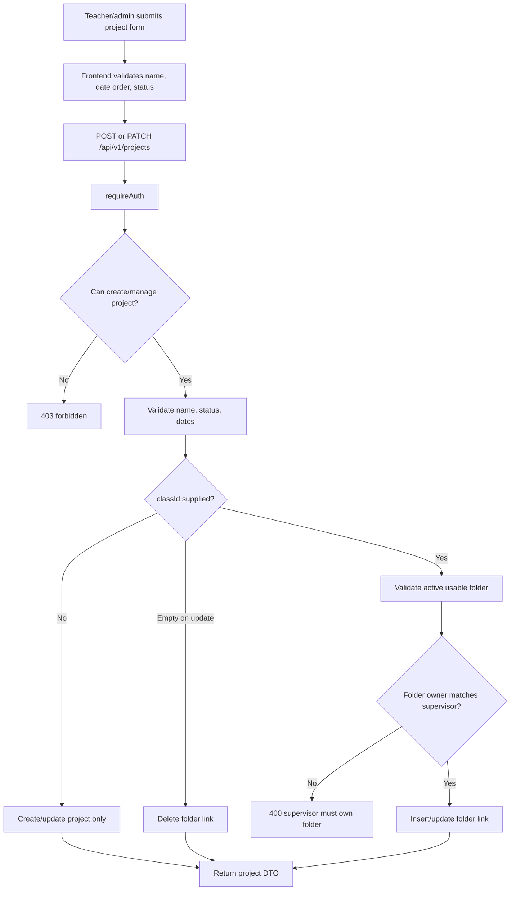
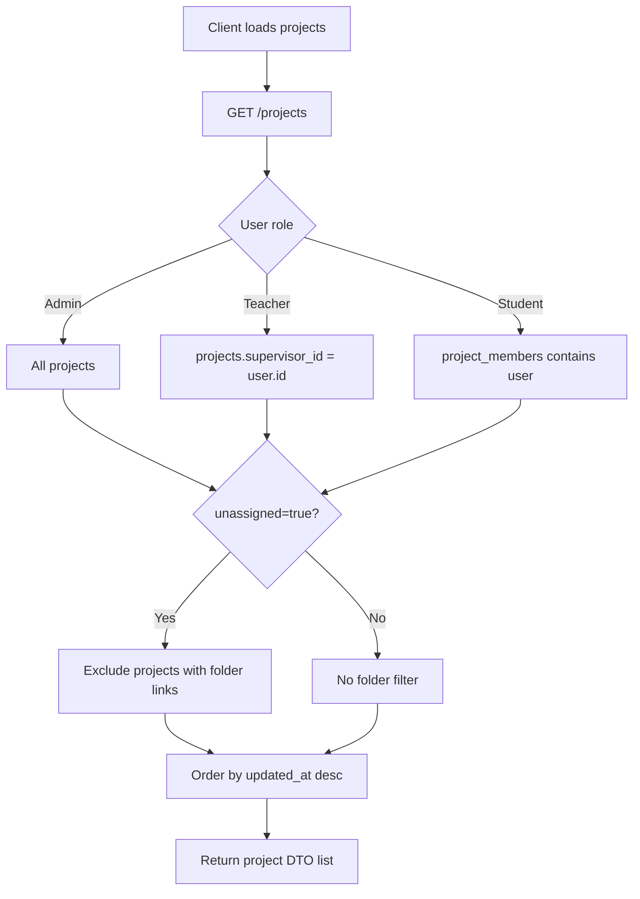
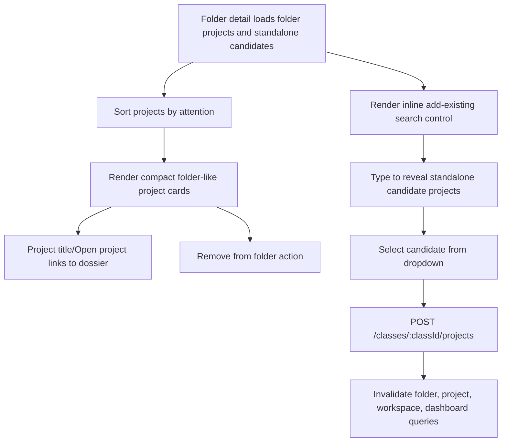

# Projects Onboarding

This document explains the current UniTrack Projects feature for engineers who need to maintain or extend project records, project cards, and folder assignment.

## Purpose

Projects are the primary product object in UniTrack. Teachers supervise project work, students submit work against their assignments (official tasks internally), and folders only organize projects inside the `Workspace` surface.

The current Projects slice provides:

- Role-scoped project listing.
- Project create, detail, and edit flows.
- Optional folder assignment through `classId`.
- Project date range, status, topic, description, and progress summary fields.
- Project DTO rollups for members, assignments, milestones, overdue work, pending reviews, and planned progress.
- Project cards used by workspace, folder detail, and project discovery surfaces, with show-more guards for large fake-data sets.
- Project detail command header that shows status once, moves metadata into a quiet fact strip, and keeps lifecycle warnings compact.
- Centralized project resource overview for project, checkpoint, and assignment links.
- Split `Work Plan` section that presents milestones as flat divider rows in the wider left column and searchable assignment rows for the selected checkpoint in a narrower right panel.
- Project team entry point through a low-emphasis header `Team` trigger with count, direct student add, and member management.

Folder behavior is documented in `docs/features/workspace-project-folders.md`. Project access rules are documented in `docs/features/protected-access.md`.

## Current Status

| Capability                     | Status          | Notes                                                                                                            |
| ------------------------------ | --------------- | ---------------------------------------------------------------------------------------------------------------- |
| Project list                   | Implemented     | Admin sees all, teachers see supervised projects, students see member projects; API list requests are capped at 200. |
| Project detail                 | Implemented     | Relationship-scoped read with project rollup DTO.                                                                |
| Project create                 | Implemented     | Teacher/admin only; admin can provide `supervisorId` through API.                                                |
| Project edit                   | Implemented     | Admin or supervising teacher only.                                                                               |
| Optional folder assignment     | Implemented     | Create/update accepts `classId`; empty update `classId` removes folder link.                                     |
| Date range validation          | Implemented     | Date-only values must parse and end date cannot be before start date.                                            |
| Project lifecycle status       | Implemented     | Status is one of `active`, `on_hold`, `completed`, `archived`; backend gates project-scoped writes by status.    |
| Project rollups                | Implemented     | DTO includes assignment/milestone progress, overdue count, pending review count, and last approval.              |
| Team popover integration       | Implemented     | Project detail keeps team management in a low-emphasis header trigger with count, supervisor, searchable members, direct student add, role toggles, removal, and one project leader maximum. |
| Project resources overview     | Implemented     | Project detail shows a centralized resource overview for project-level links plus checkpoint/assignment resource targets, backed by the centered resource dialog. |
| Project plan presentation      | Implemented     | Project detail uses a compact command header, quiet fact strip, one flat split `Work Plan` section, selectable milestone divider rows in a wider left column, a searchable selected-assignment row panel on the right, warning-only review/overdue cues, progress bars, app-confirmed checkpoint delete, and quiet per-row resource actions. |
| Folder-like project cards      | Implemented     | Project cards were restyled as compact folder-like project units, no longer show a redundant `Project` stamp, and grids initially show 36 cards with a show-all control. |
| Existing-project folder add UI | Implemented     | Folder detail uses an inline search control that reveals standalone-project candidates while typing.             |
| Project deletion               | Not implemented | Out of current scope; projects can be archived.                                                                  |
| Frontend automated tests       | Missing/partial | Backend lifecycle coverage is strong; frontend project/card/folder tests are still needed.                       |

## User-Facing Behavior

| User action                               | Expected result                                                                           |
| ----------------------------------------- | ----------------------------------------------------------------------------------------- |
| Teacher opens `/workspace`                | Sees supervised projects, grouped by folders plus standalone projects.                    |
| Student opens `/workspace`                | Sees project cards for projects they belong to.                                           |
| Teacher creates a standalone project      | Project is created without folder context and appears in standalone projects.             |
| Teacher creates a project inside a folder | Project is linked to that active owned folder.                                            |
| Teacher edits project metadata            | Project record, lists, folder rollups, and dashboard summaries refresh.                   |
| Teacher moves project between folders     | Existing folder link is replaced with the target folder link.                             |
| Teacher removes project from folder       | Project returns to standalone projects.                                                   |
| Student opens assigned project            | Project detail loads but management actions are hidden/blocked.                           |
| Any project viewer opens detail           | Header shows project status once, uses compact lifecycle copy and a quiet fact strip, then shows resource overview and one split `Work Plan` where selecting a checkpoint updates a searchable assignment row panel that initially shows 30 matches. |
| Any project viewer opens an assignment row | The assignment title is the route link; there is no separate redundant `Open` button. |
| Any project viewer opens team             | Low-emphasis header `Team` trigger with a count opens a popover with supervisor, searchable students, and management controls when allowed. |
| Non-member student opens project          | Backend returns `403`; frontend shows a restricted state.                                 |
| Teacher opens another teacher's project   | Backend returns `403`; frontend shows a restricted state.                                 |
| Admin opens existing project              | Admin can view/update the project, subject to folder supervisor-owner rules for movement. |
| Manager archives a project                | Project remains readable but becomes read-only except for status reactivation.             |
| Manager puts a project on hold            | Student submissions and new assignments stop; managers can maintain plans, team, and resources. |
| Manager completes a project               | New work, resources, and team changes stop; pending submissions can still be reviewed.    |

## Project Lifecycle Semantics

`project.status` is manual lifecycle state. It does not replace `officialProgressState`, which remains a rollup derived from reviewed assignments.

| Status | Product Meaning | Backend Write Behavior |
| --- | --- | --- |
| `active` | Normal live project. | All current project, plan, team, resource, submission, review, and evidence actions are allowed when relationship permissions pass. |
| `on_hold` | Temporarily paused project. | Managers can edit metadata, milestones, assignment details, team, resources, and evidence cleanup; new assignments and student submissions are blocked. |
| `completed` | Finished project retained as a record. | Metadata/status updates and pending submission reviews are allowed; plan, team, resource, submission, and evidence writes are blocked. |
| `archived` | Historical read-only record. | Reads remain allowed; only status-only project update requests can reactivate or change lifecycle state. |

Lifecycle status also affects attention and rollups: overdue assignment counts apply only to active projects, and archived projects do not surface pending-review attention.

## API Contract

Base path: `/api/v1`

| Method  | Endpoint                | Access          | Request                             | Success            | Common Errors              |
| ------- | ----------------------- | --------------- | ----------------------------------- | ------------------ | -------------------------- |
| `GET`   | `/projects`             | Authenticated   | Optional `limit` capped at 200, `unassigned=true` | `200` project list | `400`, `401`, `500`        |
| `POST`  | `/projects`             | Teacher/admin   | Project create DTO                  | `201` project DTO  | `400`, `401`, `403`, `500` |
| `GET`   | `/projects/{projectId}` | Project viewer  | Cookie only                         | `200` project DTO  | `400`, `401`, `403`, `404` |
| `PATCH` | `/projects/{projectId}` | Project manager | Partial project update DTO          | `200` project DTO  | `400`, `401`, `403`, `404`, `409` |

Create DTO fields:

| Field          | Required                | Meaning                                                        |
| -------------- | ----------------------- | -------------------------------------------------------------- |
| `name`         | Yes                     | Project display name.                                          |
| `description`  | No                      | Longer project description.                                    |
| `topic`        | No                      | Short topic/product/research focus.                            |
| `classId`      | No                      | Folder ID; must be active and owned by the project supervisor. |
| `supervisorId` | Admin API only optional | Defaults to current user for teachers.                         |
| `startDate`    | No                      | Date-only `YYYY-MM-DD`.                                        |
| `endDate`      | No                      | Date-only `YYYY-MM-DD`; cannot precede `startDate`.            |
| `status`       | No                      | Defaults to `active`.                                          |

Update DTO fields:

| Field             | Meaning                                                                |
| ----------------- | ---------------------------------------------------------------------- |
| `name`            | New project name; cannot become blank.                                 |
| `description`     | New description; empty string clears it.                               |
| `topic`           | New topic; empty string clears it.                                     |
| `classId`         | New folder ID; empty string removes folder link; omitted leaves as-is. |
| `startDate`       | New start date; empty string clears it.                                |
| `endDate`         | New end date; empty string clears it.                                  |
| `status`          | New project lifecycle status; archived projects accept status-only updates. |
| `progressSummary` | Teacher/admin-maintained supervision summary.                          |

Project DTO rollup fields:

| Field                                 | Meaning                                                                                |
| ------------------------------------- | -------------------------------------------------------------------------------------- |
| `classId`, `classTitle`, `classColor` | Folder context when assigned.                                                          |
| `memberCount`                         | Number of project members.                                                             |
| `taskCount`                           | Number of active assignments.                                                          |
| `completedTaskCount`                  | Assignments with completed reviewed progress.                                          |
| `inProgressTaskCount`                 | Assignments in progress.                                                               |
| `needsChangesTaskCount`               | Assignments needing revision.                                                          |
| `milestoneCount`                      | Number of project milestones.                                                          |
| `completedMilestoneCount`             | Milestones whose assignments are all completed.                                        |
| `plannedProgressPercent`              | Milestone completion percent when milestones exist; otherwise assignment completion percent. |
| `overdueTaskCount`                    | Overdue assignments counted only while the project is `active`.                         |
| `pendingReviewCount`                  | Pending submissions across non-archived projects.                                      |
| `lastApprovedUpdateAt`                | Most recent approved progress review timestamp.                                        |

## Data Model

| Table                     | Important Fields                                                                           | Purpose                                             |
| ------------------------- | ------------------------------------------------------------------------------------------ | --------------------------------------------------- |
| `projects`                | `id`, `name`, `description`, `topic`, `supervisor_id`, dates, `status`, `progress_summary` | Core project metadata.                              |
| `project_members`         | `project_id`, `student_id`, `member_role`, `joined_at`                                     | Student project membership, member count, and one-leader-per-project state. |
| `course_section_projects` | `course_section_id`, `project_id`, `added_by`, unique `project_id`                         | One-folder-per-project assignment.                  |
| `course_sections`         | `id`, `title`, `color`, `owner_teacher_id`, `status`                                       | Folder context and assignment validation.           |
| `tasks`                   | `project_id`, `parent_task_id`, `milestone_id`, `official_progress_state`, `deadline`, `status` | Assignment progress, counts, and overdue rollups; active assignments require `parent_task_id IS NULL` and `milestone_id`. |
| `project_milestones`      | `project_id`, `sort_order`, dates                                                          | Milestone count and planned progress rollups.       |
| `progress_updates`        | `project_id`, `task_id`, `review_status`, timestamps                                       | Pending review rollups and progress freshness.      |
| `progress_reviews`        | `progress_update_id`, `review_status`, `reviewed_at`                                       | Last approved update and stale-progress indicators. |

## Backend Implementation Map

| File                                      | Responsibility                                                                                     |
| ----------------------------------------- | -------------------------------------------------------------------------------------------------- |
| `apps/api/internal/app/server.go`         | Registers protected project routes.                                                                |
| `apps/api/internal/app/projects.go`       | Project list/create/detail/update, project DTO scanning, project rollups, and members.             |
| `apps/api/internal/app/permissions.go`    | Project viewer/manager/create permission helpers.                                                  |
| `apps/api/internal/app/classes.go`        | Folder usability and supervisor-owner checks used by project folder assignment.                    |
| `apps/api/internal/app/types.go`          | `ProjectDTO`, `ProjectMemberDTO`, and related DTOs.                                                |
| `apps/api/internal/app/lifecycle_test.go` | Backend regression coverage for project permissions, member lifecycle, folder assignment, rollups. |

Important functions:

| Function                     | What It Does                                                                              |
| ---------------------------- | ----------------------------------------------------------------------------------------- |
| `handleListProjects`         | Parses list filters and returns role-scoped project DTOs.                                 |
| `handleCreateProject`        | Validates create input, optional folder, supervisor, dates, status, then inserts project. |
| `handleGetProject`           | Requires project view permission and returns a project DTO.                               |
| `handleUpdateProject`        | Requires project management permission, updates metadata, and moves/unlinks folder.       |
| `listProjectsFiltered`       | Applies admin/teacher/student and unassigned filters.                                     |
| `projectSelectSQL`           | Selects project metadata plus folder context and aggregate rollups.                       |
| `scanProject`                | Maps SQL rows into `ProjectDTO` and applies rollup-derived progress state.                |
| `applyProjectProgressRollup` | Derives planned progress percent and official progress state.                             |
| `ensureSupervisor`           | Validates an active teacher/admin supervisor.                                             |
| `requireProjectLifecycle`    | Enforces project-status gates for project-scoped mutations.                               |
| `canViewProject`             | Allows admin existing-project, teacher-supervised, or student-member reads.               |
| `canManageProject`           | Allows admin existing-project or supervising-teacher writes.                              |

## Frontend Implementation Map

| File                                                                  | Responsibility                                                                            |
| --------------------------------------------------------------------- | ----------------------------------------------------------------------------------------- |
| `apps/web/src/features/projects/api.ts`                               | Project REST calls and input types.                                                       |
| `apps/web/src/features/projects/components/project-forms.tsx`         | Project create/edit forms, folder selector, validation, query invalidation.               |
| `apps/web/src/features/projects/components/create-project-dialog.tsx` | Create dialog with folder-aware description.                                              |
| `apps/web/src/features/projects/components/project-card.tsx`          | Compact folder-like project cards and 36-card show-more grids used in workspace and folder detail. |
| `apps/web/src/features/projects/components/project-table.tsx`         | Dashboard/project table view for attention queues.                                        |
| `apps/web/src/features/projects/pages/project-detail-page.tsx`        | Project dossier, compact command header, quiet fact strip, centralized resource overview, flat split `Work Plan`, selectable milestone rows, searchable selected assignment row panel, capped team popover results, quiet resource actions, and centered resource dialog. |
| `apps/web/src/features/classes/pages/class-detail-page.tsx`           | Folder detail project cards and searchable add-existing-project flow.                     |
| `apps/web/src/features/workspace/pages/workspace-page.tsx`            | Workspace project/folder landing page and standalone project tray.                        |
| `apps/web/src/features/projects/attention.ts`                         | Project attention helpers used by dashboard, workspace, and folder detail sorting.        |
| `apps/web/src/types/api.ts`                                           | Project and related frontend API types.                                                   |

## Create And Update Flow

## List And Detail Flow

## Project Card And Folder Detail Flow

## Audit Notes

This slice was audited across backend logic, frontend implementation, UI composition, and tests.

Findings addressed during the audit pass:

| Finding                                                               | Resolution                                                                               |
| --------------------------------------------------------------------- | ---------------------------------------------------------------------------------------- |
| Redundant `Project folder` label in folder header                     | Removed from folder detail header.                                                       |
| Project cards looked unlike folders and had redundant `Project` stamp | Project cards were redesigned as smaller folder-like project units.                      |
| Existing-project movement was hidden in a disclosure/select flow      | Replaced with an inline search-to-add control for standalone projects only.              |
| Move select could accidentally submit first project                   | Removed select-based movement entirely.                                                  |
| Awkward `unassigned` candidate copy                                   | Removed from folder-detail add flow; candidates are standalone-only.                     |
| Lingering class-facing copy                                           | Updated touched UI copy to folder terminology.                                           |
| Dashboard cache could stale after folder link/unlink                  | Added dashboard invalidation to folder link/unlink success handlers.                     |
| Project card progress could overflow with bad API data                | Clamped rendered progress width to `0..100`.                                             |
| Team drawer was abrupt and visually heavy                             | Replaced with a neutral header team trigger with two overlapping avatars, label, count, and popover. |
| Team panel consumed project-detail space                              | Team management now lives in the project command header popover instead of a right-side rail. |
| Header repeated status and showed a redundant archived next-action card | Header now shows status once, lifecycle copy is compact, and archived/completed projects without real work do not render a next-action strip. |
| Milestone/task rows were difficult to scan                             | Replaced with a compact command header, one split `Work Plan` section, selectable milestone cards, a selected-assignment panel, warning-only review/overdue affordances, inline resource shelves, and a centered resource dialog. |
| Multiple project leaders were possible                                | Added transactional demotion plus a partial unique database index for one leader maximum. |

Backend audit outcome:

| Area                       | Result                                                                                                               |
| -------------------------- | -------------------------------------------------------------------------------------------------------------------- |
| Project authorization      | No obvious gap found; access is role and relationship scoped.                                                        |
| Folder assignment          | Active-folder and supervisor-owner checks are present.                                                               |
| Rollups                    | Assignment rollups use active assignment rows and are covered by lifecycle tests.                                |
| Nonexistent project status | Current behavior usually returns `403` before `404`; decide if this is intentional access hiding before changing it. |

## Test Coverage

Backend lifecycle tests in `apps/api/internal/app/lifecycle_test.go` cover the current project behavior:

| Test                                              | Coverage                                                                                                |
| ------------------------------------------------- | ------------------------------------------------------------------------------------------------------- |
| `TestProjectRoutesEnforceMembershipAndSupervisor` | Teacher, other teacher, member student, non-member student, and admin project access.                   |
| `TestOnHoldProjectBlocksNewWorkButAllowsManagerMaintenance` | On-hold projects block new assignments/submissions while allowing manager maintenance. |
| `TestCompletedProjectAllowsPendingReviewsOnly` | Completed projects block new work/team/resource writes while allowing pending review. |
| `TestArchivedProjectIsReadOnlyExceptStatusChange` | Archived projects remain readable but block writes except status change. |
| `TestProjectMemberRoleLifecycleAndPermissions`    | Member role mutation is manager-only.                                                                   |
| `TestCreateProjectRejectsDirectMembers`           | Project creation rejects unsupported direct member assignment.                                          |
| `TestProjectCreationAllowsOptionalClass`          | Standalone project creation, folder-linked creation, unassigned filtering, and folder detail inclusion. |
| `TestProjectUpdateCanChangeClass`                 | Moving, rejecting archived/foreign folders, admin cross-owner rejection, and unlinking.                 |
| `TestProjectOverdueCountIgnoresLegacyChildTasks`  | Project overdue rollups ignore historical child-task rows.                                             |
| `TestCourseSectionRoutesEnforceTeacherOwnership`  | Folder/project movement enforces teacher ownership.                                                     |

Frontend automated coverage for project cards, folder detail movement, project forms, and project dossier rendering is still missing or minimal.

## Known Gaps And Risks

| Gap or Risk                                                         | Impact                                                                                                      |
| ------------------------------------------------------------------- | ----------------------------------------------------------------------------------------------------------- |
| Nonexistent project responses usually return `403`                  | Decide whether this is intentional access hiding or should become `404` for admins/managers.                |
| Candidate project loading is capped at 100 and filtered client-side | Large teacher workspaces need search/pagination or a backend standalone-candidate endpoint.                 |
| Frontend tests are sparse                                           | Project card, add-existing-project, form, and detail regressions can slip through.                          |
| Admin ownership UI is limited                                       | Admin backend capabilities exist, but ownership/supervisor correction is not a polished product surface.    |
| Project deletion is absent                                          | Users must archive instead of deleting; keep destructive delete out of scope unless explicitly requested.   |
| Project detail page is broad                                        | It aggregates many feature surfaces; keep future changes slice-based to avoid making it harder to maintain. |

## Maintenance Checklist

When adding or changing project behavior:

- Keep project routes protected with `requireAuth`.
- Use `canViewProject` for reads and `canManageProject` for manager writes.
- Keep students out of project create/update/member management paths.
- Validate date-only fields and date ordering on both frontend and backend.
- Validate folder assignment through active-folder access and supervisor-owner matching.
- Preserve one-folder-per-project semantics unless the database schema intentionally changes.
- Keep project DTO rollups aligned with assignment, review, and milestone lifecycle semantics.
- Invalidate `dashboard`, `projects`, `project(id)`, `classes`, and relevant `class(...)` queries when project metadata, folder assignment, assignments, milestones, reviews, or members change.
- Keep project card UI compact and folder-adjacent, but avoid redundant labels like `Project` when context already makes it clear.
- Add frontend tests for create/edit forms, folder movement, project card rendering, and restricted project states when frontend test coverage is expanded.
