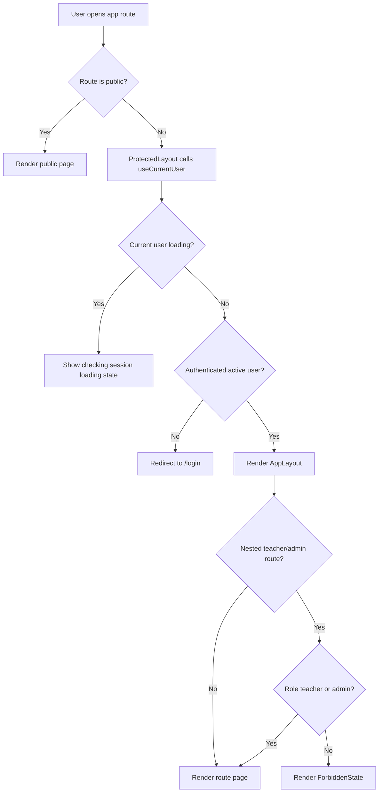
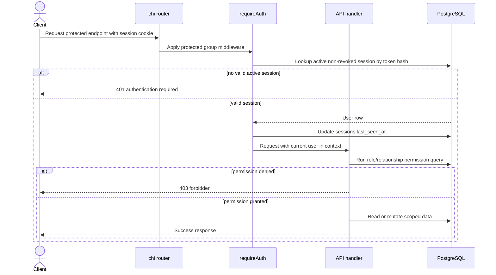
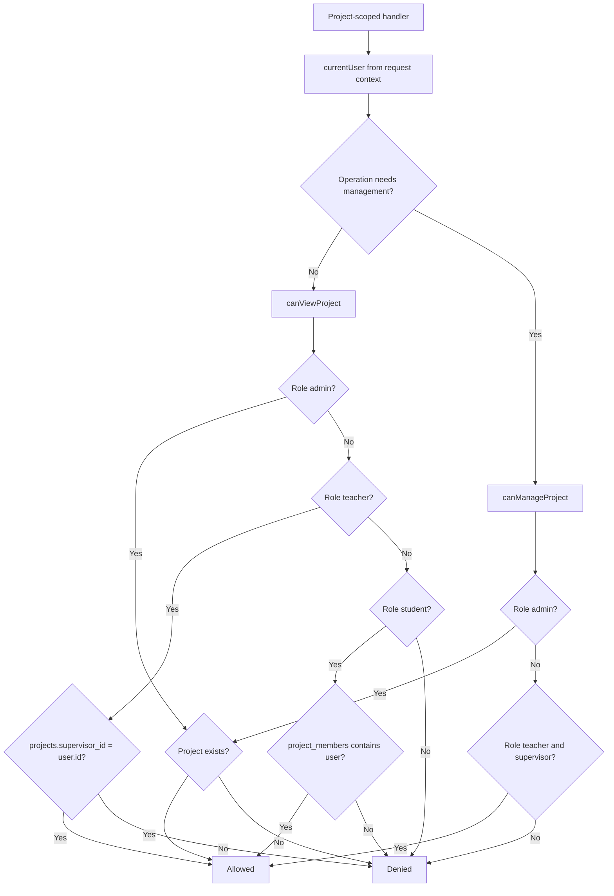
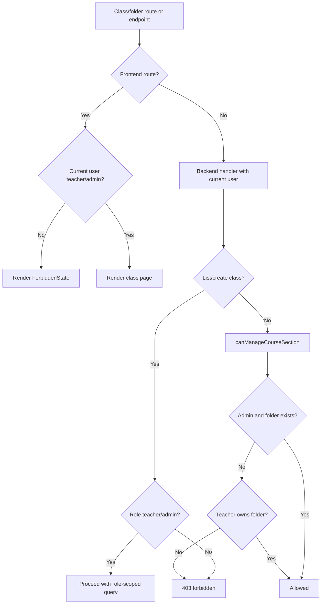

# Protected Access Onboarding

This document explains the current UniTrack protected routing and authorization layer for engineers who need to maintain or extend access control.

## Purpose

Protected access keeps UniTrack project-first and relationship-scoped:

- Public users can only reach login and health checks.
- Active authenticated users can enter the main app shell.
- Teachers supervise only their own projects unless the user is an admin.
- Students view only projects where they are members.
- Class folders are teacher/admin surfaces and are owned by a teacher.
- Mutating project-management actions require project-manager permission.
- Project-scoped writes also pass lifecycle gates based on `project.status` after relationship permission succeeds.

Authentication/session mechanics are documented separately in `docs/features/auth-session.md`. Project membership management is documented in `docs/features/team-members.md`.

## Current Status

| Capability                       | Status          | Notes                                                                                        |
| -------------------------------- | --------------- | -------------------------------------------------------------------------------------------- |
| Protected frontend shell         | Implemented     | `ProtectedLayout` redirects unauthenticated or inactive users away from app routes.          |
| Public route separation          | Implemented     | Login stays outside `ProtectedLayout`; public registration and invite acceptance are not routed. |
| Root redirect                    | Implemented     | `/` sends valid sessions to `/dashboard` and signed-out users to `/login`.                   |
| Legacy workspace redirects       | Implemented     | Old `/projects` and `/classes` paths redirect into `/workspace`.                             |
| Teacher/admin folder route guard | Implemented     | Class detail route renders a forbidden state for students.                                   |
| Protected API group              | Implemented     | Most app API routes sit behind `requireAuth`.                                                |
| Active-account enforcement       | Implemented     | Session lookup only returns active users.                                                    |
| Project view checks              | Implemented     | Admins view existing projects, teachers view supervised projects, students view memberships. |
| Project manage checks            | Implemented     | Admins manage existing projects, teachers manage supervised projects, students cannot.       |
| Project lifecycle write gates    | Implemented     | Active/on-hold/completed/archived status controls project-scoped mutations after relationship checks. |
| Class/folder ownership checks    | Implemented     | Admins manage existing folders; teachers manage their owned folders.                         |
| Feature-specific action checks   | Implemented     | Tasks, milestones, files, and resources add guards.                                          |
| Client permission affordances    | Implemented     | UI hides or disables actions through `apps/web/src/lib/permissions.ts`.                      |
| Frontend route/access tests      | Missing/partial | Backend lifecycle coverage is strong; frontend route/component tests are still needed.       |
| Admin override audit trail       | Missing/partial | Admin access works in many checks, but activity-log writes are not wired.                    |

## User-Facing Behavior

| User action                                              | Expected result                                                                             |
| -------------------------------------------------------- | ------------------------------------------------------------------------------------------- |
| Open `/dashboard` without a valid session                | Frontend redirects to `/login` and preserves the attempted path in router state.            |
| Open `/` with a valid active session                     | Frontend redirects to `/dashboard`.                                                         |
| Open `/` without a valid session                         | Frontend redirects to `/login`.                                                             |
| Student opens `/workspace/classes/:classId`              | Frontend renders a forbidden state before the class page loads.                             |
| Student calls `/api/v1/classes` directly                 | Backend returns `403`.                                                                      |
| Supervising teacher opens their project                  | Project loads successfully.                                                                 |
| Other teacher opens a project they do not supervise      | Backend returns `403`; frontend shows the project forbidden state.                          |
| Project member student opens their project               | Project loads successfully, but management actions are blocked.                             |
| Non-member student opens another project                 | Backend returns `403`; frontend shows the project forbidden state.                          |
| Admin opens an existing project or class                 | Request succeeds through admin override checks.                                             |
| User attempts an action hidden by the UI through the API | Backend remains authoritative and returns `401`, `403`, `404`, `409`, or validation errors. |

## Access Vocabulary

| Term                    | Meaning                                                                                       |
| ----------------------- | --------------------------------------------------------------------------------------------- |
| Authenticated user      | A request with a valid session cookie whose user is still `active`.                           |
| Project viewer          | Admin for existing project, supervising teacher, or student member.                           |
| Project manager         | Admin for existing project or supervising teacher.                                            |
| Project lifecycle gate  | A status-specific write check run after project relationship authorization.                    |
| Project creator         | Admin or teacher.                                                                             |
| Folder manager          | Admin for existing folder or the folder's owning teacher.                                     |
| Folder user for project | Admin for an active folder or owning teacher for an active folder.                            |
| Assigned student        | Student member assigned to an assignment; required for submissions.                            |
| Client affordance       | Frontend-only visibility check. It improves UX but is not the security boundary.              |

## Frontend Route Map

| Route                                          | Public or Protected | Extra Frontend Guard | Purpose                                         |
| ---------------------------------------------- | ------------------- | -------------------- | ----------------------------------------------- |
| `/`                                            | Public redirect     | Current-user lookup  | Send users to login or dashboard.               |
| `/login`                                       | Public              | None                 | Existing user sign-in.                          |
| `/admin/users`                                 | Protected           | Admin only           | Account management.                             |
| `/dashboard`                                   | Protected           | None                 | Role-aware work summary.                        |
| `/workspace`                                   | Protected           | UI affordances       | Main workspace with projects and folders.       |
| `/workspace/classes/:classId`                  | Protected           | Teacher/admin only   | Folder detail and project movement.             |
| `/workspace/projects/:projectId`               | Protected           | Backend project ACL  | Project dossier.                                |
| `/workspace/projects/:projectId/tasks/:taskId` | Protected           | Backend project ACL  | Task docket.                                    |
| `/projects`, `/projects/:projectId`            | Protected redirect  | None                 | Legacy redirects into workspace project routes. |
| `/classes`, `/classes/:classId`                | Protected redirect  | None                 | Legacy redirects into workspace class routes.   |

## API Access Groups

Base path: `/api/v1`

| Group                         | Representative Endpoints                                                                                        | Access Rule                                                    |
| ----------------------------- | --------------------------------------------------------------------------------------------------------------- | -------------------------------------------------------------- |
| Public system/auth            | `GET /health`, `GET /ready`, `POST /auth/login`                                                                 | No session required. Unsafe requests still pass origin checks. |
| Auth/session protected        | `GET /auth/me`, `POST /auth/logout`                                                                             | `requireAuth`.                                                 |
| Admin account management      | `GET/POST /admin/users`, `PATCH /admin/users/{userId}`, `POST /admin/users/{userId}/password`                   | `requireAuth` plus admin role.                                 |
| Dashboard                     | `GET /dashboard`                                                                                                | `requireAuth`, role-aware query scope.                         |
| Project list/create           | `GET /projects`, `POST /projects`                                                                               | List is scoped by role; create requires teacher/admin.         |
| Project view                  | `GET /projects/{projectId}`, members, milestones, tasks, progress, resources, files | `canViewProject`.                                              |
| Project management            | project update, member add/change/remove, milestone writes, task writes, reviews | `canManageProject`, plus feature validation and lifecycle gates. |
| Class/folder routes           | `GET/POST/PATCH /classes`, `GET /classes/{classId}`, `POST /classes/{classId}/projects`                         | Teacher/admin only; owned folder/project checks for teachers; archived projects cannot be moved. |
| Resource/file writes | resource links, uploaded files                                                                                   | Project view/manage checks plus lifecycle and author/uploader rules. |

## Data Model And Authorization Relationships

| Table                     | Access-Relevant Fields                                       | Used For                                               |
| ------------------------- | ------------------------------------------------------------ | ------------------------------------------------------ |
| `users`                   | `id`, `role`, `status`                                       | Role checks and active-account enforcement.            |
| `sessions`                | `user_id`, `token_hash`, `expires_at`, `revoked_at`          | Authenticated API requests.                            |
| `projects`                | `id`, `supervisor_id`, `status`                              | Teacher ownership and admin existence checks.          |
| `project_members`         | `project_id`, `student_id`, `member_role`                    | Student project visibility and team management.        |
| `course_sections`         | `id`, `owner_teacher_id`, `status`                           | Folder ownership and active-folder project assignment. |
| `course_section_projects` | `course_section_id`, `project_id`                            | Project placement in a folder.                         |
| `tasks`                   | `project_id`, `created_by`, `parent_task_id`, `milestone_id` | Project-scoped assignment access; `parent_task_id` is historical schema only. |
| `task_assignees`          | `task_id`, `student_id`                                      | Assigned-student submission access.                    |
| `resource_links`          | `project_id`, `added_by`, target fields                      | Resource write/delete authorization.                   |
| `uploaded_files`          | `project_id`, `uploaded_by`, `target_type`, `target_id`      | File download/delete/upload authorization.             |

## Backend Implementation Map

| File                                      | Responsibility                                                                                            |
| ----------------------------------------- | --------------------------------------------------------------------------------------------------------- |
| `apps/api/internal/app/server.go`         | Registers public routes, wraps protected routes in `requireAuth`, and exposes class/project route groups. |
| `apps/api/internal/app/auth.go`           | Session middleware and current-user context.                                                             |
| `apps/api/internal/app/admin_users.go`    | Admin-only account routes, last-admin safety checks, deactivation session revocation, and audit writes.   |
| `apps/api/internal/app/permissions.go`    | Core project authorization helpers.                                                                      |
| `apps/api/internal/app/classes.go`        | Class/folder teacher/admin checks, folder ownership checks, and project-folder assignment checks.         |
| `apps/api/internal/app/projects.go`       | Project list/create/detail/update and member guards.                                                      |
| `apps/api/internal/app/dashboard.go`      | Role-scoped dashboard queries.                                                                            |
| `apps/api/internal/app/tasks.go`          | Assignment, submission, review, and assignment-specific authorization.                                    |
| `apps/api/internal/app/milestones.go`     | Milestone view/manage checks.                                                                             |
| `apps/api/internal/app/resources.go`      | Resource target validation and author/manager write checks.                                               |
| `apps/api/internal/app/files.go`          | File target validation and uploader/supervisor delete/upload checks.                                      |
| `apps/api/internal/app/lifecycle_test.go` | Backend regression coverage for project, class, member, task, file, and resource access.                  |

Important functions:

| Function                             | What It Does                                                                                   |
| ------------------------------------ | ---------------------------------------------------------------------------------------------- |
| `requireAuth`                        | Loads active session user and stores it on request context, or returns `401`.                  |
| `currentUser`                        | Reads the authenticated `User` from request context.                                           |
| `canViewProject`                     | Authorizes admin existing-project view, teacher supervisor view, or student member view.       |
| `canManageProject`                   | Authorizes admin existing-project management or teacher supervisor management.                 |
| `requireProjectLifecycle`            | Enforces status-specific project write gates after view/manage checks pass.                    |
| `projectExists`                      | Lets admin checks distinguish existing project IDs from unrestricted blanket access.           |
| `canCreateProject`                   | Allows project creation for admins and teachers.                                               |
| `canManageCourseSection`             | Authorizes admin existing-folder management or teacher owner management.                       |
| `canUseCourseSectionForProject`      | Authorizes active folder use for project creation or movement.                                 |
| `classOwnerMatchesSupervisor`        | Ensures admin-created teacher projects are assigned only to folders owned by that supervisor.  |
| `classOwnerMatchesProjectSupervisor` | Ensures a project can only be moved into a folder owned by its supervising teacher.            |

## Frontend Implementation Map

| File                                                           | Responsibility                                                                            |
| -------------------------------------------------------------- | ----------------------------------------------------------------------------------------- |
| `apps/web/src/app/router.tsx`                                  | Public/protected route split, root redirect, teacher/admin class guard, legacy redirects. |
| `apps/web/src/features/auth/hooks.ts`                          | `useCurrentUser()` query used by route guards and feature pages.                          |
| `apps/web/src/features/auth/api.ts`                            | Auth/current-user calls that include session cookies through Axios configuration.         |
| `apps/web/src/stores/auth-store.ts`                            | Client-side current-user cache for app layout and feature affordances.                    |
| `apps/web/src/lib/permissions.ts`                              | Client permission helpers for create/manage/review affordances.                           |
| `apps/web/src/components/layout/app-layout.tsx`                | Protected shell and logout action.                                                        |
| `apps/web/src/components/shared/forbidden-state.tsx`           | Shared restricted-state UI.                                                               |
| `apps/web/src/features/workspace/pages/workspace-page.tsx`     | Project/folder create affordances.                                                        |
| `apps/web/src/features/projects/pages/project-detail-page.tsx` | Project forbidden state and manager-only project actions.                                 |
| `apps/web/src/features/tasks/pages/task-detail-page.tsx`       | Task forbidden state, review affordances, and assigned-student submission affordances.    |

## Protected Frontend Route Flow

## Protected API Sequence

## Project Access Flow

## Class Folder Access Flow

## Permission Matrix

| User and Relationship  | List Projects                   | View Project                    | Manage Project                  | Use Class Folder              | Manage Class Folder           |
| ---------------------- | ------------------------------- | ------------------------------- | ------------------------------- | ----------------------------- | ----------------------------- |
| Admin                  | All projects                    | Any existing project            | Any existing project            | Any active folder             | Any existing folder           |
| Supervising teacher    | Own supervised projects         | Own supervised projects         | Own supervised projects         | Own active folders            | Own folders                   |
| Other teacher          | Only own supervised projects    | Denied for others' projects     | Denied for others' projects     | Only own active folders       | Only own folders              |
| Student project member | Member projects                 | Member projects                 | Denied                          | Denied                        | Denied                        |
| Student non-member     | No unrelated projects           | Denied                          | Denied                          | Denied                        | Denied                        |
| Signed-out user        | Denied with `401` on API routes | Denied with `401` on API routes | Denied with `401` on API routes | Denied with `401` or redirect | Denied with `401` or redirect |

## Error Behavior

| Status | Meaning in Protected Access                                                                                        |
| ------ | ------------------------------------------------------------------------------------------------------------------ |
| `400`  | Request shape or target relationship is invalid, such as invalid folder color or invalid member role.              |
| `401`  | No valid active session was provided to a protected API endpoint.                                                  |
| `403`  | The user is authenticated but does not have the role, ownership, membership, assignment, or visibility required.   |
| `404`  | Some feature handlers return not found for missing nested resources after the project-level check succeeds.        |
| `409`  | State conflict, such as already-member add, inactive student add, review/action contradiction, or project lifecycle write blocking. |

## Test Coverage

Backend lifecycle tests in `apps/api/internal/app/lifecycle_test.go` cover the current access model:

| Test                                                         | Coverage                                                                                          |
| ------------------------------------------------------------ | ------------------------------------------------------------------------------------------------- |
| `TestAdminCanManageAccounts`                                 | Admin account routes, non-admin denial, safety checks, session revocation, and audit writes.      |
| `TestStudentCannotAccessClasses`                             | Students receive `403` from class/folder API routes.                                              |
| `TestProjectRoutesEnforceMembershipAndSupervisor`            | Supervising teacher, other teacher, member student, non-member student, and admin project access. |
| `TestOnHoldProjectBlocksNewWorkButAllowsManagerMaintenance`  | Project lifecycle gates block new work but allow manager maintenance on on-hold projects.     |
| `TestCompletedProjectAllowsPendingReviewsOnly`               | Completed projects allow pending reviews but block new work/team/support writes.               |
| `TestArchivedProjectIsReadOnlyExceptStatusChange`            | Archived projects are read-only except status changes.                                         |
| `TestProjectMemberRoleLifecycleAndPermissions`               | Member role mutation is manager-only and validates membership/role state.                         |
| `TestProjectCreationAllowsOptionalClass`                     | Project creation is teacher/admin-scoped and class assignment is validated.                       |
| `TestProjectUpdateCanChangeClass`                            | Project folder reassignment follows manager and folder ownership rules.                           |
| `TestCourseSectionRoutesEnforceTeacherOwnership`             | Teachers can manage owned folders but not other teachers' folders/projects.                       |
| `TestStudentProgressRequiresAssignedOfficialTask`            | Students need assignment to submit work.                                                          |
| `TestProgressReviewRejectsContradictionsAndDuplicateReviews` | Progress review remains teacher/admin-managed with lifecycle guards.                              |
| File and resource tests                                      | Feature-specific manager/viewer/owner checks on nested project resources.                         |

Frontend automated tests for protected redirects, forbidden states, and client affordances are still missing or minimal.

## Known Gaps And Risks

| Gap or Risk                                 | Impact                                                                                                                  |
| ------------------------------------------- | ----------------------------------------------------------------------------------------------------------------------- |
| Frontend guards are not a security boundary | Keep all authorization decisions enforced in backend handlers.                                                          |
| Per-handler guard pattern is easy to forget | New project-scoped handlers must explicitly call `canViewProject` or `canManageProject`.                                |
| Lifecycle gates are per-handler | New write handlers must call `requireProjectLifecycle` with the correct allowed status set.                            |
| Project override audit is partial           | Account-management actions write logs, but broader admin project overrides and activity-log UI are not implemented.     |
| Frontend route/component tests are sparse   | Redirects, forbidden states, and hidden action affordances can regress without backend tests noticing.                  |
| Historical course schema names remain       | Active product routes use class/folder endpoints; avoid reintroducing standalone course routes without a separate product decision. |

## Maintenance Checklist

When adding or changing protected functionality:

- Put API routes that require a session inside the protected chi group in `apps/api/internal/app/server.go`.
- Use `currentUser(r)` only after `requireAuth` has run.
- For project-scoped reads, call `canViewProject` before loading nested project data.
- For project-scoped writes, call `canManageProject` unless the feature intentionally allows member/owner writes.
- For project-scoped writes, call `requireProjectLifecycle` after relationship checks and before mutating data.
- For student writes, validate membership and assignment explicitly; project membership alone is not enough for submissions.
- For class/folder changes, use `canManageCourseSection` and `canUseCourseSectionForProject`.
- Keep frontend permission helpers aligned with backend behavior, but do not rely on them for security.
- Add lifecycle coverage for each new role/relationship combination, including negative cases.
- If admin override behavior expands, add activity-log writes before relying on it operationally.
