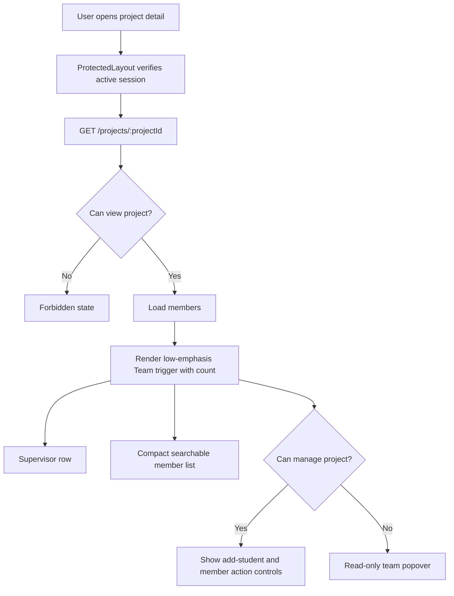
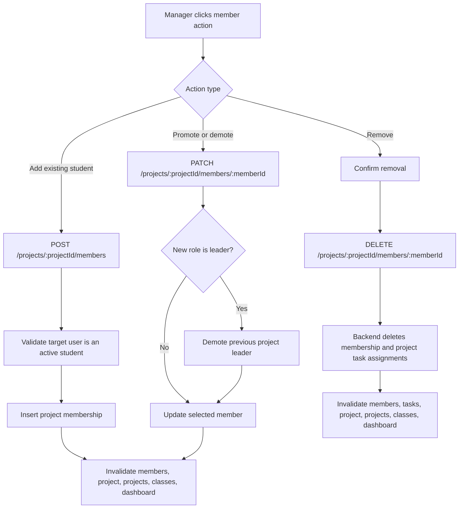

# Team And Members Onboarding

This document explains the current UniTrack project team/member implementation for engineers who need to maintain project membership and the project team popover.

## Purpose

Project teams define which students can access a project and which students can be assigned work. Student accounts must already exist before they can be added to a project; public invitation onboarding is removed from the active product.

The feature provides:

- Project member listing for project viewers.
- Teacher/admin direct add of existing active student accounts by email.
- Member role changes between `member` and `leader`.
- At most one `leader` per project; promoting a new leader demotes the previous leader.
- Student removal from projects, including cleanup of task assignments in that project.
- A low-emphasis header `Team` trigger with a member count and a popover on the project detail page instead of a page-consuming rail or modal drawer.

Project-level access rules are documented in `docs/features/protected-access.md`. Admin account creation is documented in `docs/features/admin-accounts.md`.

## Current Status

| Capability | Status | Notes |
| --- | --- | --- |
| Member list | Implemented | Project viewers can list project students; managers and member students can see names/emails. |
| Team popover | Implemented | Project detail renders a low-emphasis header `Team` trigger with a count; it opens a popover with supervisor, add-student, search, member rows, and management actions. |
| Compact member rows | Implemented | Members render as dense rows with initials, email, joined date, and leader marker. |
| Member search | Implemented | Search appears for larger teams or after typing, filtering by name, email, or member role. |
| Add existing student | Implemented | Managers add an existing active student account by email. Unknown student emails return `404`. |
| Promote/demote member | Implemented | Managers can toggle `leader` and `member`; promoting one member demotes any existing project leader. |
| Single leader invariant | Implemented | Database unique index and transactional backend update enforce at most one `leader` per project. |
| Remove member | Implemented | Managers can remove students after app confirmation; backend also removes their project task assignments. |
| Project lifecycle gates | Implemented | Member add, role change, and removal are allowed only while projects are `active` or `on_hold`. |
| Supervisor removal guard | Implemented | Backend rejects removing the project supervisor. |
| Invitation onboarding | Removed | No invite routes, public accept page, invitation DTO, or active invitation table remain. |
| Frontend automated tests | Missing/partial | Backend lifecycle coverage is strong; frontend popover interaction tests are still needed. |

## User-Facing Behavior

| User action | Expected result |
| --- | --- |
| Teacher/admin opens a project | Sees project content and a low-emphasis header `Team` button with a member count. |
| Student opens an assigned project | Can open a read-only team popover with supervisor and members; management actions are hidden. |
| Teacher/admin opens the team popover | The popover shows supervisor, add-student controls, searchable students, leader toggle, and removal actions. |
| Teacher/admin closes the team popover | Project detail returns to full-width project content with only the neutral header `Team` trigger visible. |
| Teacher/admin adds an active student email | The existing student becomes a project member and can view project work. |
| Teacher/admin adds an unknown student email | API returns `404 student account not found`; the teacher/admin must ask an admin to create the student account first. |
| Teacher/admin adds a teacher/admin email | API returns `400`; project members must be student accounts. |
| Teacher/admin adds an inactive student | API returns `409`; admin account correction is required first. |
| Teacher/admin promotes a student | Student row shows the `leader` marker after mutation refresh; any previous leader becomes `member`. |
| Teacher/admin demotes a leader | Student row returns to normal member display. |
| Teacher/admin removes a member | App confirmation appears first; after confirmation, the student loses project membership and project task assignments are removed. |
| Teacher/admin changes team on a completed or archived project | API returns `409`; frontend hides member mutation controls. |
| Large team is displayed | Member list remains compact and scrollable; search filters members without changing backend data. |

## API Contract

Base path: `/api/v1`

| Method | Endpoint | Access | Request | Success | Common Errors |
| --- | --- | --- | --- | --- | --- |
| `GET` | `/projects/{projectId}/members` | Project viewer | Cookie only | `200` member DTO list | `400`, `401`, `403`, `500` |
| `POST` | `/projects/{projectId}/members` | Project manager plus active/on-hold project | `{ "email": string }` | `201` member DTO | `400`, `401`, `403`, `404`, `409`, `500` |
| `PATCH` | `/projects/{projectId}/members/{memberId}` | Project manager plus active/on-hold project | `{ "memberRole": "member" | "leader" }` | `200` member DTO | `400`, `401`, `403`, `404`, `409`, `500` |
| `DELETE` | `/projects/{projectId}/members/{memberId}` | Project manager plus active/on-hold project | Cookie only | `200` `{ "status": "removed" }` | `400`, `401`, `403`, `404`, `409`, `500` |

Member DTO fields:

| Field | Meaning |
| --- | --- |
| `id` | Student user ID. |
| `fullName` | Student display name. |
| `email` | Student email. |
| `role` | User role, expected to be `student` for project members. |
| `status` | User account status. |
| `memberRole` | Project role: `member` or `leader`. |
| `joinedAt` | Membership creation timestamp. |

## Data Model

| Table | Important Fields | Purpose |
| --- | --- | --- |
| `project_members` | `project_id`, `student_id`, `member_role`, `joined_at`, unique project/student pair, partial unique leader index | Stores project membership and member role. |
| `task_assignees` | `task_id`, `student_id` | Cleaned up when a student is removed from a project. |
| `projects` | `id`, `supervisor_id`, `status` | Determines project manager, supervisor removal guard, and lifecycle write gates. |
| `users` | `id`, `email`, `role`, `status`, `full_name` | Supplies target student account details for direct add. |

Relevant migrations:

| Migration | Role |
| --- | --- |
| `20260601000100_init_mvp.sql` | Historically creates `project_members` and the now-removed `invitations` table. |
| `20260607000300_single_project_leader.sql` | Demotes duplicate historical leaders and adds `project_members_one_leader_per_project`. |
| `20260609000100_remove_invitations.sql` | Drops the active `invitations` table and invitation indexes/triggers. |

## Backend Implementation Map

| File | Responsibility |
| --- | --- |
| `apps/api/internal/app/server.go` | Registers protected member project routes. |
| `apps/api/internal/app/projects.go` | Member list/add/update/remove handlers. |
| `apps/api/internal/app/permissions.go` | `canViewProject` and `canManageProject` relationship checks. |
| `apps/api/internal/app/types.go` | `ProjectMemberDTO` and request DTOs. |
| `apps/api/internal/app/lifecycle_test.go` | Backend regression coverage for membership, direct add, role changes, and removal. |

Important functions:

| Function | What It Does |
| --- | --- |
| `handleListProjectMembers` | Allows project viewers to list member students. |
| `handleAddProjectMember` | Requires project manager, validates existing active student email, rejects duplicates, and inserts membership. |
| `handleUpdateProjectMember` | Requires project manager, validates `memberRole`, and updates role. |
| `updateProjectMemberRole` | Locks project members, demotes existing leaders before a new promotion, updates role, and returns joined user/member DTO. |
| `handleRemoveProjectMember` | Requires manager, blocks supervisor removal, deletes membership, and removes project task assignments. |

Member lifecycle gates:

| Project Status | Member Add | Role Change | Member Remove |
| --- | --- | --- | --- |
| `active` | Yes | Yes | Yes |
| `on_hold` | Yes | Yes | Yes |
| `completed` | No | No | No |
| `archived` | No | No | No |

## Frontend Implementation Map

| File | Responsibility |
| --- | --- |
| `apps/web/src/features/projects/pages/project-detail-page.tsx` | Project detail layout, neutral header team trigger/popover, member rows, member search, role/remove actions, add-student section. |
| `apps/web/src/features/projects/components/project-forms.tsx` | `AddProjectMemberForm`, project create/edit forms, validation, query invalidation. |
| `apps/web/src/features/projects/api.ts` | Member REST client functions. |
| `apps/web/src/lib/query-keys.ts` | `projectMembers(projectId)` query key. |
| `apps/web/src/types/api.ts` | `ProjectMember` frontend type. |

## Project Team Popover Flow

## Member Mutation Flow

## Access Matrix

| User and Relationship | List Members | Add Student | Promote/Demote | Remove Member |
| --- | --- | --- | --- | --- |
| Admin | Yes | Yes | Yes | Yes, except supervisor guard applies |
| Supervising teacher | Yes | Yes | Yes | Yes, except supervisor guard applies |
| Other teacher | Denied | Denied | Denied | Denied |
| Student project member | Yes | Denied | Denied | Denied |
| Student non-member | Denied | Denied | Denied | Denied |
| Signed-out user | `401` | `401` | `401` | `401` |

## Cache And Refresh Behavior

| Trigger | Invalidated Query Keys |
| --- | --- |
| Member added | `projectMembers(projectId)`, `project(projectId)`, `projects`, `classes`, `dashboard` |
| Member role changed | Active `projectMembers(projectId)` cache is patched immediately; then `projectMembers(projectId)`, `project(projectId)`, `projects`, `classes`, and `dashboard` are invalidated because leader promotion can demote another row. |
| Member removed | `projectMembers(projectId)`, `projectTasks(projectId)`, `project(projectId)`, `projects`, `classes`, `dashboard` |

## Error Behavior

| Status | Meaning In Team/Member Context |
| --- | --- |
| `400` | Invalid project ID, invalid member role, malformed email, non-student account, or supervisor removal attempt. |
| `401` | No valid active session reached a protected member route. |
| `403` | Authenticated user lacks project view or management relationship. |
| `404` | Project member not found or target student account not found. |
| `409` | Student is already a member or target student account is inactive. |

## Test Coverage

Backend lifecycle tests in `apps/api/internal/app/lifecycle_test.go` cover the current team/member model:

| Test | Coverage |
| --- | --- |
| `TestTeacherCanAddExistingActiveStudentToProject` | Teacher direct add by email, duplicate rejection, and added student project visibility. |
| `TestAddProjectMemberValidatesStudentAccountState` | Invalid email, unknown account `404`, non-student blocking, inactive student blocking, and no accidental membership writes. |
| `TestAdminCanAddProjectMember` | Admin can add an active student to an existing project. |
| `TestOnHoldProjectBlocksNewWorkButAllowsManagerMaintenance` | On-hold projects still allow member maintenance. |
| `TestCompletedProjectAllowsPendingReviewsOnly` | Completed projects block member additions. |
| `TestProjectRoutesEnforceMembershipAndSupervisor` | Project/member access for supervising teacher, other teacher, member student, non-member student, and admin. |
| `TestProjectMemberRoleLifecycleAndPermissions` | Students/other teachers cannot update roles; managers can promote/demote; invalid roles and non-members are rejected; promoting a second leader demotes the previous leader. |
| `TestCreateProjectRejectsDirectMembers` | Project creation rejects unsupported direct member assignment. |
| `TestTeacherCanRemoveProjectMember` | Students cannot remove members; supervisor removal is rejected; member removal deletes task assignments. |

Frontend automated tests for team popover open/close, member search, manager actions, and add-student behavior are still missing.

## Known Gaps And Risks

| Gap or Risk | Impact |
| --- | --- |
| Frontend tests are sparse | Team popover interaction regressions can slip through lint/build. |
| Member search is client-side | Very large teams may need server-side member search later, but current project teams are expected to be modest. |
| Student account lookup exposes missing accounts to project managers | Direct add intentionally returns `404 student account not found` per product decision. |
| No activity log writes | Admin/teacher member changes are not audit-logged yet. |
| No student self-leave flow | Membership removal remains manager-only. |

## Maintenance Checklist

When adding or changing team/member behavior:

- Keep project membership project-first; do not turn folders/classes into student team surfaces.
- Use `canViewProject` for member list reads and `canManageProject` for member mutations.
- Require existing active student accounts for direct member add.
- Preserve `memberRole` values: `member` and `leader`.
- Preserve the one-leader-per-project invariant in both backend mutations and database constraints.
- Preserve already-member protections.
- Preserve task assignment cleanup when removing a project member.
- Keep large-team UI compact and searchable rather than card-heavy.
- Keep icon-only actions accessible with labels and titles.
- Invalidate member, task, project, project list, classes, and dashboard queries according to the cache table above.
- Add frontend coverage when a test setup is introduced.
