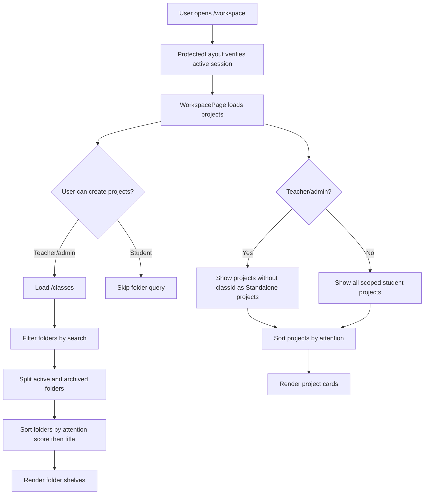
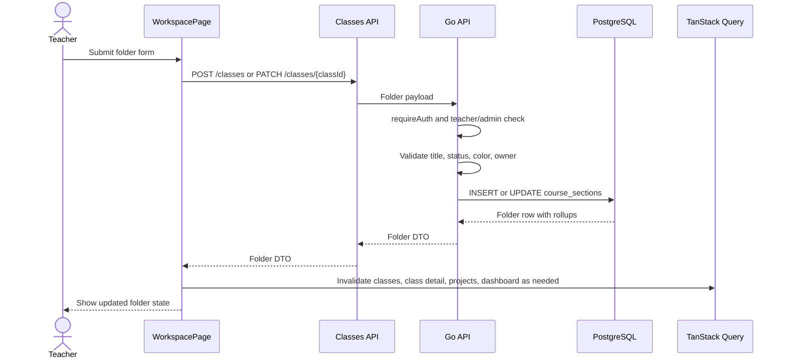
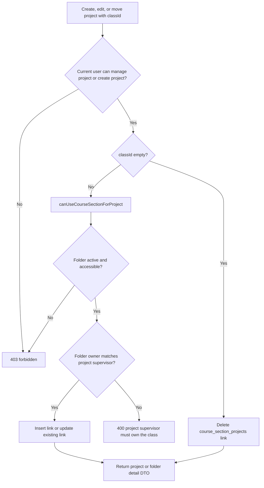
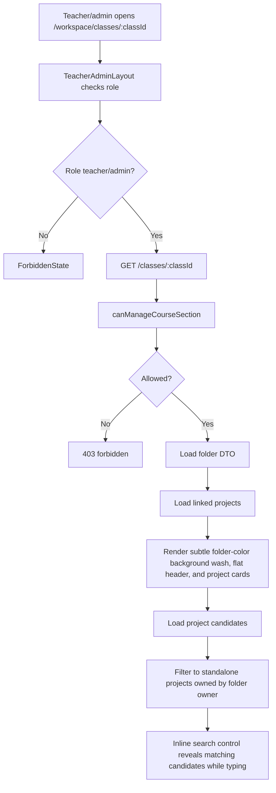

# Workspace And Project Folders Onboarding

This document explains the current UniTrack workspace and project folder implementation for engineers who need to maintain or extend project organization.

## Purpose

The workspace is the main navigation surface for project supervision. Project folders are lightweight organization containers for teachers/admins, not a standalone course module.

The feature provides:

- A `/workspace` landing page for projects and folders.
- Teacher/admin folder shelves split into active and archived folders with show-more guards.
- Folder search by title, description, owner name, or color.
- Colored folder cards with project counts, pending review counts, and overdue task counts.
- Searchable standalone project cards for projects not assigned to a folder.
- Folder detail pages with a subtle folder-color background wash, flat metadata header, searchable guarded project grids, and an inline standalone-project search-to-add control.
- Project creation/editing with optional folder assignment.
- Backend ownership checks that keep teacher folders aligned with supervised projects.

Protected access behavior is documented in `docs/features/protected-access.md`. Project CRUD details beyond folder assignment should be documented in the project feature doc when that slice is audited.

## Current Status

| Capability                         | Status      | Notes                                                                                                            |
| ---------------------------------- | ----------- | ---------------------------------------------------------------------------------------------------------------- |
| Workspace route                    | Implemented | `/workspace` is protected and is the main project navigation surface.                                            |
| Active folder shelf                | Implemented | Teacher/admin users see active folders first; shelves initially show 24 folders with a show-all control.         |
| Archived folder shelf              | Implemented | Archived folders are kept below active folders, initially show 24 folders, and can be reactivated.               |
| Folder search                      | Implemented | Client-side search checks folder title, description, owner name, and color.                                      |
| Colored folder cards               | Implemented | Colors are constrained to `blue`, `teal`, `amber`, `rose`, `violet`, and `slate`.                                |
| Folder create/edit/archive         | Implemented | Teachers/admins can create and update folder title, color, description, and status.                              |
| Folder detail                      | Implemented | `/workspace/classes/:classId` shows a subtle folder-color background wash, flat folder metadata, actions, local project search, and contained projects with a 36-card initial grid. |
| Add standalone project to folder   | Implemented | Folder detail uses an inline search control; selecting a standalone project calls `POST /classes/{classId}/projects`. |
| Remove project from folder         | Implemented | Project update with `classId: ""` deletes the folder link.                                                       |
| Project create with folder         | Implemented | Project create accepts optional `classId` and writes the folder link transactionally.                            |
| Project edit folder assignment     | Implemented | Project update can move or unlink a project from folders.                                                        |
| Student workspace                  | Implemented | Students see only their projects through the searchable project tray and do not load folder shelves.             |
| Teacher ownership enforcement      | Implemented | Teachers can use only active folders they own and projects they supervise.                                       |
| Admin folder access                | Implemented | Admins can view/manage existing folders, but cross-owner project/folder moves are rejected.                      |
| Historical course module avoidance | Implemented | Active routes expose folder-style `/classes`; old standalone course handlers have been removed.                  |
| Frontend folder tests              | Missing     | Backend lifecycle coverage exists; workspace/folder component tests are still needed.                            |

## User-Facing Behavior

| User action                                        | Expected result                                                                               |
| -------------------------------------------------- | --------------------------------------------------------------------------------------------- |
| Teacher/admin opens `/workspace`                   | Sees searchable folder shelves plus searchable standalone projects, with long shelves/grids collapsed by default. |
| Student opens `/workspace`                         | Sees searchable project cards only; folder query is disabled and folder shelves are hidden.   |
| Teacher creates a folder                           | Folder is created, class/folder queries are invalidated, and user navigates to folder detail. |
| Teacher archives a folder                          | Folder moves to the archived shelf; linked projects remain linked.                            |
| Teacher reactivates a folder                       | Folder moves back to the active shelf.                                                        |
| Teacher searches folders                           | Active and archived shelves show matching folders and matching empty states.                  |
| User searches standalone projects                  | The project tray filters by project name, topic, description, supervisor, folder, or status.  |
| Teacher creates a project without a folder         | Project appears in standalone projects.                                                       |
| Teacher creates a project inside a folder          | Project is linked to that folder and appears in folder detail.                                |
| Teacher opens a folder detail page                 | Sees a subtly folder-tinted page with folder title, owner/count metadata, edit action, and new-project action. |
| Teacher adds a standalone project to a folder      | Project is linked to the folder and disappears from standalone project candidates.            |
| Teacher searches standalone project candidates     | Archived projects are excluded because archived projects cannot be moved until reactivated.   |
| Teacher removes a project from a folder            | Project returns to standalone projects.                                                       |
| Teacher tries another teacher's folder/project     | Backend returns `403` or `400` depending on the failed relationship check.                    |
| Admin tries to place a project in non-owner folder | Backend rejects the move because the project supervisor must own the folder.                  |

## API Contract

Base path: `/api/v1`

| Method  | Endpoint                      | Access                         | Request                                      | Success                 | Common Errors              |
| ------- | ----------------------------- | ------------------------------ | -------------------------------------------- | ----------------------- | -------------------------- |
| `GET`   | `/classes`                    | Teacher/admin                  | Cookie only                                  | `200` folder DTO list   | `401`, `403`, `500`        |
| `POST`  | `/classes`                    | Teacher/admin                  | Folder create DTO                            | `201` folder DTO        | `400`, `401`, `403`        |
| `GET`   | `/classes/{classId}`          | Folder manager                 | Cookie only                                  | `200` folder detail DTO | `400`, `401`, `403`, `404` |
| `PATCH` | `/classes/{classId}`          | Folder manager                 | Partial folder update DTO                    | `200` folder DTO        | `400`, `401`, `403`, `404` |
| `POST`  | `/classes/{classId}/projects` | Folder manager/project manager | `{ "projectId": string }`                    | `200` folder detail DTO | `400`, `401`, `403`, `500` |
| `GET`   | `/projects?unassigned=true`   | Authenticated                  | Optional `limit` capped at 200 and `unassigned` parameters | `200` project DTO list  | `400`, `401`, `500`        |
| `POST`  | `/projects`                   | Teacher/admin                  | Project create DTO with optional `classId`   | `201` project DTO       | `400`, `401`, `403`        |
| `PATCH` | `/projects/{projectId}`       | Project manager                | Project update DTO with optional `classId`   | `200` project DTO       | `400`, `401`, `403`, `404` |

Folder create DTO fields:

| Field            | Required            | Meaning                                                             |
| ---------------- | ------------------- | ------------------------------------------------------------------- |
| `title`          | Yes                 | Folder display name.                                                |
| `color`          | No                  | Folder palette; defaults to `blue`.                                 |
| `description`    | No                  | Optional notes shown on folder cards and detail pages.              |
| `status`         | No                  | `active` or `archived`; defaults to `active`.                       |
| `ownerTeacherId` | Admin only optional | Admin can create a folder owned by a specific active teacher/admin. |

Folder DTO fields:

| Field                | Meaning                                                   |
| -------------------- | --------------------------------------------------------- |
| `id`                 | Folder ID. The API path still calls this `classId`.       |
| `title`              | Folder display name.                                      |
| `color`              | Folder palette.                                           |
| `description`        | Optional folder notes.                                    |
| `ownerTeacherId`     | Teacher/admin user who owns the folder.                   |
| `ownerTeacherName`   | Owner display name.                                       |
| `status`             | `active` or `archived`.                                   |
| `projectCount`       | Count of linked projects.                                 |
| `pendingReviewCount` | Count of pending submissions across linked projects.      |
| `overdueTaskCount`   | Count of overdue assignments across linked projects.      |
| `createdAt`          | Creation timestamp.                                       |
| `updatedAt`          | Last update timestamp.                                    |

Folder detail DTO:

| Field         | Meaning                                  |
| ------------- | ---------------------------------------- |
| `classFolder` | Folder DTO.                              |
| `projects`    | Projects currently linked to the folder. |

## Data Model

| Table                     | Important Fields                                                                              | Purpose                                               |
| ------------------------- | --------------------------------------------------------------------------------------------- | ----------------------------------------------------- |
| `course_sections`         | `id`, `title`, `color`, `description`, `owner_teacher_id`, `status`, `created_by`, timestamps | Stores lightweight project folders.                   |
| `course_section_projects` | `course_section_id`, `project_id`, `added_by`, `added_at`, unique `project_id`                | Links each project to at most one folder.             |
| `projects`                | `id`, `name`, `supervisor_id`, `status`, dates, progress fields                               | Project records shown in workspace and folder detail. |
| `users`                   | `id`, `full_name`, `role`, `status`                                                           | Folder owner and project supervisor validation.       |
| `tasks`                   | `project_id`, `parent_task_id`, `deadline`, `status`, `official_progress_state`               | Folder/project overdue rollups for active assignments. |
| `progress_updates`        | `project_id`, `review_status`                                                                 | Folder/project pending-review rollups.                |

Relevant migrations:

| Migration                                | Role                                                                                                  |
| ---------------------------------------- | ----------------------------------------------------------------------------------------------------- |
| `20260603000100_lifecycle_hardening.sql` | Creates `course_sections` and `course_section_projects`, including one-folder-per-project uniqueness. |
| `20260604000200_courses_hierarchy.sql`   | Historical course hierarchy migration kept for schema history; active product routes do not expose courses. |
| `20260606000100_class_folders.sql`       | Adds folder colors and removes course-code/title/term columns from active folder shape.               |

## Backend Implementation Map

| File                                      | Responsibility                                                                                     |
| ----------------------------------------- | -------------------------------------------------------------------------------------------------- |
| `apps/api/internal/app/server.go`         | Registers protected `/classes` routes and project routes.                                          |
| `apps/api/internal/app/classes.go`        | Folder list/create/get/update, project movement endpoint, folder rollups, ownership helpers.       |
| `apps/api/internal/app/projects.go`       | Project list/create/update with optional folder assignment and unassigned filtering.               |
| `apps/api/internal/app/permissions.go`    | Project create/manage helpers used by folder assignment checks.                                    |
| `apps/api/internal/app/types.go`          | `CourseSectionDTO`, `CourseSectionDetailDTO`, and project folder context fields.                   |
| `apps/api/internal/app/lifecycle_test.go` | Backend regression tests for student blocking, project-folder assignment, movement, and ownership. |

Important functions:

| Function                             | What It Does                                                                                |
| ------------------------------------ | ------------------------------------------------------------------------------------------- |
| `handleListCourseSections`           | Lists folders for teacher/admin users; teachers see only owned folders.                     |
| `handleCreateCourseSection`          | Validates title, status, color, owner, then creates a folder.                               |
| `handleGetCourseSection`             | Requires folder manager permission, then returns folder metadata and linked projects.       |
| `handleUpdateCourseSection`          | Updates folder title, color, description, and status after manager permission check.        |
| `handleLinkCourseSectionProject`     | Moves a project into a folder after folder, project, active status, and owner-match checks. |
| `listCourseSections`                 | Runs role-scoped folder list query with rollup counts.                                      |
| `listCourseSectionProjects`          | Lists projects linked to a folder, scoped by teacher supervision or admin access.           |
| `canManageCourseSection`             | Authorizes admin existing-folder management or teacher owned-folder management.             |
| `canUseCourseSectionForProject`      | Ensures folder is active and role-accessible before assigning a project.                    |
| `classOwnerMatchesSupervisor`        | Ensures a folder owner matches a new project's supervisor.                                  |
| `classOwnerMatchesProjectSupervisor` | Ensures a moved project's supervisor owns the target folder.                                |
| `projectSelectSQL`                   | Adds folder context fields to project DTOs and supports unassigned project filtering.       |

## Frontend Implementation Map

| File                                                                  | Responsibility                                                                                                 |
| --------------------------------------------------------------------- | -------------------------------------------------------------------------------------------------------------- |
| `apps/web/src/app/router.tsx`                                         | Registers `/workspace` and teacher/admin `/workspace/classes/:classId` route guard.                            |
| `apps/web/src/features/workspace/pages/workspace-page.tsx`            | Workspace landing page, folder shelves, search, folder create/edit/archive, searchable standalone projects, and show-more guards. |
| `apps/web/src/features/classes/api.ts`                                | Folder API client calls.                                                                                       |
| `apps/web/src/features/classes/pages/class-detail-page.tsx`           | Folder detail page, subtle folder-color background wash, flat folder header, searchable guarded project grid, edit form, inline standalone-project add control, unlink action, new-project-in-folder flow. |
| `apps/web/src/features/projects/api.ts`                               | Project create/update/list APIs with `classId` and `unassigned` support.                                       |
| `apps/web/src/features/projects/components/project-forms.tsx`         | Project create/edit folder selectors and cache invalidation.                                                   |
| `apps/web/src/features/projects/components/create-project-dialog.tsx` | Passes optional folder context into project creation.                                                          |
| `apps/web/src/features/projects/components/project-card.tsx`          | Shows folder context and uses folder color for project card accents.                                           |
| `apps/web/src/features/projects/attention.ts`                         | Provides project attention signal used to sort standalone projects.                                            |
| `apps/web/src/lib/query-keys.ts`                                      | Defines `classes`, `class`, and `classProjectCandidates` query keys.                                           |
| `apps/web/src/types/api.ts`                                           | `ClassFolder`, `CourseSection`, `CourseSectionDetail`, and project folder context types.                       |

## Workspace Load Flow

## Folder Create/Edit Flow

## Project Assignment Flow

## Folder Detail Flow

## Access Matrix

| User and Relationship | List Folders     | Create Folder       | Edit Folder             | Create Project In Folder       | Move Project Into Folder                        | Unlink Project From Folder  |
| --------------------- | ---------------- | ------------------- | ----------------------- | ------------------------------ | ----------------------------------------------- | --------------------------- |
| Admin                 | All folders      | Yes, optional owner | Any existing folder     | Yes, if supervisor owns folder | Yes, if project supervisor owns folder          | Yes, through project update |
| Folder-owning teacher | Owned folders    | Yes, self-owned     | Owned folders           | Yes, owned active folder       | Yes, owned active folder and supervised project | Yes, supervised project     |
| Other teacher         | Own folders only | Yes, self-owned     | Denied for other folder | Denied for other folder        | Denied for other folder/project                 | Denied for other project    |
| Student               | Denied           | Denied              | Denied                  | Denied                         | Denied                                          | Denied                      |
| Signed-out user       | `401`            | `401`               | `401`                   | `401`                          | `401`                                           | `401`                       |

## Sorting And Attention Rules

Folder shelves:

| Rule                   | Behavior                                                             |
| ---------------------- | -------------------------------------------------------------------- |
| Active before archived | Workspace renders active folders first and archived folders below.   |
| Folder attention score | `pendingReviewCount * 10 + overdueTaskCount * 5`; overdue counts include active projects only and pending reviews exclude archived projects. |
| Folder tie-breaker     | Alphabetical by title.                                               |
| Search                 | Client-side search across title, description, owner name, and color. |

Project cards:

| Rule                    | Behavior                                                                           |
| ----------------------- | ---------------------------------------------------------------------------------- |
| Teacher/admin workspace | Standalone projects are projects with no `classId`.                                |
| Student workspace       | All scoped student projects are shown, regardless of folder context.               |
| Project attention score | `pendingReviewCount * 10 + overdueTaskCount * 5 + projectNeedsAttention(project)`; archived projects are not add candidates or attention items. |
| Project tie-breaker     | Newer `updatedAt` first.                                                           |
| Folder color            | Folder detail uses a compact folder marker; project cards use `classColor` when a project is linked to a folder. |

## Cache And Refresh Behavior

| Trigger Area                     | Invalidated Query Keys                                                                                    |
| -------------------------------- | --------------------------------------------------------------------------------------------------------- |
| Folder create                    | `classes`, then navigation to `class(id)`.                                                                |
| Folder edit/archive/reactivate   | `classes`, `class(id)`, `projects`, `dashboard`.                                                          |
| Add standalone project to folder | `class(id)`, `classes`, `projects`, `dashboard`, `project(projectId)`, `classProjectCandidates(id)`.      |
| Unlink project from folder       | `class(id)`, `classes`, `projects`, `project(projectId)`, `classProjectCandidates(id)`, old class if any. |
| Project create with folder       | `dashboard`, `projects`, `classes`, `class(project.classId)`, `classProjectCandidates(project.classId)`.  |
| Project edit folder assignment   | `dashboard`, `projects`, `project(id)`, `classes`, old/new `class(...)`, old/new candidate queries.       |

The frontend uses TanStack Query invalidation rather than trying to manually patch every aggregate shelf/card count.

## Error Behavior

| Status | Meaning In Workspace/Folder Context                                                                                |
| ------ | ------------------------------------------------------------------------------------------------------------------ |
| `400`  | Invalid title, status, color, date, malformed ID, unknown request field, or supervisor/folder mismatch.            |
| `401`  | No valid active session reached a protected API route.                                                             |
| `403`  | Authenticated user lacks teacher/admin role, folder ownership, active-folder access, or project management access. |
| `404`  | Folder or project was missing after permission checks allowed lookup.                                              |
| `409`  | Target project lifecycle is archived and must be reactivated before folder movement.                              |
| `500`  | Database or aggregate query failure.                                                                               |

Frontend states:

| State                 | UI Behavior                                                |
| --------------------- | ---------------------------------------------------------- |
| Workspace loading     | `LoadingState` with `Loading workspace`.                   |
| Project load error    | `ErrorState` saying workspace could not be loaded.         |
| Class load error      | `ErrorState` saying classes could not be loaded.           |
| Folder detail loading | `LoadingState` with `Loading folder`.                      |
| Folder detail error   | `ErrorState` saying folder could not be loaded.            |
| Empty folder shelves  | `EmptyState` messages for no folders or no search matches. |
| Empty folder projects | `EmptyState` saying the folder is empty.                   |
| Empty add candidates  | Inline search is disabled with `No standalone projects`.   |

## Test Coverage

Backend lifecycle tests in `apps/api/internal/app/lifecycle_test.go` cover the current folder model:

| Test                                              | Coverage                                                                                                                                  |
| ------------------------------------------------- | ----------------------------------------------------------------------------------------------------------------------------------------- |
| `TestStudentCannotAccessClasses`                  | Students cannot access class/folder API routes.                                                                                           |
| `TestProjectCreationAllowsOptionalClass`          | Project creation can be standalone or linked to an owned active folder; unassigned filtering and folder detail include linked projects.   |
| `TestCreateClassReportsUnknownRequestField`       | Folder create rejects unexpected request fields.                                                                                          |
| `TestProjectUpdateCanChangeClass`                 | Project update can move between folders, reject archived/foreign folders, reject admin cross-owner moves, and unlink.                     |
| `TestCourseSectionRoutesEnforceTeacherOwnership`  | Teachers can create folders, reject invalid colors, move owned projects between owned folders, and cannot access other teachers' folders. |
| `TestProjectRoutesEnforceMembershipAndSupervisor` | Project view/manage access remains relationship-scoped before folder actions can affect projects.                                         |

Frontend automated tests for workspace shelves, search, folder detail, movement forms, and empty/error states are still missing or minimal.

## Known Gaps And Risks

| Gap or Risk                                              | Impact                                                                                         |
| -------------------------------------------------------- | ---------------------------------------------------------------------------------------------- |
| Backend names still use `course_sections` and `/classes` | Keep UI copy folder-oriented unless a real course module is explicitly requested.              |
| Historical course migrations/table names remain          | Avoid reviving standalone course routes accidentally; keep active UX around folders.            |
| No folder delete endpoint                                | Folders are archived/reactivated rather than deleted.                                          |
| Admin UI is limited                                      | Admin can use backend override paths but no polished admin ownership management exists.        |
| Frontend tests are sparse                                | Workspace search, folder movement, and cache invalidation can regress without component tests. |
| Folder rollups are query-time aggregates                 | New task/progress lifecycle states must keep rollup filters aligned.                           |
| One folder per project is enforced in DB                 | Future multi-folder tagging would require schema and UI changes.                               |

## Maintenance Checklist

When adding or changing workspace/folder behavior:

- Keep folder UX lightweight and project-first; do not add course code, term, or section fields without explicit product scope.
- Keep folder APIs protected and teacher/admin-only.
- Preserve teacher folder ownership through `owner_teacher_id` checks.
- Preserve active-folder checks for assigning projects into folders.
- Preserve supervisor-owner matching when admins create or move projects with folders.
- Preserve one-folder-per-project semantics unless the schema changes intentionally.
- Update folder rollup SQL when task or progress review state semantics change.
- Invalidate `classes`, `class(id)`, `projects`, `project(id)`, and `dashboard` when folder membership or project summary data changes.
- Keep frontend type names and API names bridged carefully: UI says folder, API and DB still say class/course section.
- Add backend lifecycle coverage for new role/relationship cases and frontend tests for shelves, search, movement, and empty/error states.
